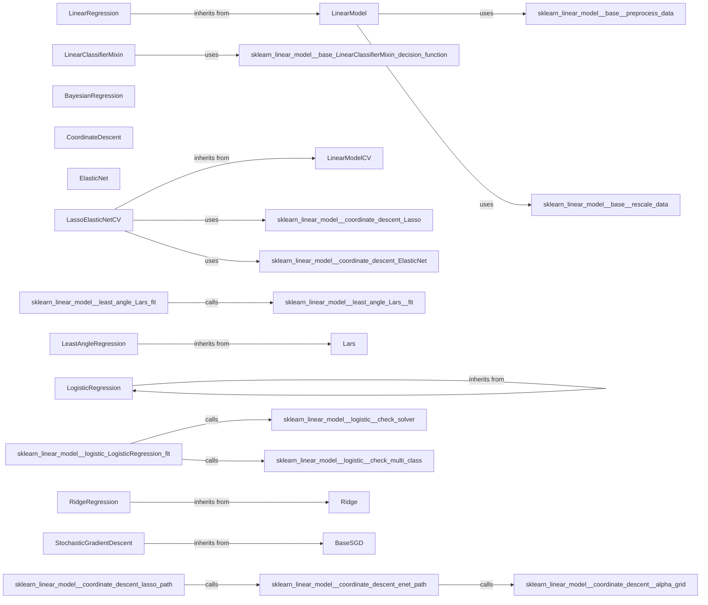

## Component Details

The Supervised Learning Algorithms component in scikit-learn provides a comprehensive suite of tools for building predictive models from labeled data. It encompasses a variety of algorithms, including linear models, tree-based methods, and support vector machines, designed for both classification and regression tasks. The component offers utilities for regularization, model selection, and performance optimization, catering to diverse data characteristics and problem types. It enables users to train models, predict outcomes, and evaluate performance using various metrics.

### LinearModel
Base class for linear models in scikit-learn, providing common functionalities such as setting the intercept and handling data preprocessing. It serves as an abstract class for various linear regression models.
**Related Classes/Methods**:

- <a href="https://github.com/scikit-learn/scikit-learn/blob/master/sklearn/linear_model/_base.py#L267-L319" target="_blank" rel="noopener noreferrer">`sklearn.linear_model._base.LinearModel` (267:319)</a>
- <a href="https://github.com/scikit-learn/scikit-learn/blob/master/sklearn/linear_model/_base.py#L108-L202" target="_blank" rel="noopener noreferrer">`sklearn.linear_model._base._preprocess_data` (108:202)</a>
- <a href="https://github.com/scikit-learn/scikit-learn/blob/master/sklearn/linear_model/_base.py#L210-L264" target="_blank" rel="noopener noreferrer">`sklearn.linear_model._base._rescale_data` (210:264)</a>
- <a href="https://github.com/scikit-learn/scikit-learn/blob/master/sklearn/linear_model/_base.py#LNone-LNone" target="_blank" rel="noopener noreferrer">`sklearn.linear_model._base._set_intercept` (full file reference)</a>

### LinearClassifierMixin
Mixin class for linear classifiers, providing prediction functionalities based on decision functions. It provides a unified interface for prediction tasks in linear classification models.
**Related Classes/Methods**:

- <a href="https://github.com/scikit-learn/scikit-learn/blob/master/sklearn/linear_model/_base.py#L324-L397" target="_blank" rel="noopener noreferrer">`sklearn.linear_model._base.LinearClassifierMixin` (324:397)</a>
- <a href="https://github.com/scikit-learn/scikit-learn/blob/master/sklearn/linear_model/_base.py#L330-L358" target="_blank" rel="noopener noreferrer">`sklearn.linear_model._base.LinearClassifierMixin.decision_function` (330:358)</a>
- <a href="https://github.com/scikit-learn/scikit-learn/blob/master/sklearn/linear_model/_base.py#L383-L397" target="_blank" rel="noopener noreferrer">`sklearn.linear_model._base.LinearClassifierMixin._predict_proba_lr` (383:397)</a>

### LinearRegression
Implementation of ordinary least squares linear regression. It inherits from LinearModel and utilizes data preprocessing and rescaling techniques to fit a linear model to the data.
**Related Classes/Methods**:

- <a href="https://github.com/scikit-learn/scikit-learn/blob/master/sklearn/linear_model/_base.py#L458-L712" target="_blank" rel="noopener noreferrer">`sklearn.linear_model._base.LinearRegression` (458:712)</a>

### BayesianRegression
This component includes Bayesian Ridge Regression and ARD Regression, providing probabilistic approaches to linear regression. They update coefficients and calculate the log marginal likelihood (BayesianRidge) or automatically determine the relevance of each feature (ARDRegression) during the fitting process.
**Related Classes/Methods**:

- <a href="https://github.com/scikit-learn/scikit-learn/blob/master/sklearn/linear_model/_bayes.py#L26-L461" target="_blank" rel="noopener noreferrer">`sklearn.linear_model._bayes.BayesianRidge` (26:461)</a>
- <a href="https://github.com/scikit-learn/scikit-learn/blob/master/sklearn/linear_model/_bayes.py#L468-L825" target="_blank" rel="noopener noreferrer">`sklearn.linear_model._bayes.ARDRegression` (468:825)</a>

### CoordinateDescent
Module containing functions and classes for coordinate descent based linear models like Lasso and ElasticNet. It includes path computation and alpha grid generation for efficient model fitting.
**Related Classes/Methods**:

- <a href="https://github.com/scikit-learn/scikit-learn/blob/master/sklearn/linear_model/_coordinate_descent.py#LNone-LNone" target="_blank" rel="noopener noreferrer">`sklearn.linear_model._coordinate_descent` (full file reference)</a>
- <a href="https://github.com/scikit-learn/scikit-learn/blob/master/sklearn/linear_model/_coordinate_descent.py#L203-L374" target="_blank" rel="noopener noreferrer">`sklearn.linear_model._coordinate_descent.lasso_path` (203:374)</a>
- <a href="https://github.com/scikit-learn/scikit-learn/blob/master/sklearn/linear_model/_coordinate_descent.py#L396-L720" target="_blank" rel="noopener noreferrer">`sklearn.linear_model._coordinate_descent.enet_path` (396:720)</a>
- <a href="https://github.com/scikit-learn/scikit-learn/blob/master/sklearn/linear_model/_coordinate_descent.py#L95-L183" target="_blank" rel="noopener noreferrer">`sklearn.linear_model._coordinate_descent._alpha_grid` (95:183)</a>

### ElasticNet
Implementation of Elastic Net model, which is a linear regression model with both L1 and L2 regularization. It interacts with the coordinate descent module for efficient optimization.
**Related Classes/Methods**:

- <a href="https://github.com/scikit-learn/scikit-learn/blob/master/sklearn/linear_model/_coordinate_descent.py#L727-L1155" target="_blank" rel="noopener noreferrer">`sklearn.linear_model._coordinate_descent.ElasticNet` (727:1155)</a>

### LinearModelCV
Base class for cross-validated linear models using coordinate descent. It handles alpha grid generation and estimator selection, providing a framework for model selection via cross-validation.
**Related Classes/Methods**:

- <a href="https://github.com/scikit-learn/scikit-learn/blob/master/sklearn/linear_model/_coordinate_descent.py#L1491-L1917" target="_blank" rel="noopener noreferrer">`sklearn.linear_model._coordinate_descent.LinearModelCV` (1491:1917)</a>

### LassoElasticNetCV
This component includes LassoCV and ElasticNetCV, which are implementations of Lasso and Elastic Net models with cross-validation for alpha parameter selection. They inherit from LinearModelCV and use the Lasso/ElasticNet estimators to find the optimal regularization parameter.
**Related Classes/Methods**:

- <a href="https://github.com/scikit-learn/scikit-learn/blob/master/sklearn/linear_model/_coordinate_descent.py#L1920-L2182" target="_blank" rel="noopener noreferrer">`sklearn.linear_model._coordinate_descent.LassoCV` (1920:2182)</a>
- <a href="https://github.com/scikit-learn/scikit-learn/blob/master/sklearn/linear_model/_coordinate_descent.py#L1162-L1342" target="_blank" rel="noopener noreferrer">`sklearn.linear_model._coordinate_descent.Lasso` (1162:1342)</a>
- <a href="https://github.com/scikit-learn/scikit-learn/blob/master/sklearn/linear_model/_coordinate_descent.py#L2185-L2471" target="_blank" rel="noopener noreferrer">`sklearn.linear_model._coordinate_descent.ElasticNetCV` (2185:2471)</a>
- <a href="https://github.com/scikit-learn/scikit-learn/blob/master/sklearn/linear_model/_coordinate_descent.py#L727-L1155" target="_blank" rel="noopener noreferrer">`sklearn.linear_model._coordinate_descent.ElasticNet` (727:1155)</a>

### LeastAngleRegression
This component includes classes and functions for Least Angle Regression (LARS) models. It includes path computation and gram matrix calculations for efficient model fitting, as well as cross-validation capabilities.
**Related Classes/Methods**:

- <a href="https://github.com/scikit-learn/scikit-learn/blob/master/sklearn/linear_model/_least_angle.py#LNone-LNone" target="_blank" rel="noopener noreferrer">`sklearn.linear_model._least_angle` (full file reference)</a>
- <a href="https://github.com/scikit-learn/scikit-learn/blob/master/sklearn/linear_model/_least_angle.py#L63-L232" target="_blank" rel="noopener noreferrer">`sklearn.linear_model._least_angle.lars_path` (63:232)</a>
- <a href="https://github.com/scikit-learn/scikit-learn/blob/master/sklearn/linear_model/_least_angle.py#L411-L913" target="_blank" rel="noopener noreferrer">`sklearn.linear_model._least_angle._lars_path_solver` (411:913)</a>
- <a href="https://github.com/scikit-learn/scikit-learn/blob/master/sklearn/linear_model/_least_angle.py#L920-L1207" target="_blank" rel="noopener noreferrer">`sklearn.linear_model._least_angle.Lars` (920:1207)</a>
- <a href="https://github.com/scikit-learn/scikit-learn/blob/master/sklearn/linear_model/_least_angle.py#L1515-L1828" target="_blank" rel="noopener noreferrer">`sklearn.linear_model._least_angle.LarsCV` (1515:1828)</a>
- <a href="https://github.com/scikit-learn/scikit-learn/blob/master/sklearn/linear_model/_least_angle.py#L2029-L2346" target="_blank" rel="noopener noreferrer">`sklearn.linear_model._least_angle.LassoLarsIC` (2029:2346)</a>

### LogisticRegression
Implementation of Logistic Regression model. It includes solver checking and multi-class handling to provide a versatile classification algorithm, with and without cross-validation.
**Related Classes/Methods**:

- <a href="https://github.com/scikit-learn/scikit-learn/blob/master/sklearn/linear_model/_logistic.py#L823-L1489" target="_blank" rel="noopener noreferrer">`sklearn.linear_model._logistic.LogisticRegression` (823:1489)</a>
- <a href="https://github.com/scikit-learn/scikit-learn/blob/master/sklearn/linear_model/_logistic.py#L1492-L2317" target="_blank" rel="noopener noreferrer">`sklearn.linear_model._logistic.LogisticRegressionCV` (1492:2317)</a>

### RidgeRegression
This component includes Ridge Regression (L2 regularization) with and without cross-validation. It includes solver resolution and sparse matrix handling for efficient and stable linear regression.
**Related Classes/Methods**:

- <a href="https://github.com/scikit-learn/scikit-learn/blob/master/sklearn/linear_model/_ridge.py#L1012-L1256" target="_blank" rel="noopener noreferrer">`sklearn.linear_model._ridge.Ridge` (1012:1256)</a>
- <a href="https://github.com/scikit-learn/scikit-learn/blob/master/sklearn/linear_model/_ridge.py#L2515-L2695" target="_blank" rel="noopener noreferrer">`sklearn.linear_model._ridge.RidgeCV` (2515:2695)</a>

### StochasticGradientDescent
This component includes BaseSGD and SGDClassifier, providing a base class for stochastic gradient descent models and an implementation of linear classifiers using stochastic gradient descent. It interacts with loss functions, penalty types, and learning rate types to provide a flexible optimization framework.
**Related Classes/Methods**:

- <a href="https://github.com/scikit-learn/scikit-learn/blob/master/sklearn/linear_model/_stochastic_gradient.py#L79-L330" target="_blank" rel="noopener noreferrer">`sklearn.linear_model._stochastic_gradient.BaseSGD` (79:330)</a>
- <a href="https://github.com/scikit-learn/scikit-learn/blob/master/sklearn/linear_model/_stochastic_gradient.py#L938-L1380" target="_blank" rel="noopener noreferrer">`sklearn.linear_model._stochastic_gradient.SGDClassifier` (938:1380)</a>