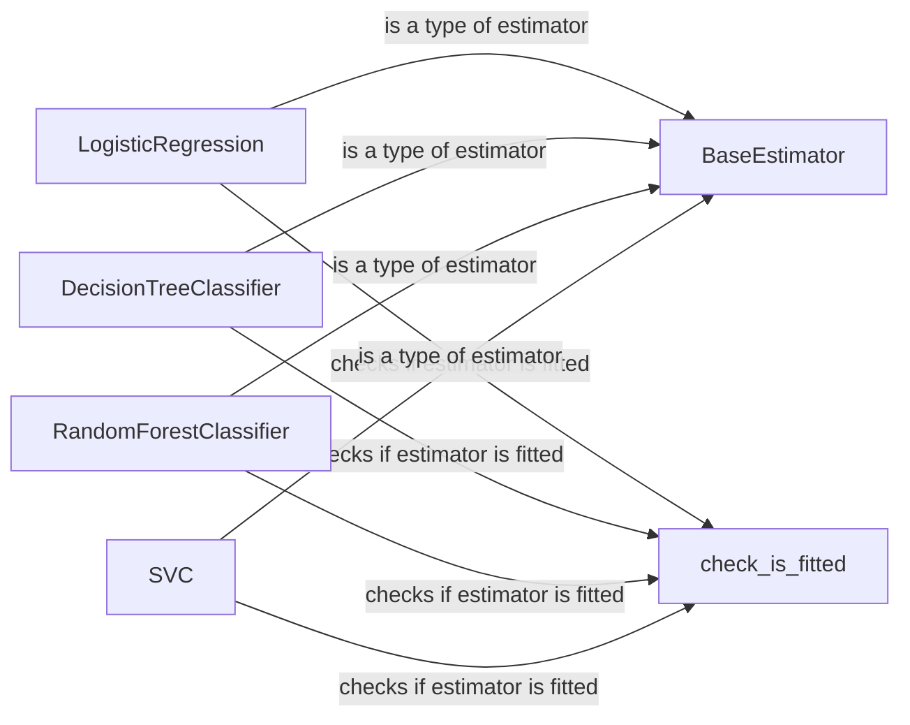

## Component Details

### BaseEstimator
The `BaseEstimator` class is the base class for all scikit-learn estimators. It provides a consistent interface for setting and getting parameters, and includes methods for cloning estimators. It ensures that all estimators have a consistent API, facilitating tasks such as model selection and hyperparameter tuning. It interacts with all the estimators.
- **Related Classes/Methods**: `sklearn.base.BaseEstimator`

### check_is_fitted
The `check_is_fitted` utility function is used to verify whether an estimator has been fitted before calling methods like `predict` or `transform`. It raises a `NotFittedError` if the estimator is not fitted, preventing common errors and ensuring that models are properly trained before making predictions. It interacts with all the estimators.
- **Related Classes/Methods**: `sklearn.utils.validation.check_is_fitted`

### LogisticRegression
The `LogisticRegression` class implements logistic regression, a linear model used for binary and multiclass classification tasks. It uses a logistic function to model the probability of a binary outcome and can be regularized to prevent overfitting. It inherits from `BaseEstimator` and uses `check_is_fitted`.
- **Related Classes/Methods**: `sklearn.linear_model._logistic.LogisticRegression`

### DecisionTreeClassifier
The `DecisionTreeClassifier` class implements a decision tree classifier, a non-parametric model that recursively splits the data based on feature values to create a tree-like structure for classification. It inherits from `BaseEstimator` and uses `check_is_fitted`.
- **Related Classes/Methods**: `sklearn.tree._classes.DecisionTreeClassifier`

### RandomForestClassifier
The `RandomForestClassifier` class implements a random forest classifier, an ensemble learning method that combines multiple decision trees to improve classification accuracy and robustness. It inherits from `BaseEstimator` and uses `check_is_fitted`.
- **Related Classes/Methods**: `sklearn.ensemble._forest.RandomForestClassifier`

### SVC
The `SVC` class implements support vector classification (SVC), a powerful classification algorithm that finds the optimal hyperplane to separate data points of different classes. It inherits from `BaseEstimator` and uses `check_is_fitted`.
- **Related Classes/Methods**: `sklearn.svm._classes.SVC`
