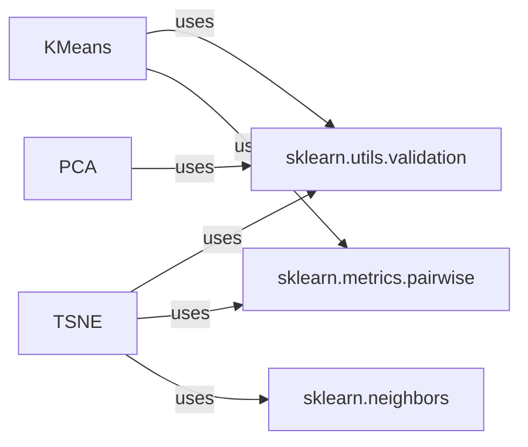

## Component Details

### KMeans
The KMeans algorithm clusters data by iteratively assigning each data point to the nearest of k cluster centers and then updating the cluster centers to be the mean of the points assigned to them. It relies on distance calculations and validation of input data.
- **Related Classes/Methods**: `sklearn.cluster._kmeans.KMeans`

### TSNE
TSNE is a dimensionality reduction technique that focuses on preserving the local structure of high-dimensional data when mapping it to a lower-dimensional space, making it suitable for visualization. It involves calculating pairwise similarities, handling nearest neighbors, and validating input data.
- **Related Classes/Methods**: `sklearn.manifold._t_sne.TSNE`

### PCA
PCA is a dimensionality reduction technique that identifies the principal components of the data, which are orthogonal directions that capture the maximum variance. It is used to reduce the number of features while retaining the most important information. It relies on linear algebra and input data validation.
- **Related Classes/Methods**: `sklearn.decomposition._pca.PCA`

### sklearn.utils.validation
This module provides functions for validating input data to ensure it meets the requirements of the algorithms. It includes checks for data type, shape, and missing values.
- **Related Classes/Methods**: `sklearn.utils.validation`

### sklearn.metrics.pairwise
This module provides functions for calculating pairwise distances and kernels between data points, which are used by many unsupervised learning algorithms.
- **Related Classes/Methods**: `sklearn.metrics.pairwise`

### sklearn.neighbors
This module provides unsupervised nearest neighbors learning. Used in manifold and clustering algorithms.
- **Related Classes/Methods**: `sklearn.neighbors`
