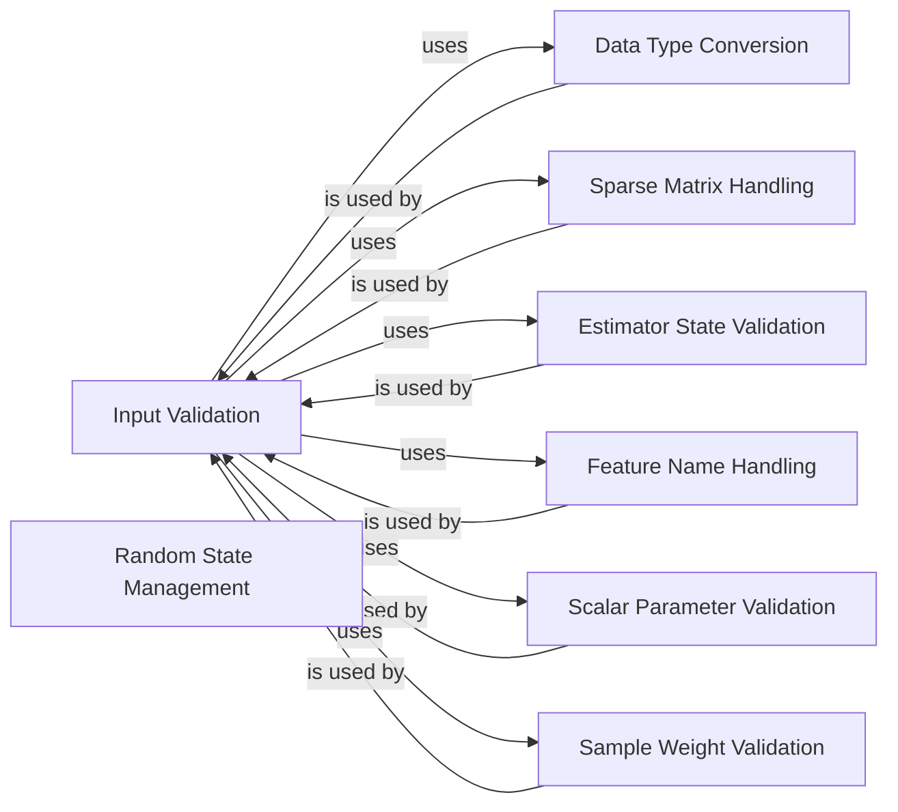

## Component Details

### Input Validation
This component focuses on validating the input data provided to scikit-learn estimators. It includes functions to check data types, shapes, and finiteness, ensuring that the data is in the expected format before being used by other parts of the library. It also handles the conversion of various input types (e.g., lists, dataframes, sparse matrices) into NumPy arrays.
- **Related Classes/Methods**: `sklearn.utils.validation.check_array`, `sklearn.utils.validation.check_X_y`, `sklearn.utils.validation.validate_data`

### Data Type Conversion
This component provides functions for converting data to specific types, such as float arrays. It ensures that the data is in the appropriate format for numerical computations within scikit-learn. It also handles the conversion of pandas extension arrays to NumPy arrays.
- **Related Classes/Methods**: `sklearn.utils.validation.as_float_array`, `sklearn.utils.validation._to_object_array`

### Sparse Matrix Handling
This component deals with the validation and conversion of sparse matrices. It ensures that sparse matrices are in the correct format (e.g., CSR, CSC) and that their indices are of the appropriate type. It also provides utilities for checking the finiteness of sparse matrix data.
- **Related Classes/Methods**: `sklearn.utils.validation._ensure_sparse_format`, `sklearn.utils.validation._check_large_sparse`

### Estimator State Validation
This component provides functions for checking whether an estimator is fitted, i.e., whether it has been trained on data. It verifies the presence of fitted attributes (ending with a trailing underscore) and raises an error if the estimator is not fitted.
- **Related Classes/Methods**: `sklearn.utils.validation.check_is_fitted`, `sklearn.utils.validation._is_fitted`

### Random State Management
This component provides a function for managing random state, allowing for reproducible results in scikit-learn. It converts a seed into a NumPy RandomState instance.
- **Related Classes/Methods**: `sklearn.utils.validation.check_random_state`

### Feature Name Handling
This component provides utilities for handling feature names, including extracting feature names from data structures like Pandas DataFrames and validating input feature names against fitted feature names.
- **Related Classes/Methods**: `sklearn.utils.validation._get_feature_names`, `sklearn.utils.validation._check_feature_names_in`, `sklearn.utils.validation._check_feature_names`

### Scalar Parameter Validation
This component provides utilities for validating scalar parameters, including checking their type and value against specified bounds.
- **Related Classes/Methods**: `sklearn.utils.validation.check_scalar`

### Sample Weight Validation
This component provides utilities for validating sample weights, ensuring that they are in the correct format and non-negative if required.
- **Related Classes/Methods**: `sklearn.utils.validation._check_sample_weight`
