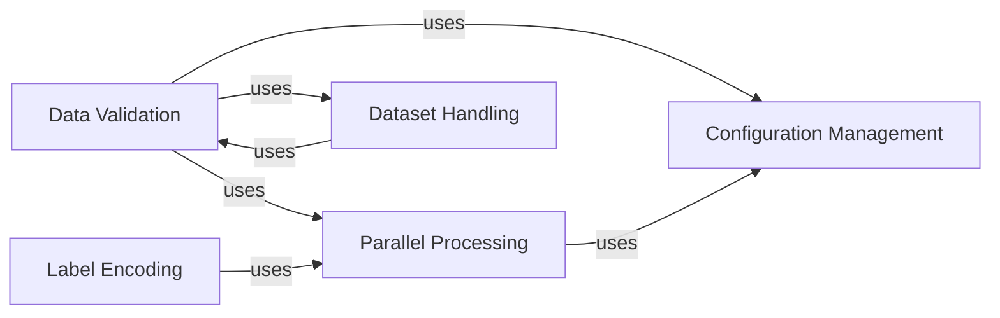

## Component Details

The Utilities and Helper Functions component provides a collection of essential tools and functionalities that support various aspects of the scikit-learn library. It encompasses data validation, parallel processing, configuration management, and dataset handling. These utilities ensure data integrity, efficient computation, consistent configuration, and easy access to datasets, contributing to the overall robustness and usability of scikit-learn.

### Data Validation
This component focuses on validating input data to ensure it meets the requirements of scikit-learn's algorithms. It includes functions for checking data types, array shapes, finite values, and other common validation tasks. By ensuring data quality, this component helps prevent errors and improves the reliability of machine learning models.
**Related Classes/Methods**:

- <a href="https://github.com/scikit-learn/scikit-learn/blob/master/sklearn/utils/validation.py#LNone-LNone" target="_blank" rel="noopener noreferrer">`sklearn.utils.validation` (full file reference)</a>
- <a href="https://github.com/scikit-learn/scikit-learn/blob/master/sklearn/utils/validation.py#L734-L1176" target="_blank" rel="noopener noreferrer">`sklearn.utils.validation:check_array` (734:1176)</a>
- <a href="https://github.com/scikit-learn/scikit-learn/blob/master/sklearn/utils/validation.py#L1201-L1389" target="_blank" rel="noopener noreferrer">`sklearn.utils.validation:check_X_y` (1201:1389)</a>
- <a href="https://github.com/scikit-learn/scikit-learn/blob/master/sklearn/utils/validation.py#L172-L215" target="_blank" rel="noopener noreferrer">`sklearn.utils.validation:assert_all_finite` (172:215)</a>

### Parallel Processing
This component provides utilities for parallelizing computations in scikit-learn. It includes the `Parallel` class, which allows for running tasks in parallel using multiple processes or threads, and the `delayed` function, which is used to wrap functions for parallel execution. By leveraging parallel processing, this component can significantly reduce the execution time of computationally intensive tasks.
**Related Classes/Methods**:

- <a href="https://github.com/scikit-learn/scikit-learn/blob/master/sklearn/utils/parallel.py#LNone-LNone" target="_blank" rel="noopener noreferrer">`sklearn.utils.parallel` (full file reference)</a>
- <a href="https://github.com/scikit-learn/scikit-learn/blob/master/sklearn/utils/parallel.py#L54-L82" target="_blank" rel="noopener noreferrer">`sklearn.utils.parallel.Parallel:__call__` (54:82)</a>
- <a href="https://github.com/scikit-learn/scikit-learn/blob/master/sklearn/utils/parallel.py#L86-L116" target="_blank" rel="noopener noreferrer">`sklearn.utils.parallel:delayed` (86:116)</a>

### Configuration Management
This component handles global configuration options for scikit-learn, such as the number of threads to use for parallel processing. It provides functions to get and set configuration values, as well as a context manager for temporarily changing configuration within a specific block of code. This component allows users to customize the behavior of scikit-learn to suit their specific needs.
**Related Classes/Methods**:

- <a href="https://github.com/scikit-learn/scikit-learn/blob/master/sklearn/_config.py#LNone-LNone" target="_blank" rel="noopener noreferrer">`sklearn._config` (full file reference)</a>
- <a href="https://github.com/scikit-learn/scikit-learn/blob/master/sklearn/_config.py#L35-L57" target="_blank" rel="noopener noreferrer">`sklearn._config:get_config` (35:57)</a>
- <a href="https://github.com/scikit-learn/scikit-learn/blob/master/sklearn/_config.py#L60-L211" target="_blank" rel="noopener noreferrer">`sklearn._config:set_config` (60:211)</a>
- <a href="https://github.com/scikit-learn/scikit-learn/blob/master/sklearn/_config.py#L215-L376" target="_blank" rel="noopener noreferrer">`sklearn._config:config_context` (215:376)</a>

### Dataset Handling
This component provides base classes and utility functions for loading datasets in scikit-learn. It includes functions for managing the data cache directory and loading data from various sources. This component simplifies the process of accessing and using datasets for machine learning tasks.
**Related Classes/Methods**:

- <a href="https://github.com/scikit-learn/scikit-learn/blob/master/sklearn/datasets/_base.py#LNone-LNone" target="_blank" rel="noopener noreferrer">`sklearn.datasets._base` (full file reference)</a>
- <a href="https://github.com/scikit-learn/scikit-learn/blob/master/sklearn/datasets/_base.py#L95-L110" target="_blank" rel="noopener noreferrer">`sklearn.datasets._base:clear_data_home` (95:110)</a>
- <a href="https://github.com/scikit-learn/scikit-learn/blob/master/sklearn/datasets/_arff_parser.py#LNone-LNone" target="_blank" rel="noopener noreferrer">`sklearn.datasets` (full file reference)</a>

### Label Encoding
This component provides utilities for label encoding and binarization, which are essential for handling categorical data in machine learning tasks. It includes classes like `LabelBinarizer` and `LabelEncoder` that transform categorical labels into numerical representations suitable for use in algorithms.
**Related Classes/Methods**:

- <a href="https://github.com/scikit-learn/scikit-learn/blob/master/sklearn/preprocessing/_label.py#LNone-LNone" target="_blank" rel="noopener noreferrer">`sklearn.preprocessing._label` (full file reference)</a>
- <a href="https://github.com/scikit-learn/scikit-learn/blob/master/sklearn/preprocessing/_label.py#L174-L426" target="_blank" rel="noopener noreferrer">`sklearn.preprocessing._label.LabelBinarizer` (174:426)</a>
- <a href="https://github.com/scikit-learn/scikit-learn/blob/master/sklearn/preprocessing/_label.py#L30-L171" target="_blank" rel="noopener noreferrer">`sklearn.preprocessing._label.LabelEncoder` (30:171)</a>