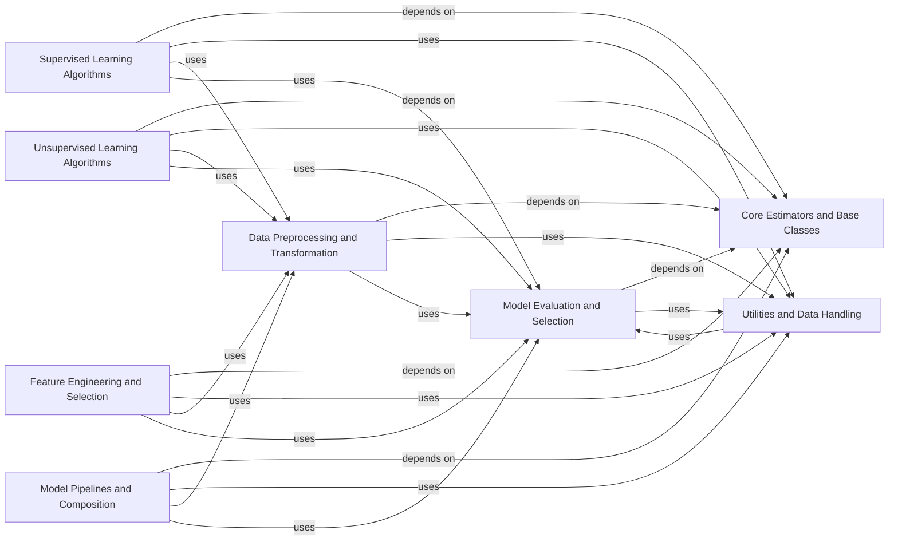

## Component Details

### Core Estimators and Base Classes
This component defines the fundamental building blocks for all machine learning models in scikit-learn. It includes the `BaseEstimator` class, which provides the basic interface for all estimators, as well as mixin classes like `ClassifierMixin`, `RegressorMixin`, and `TransformerMixin` that add specific functionalities. It also provides utilities for parameter management and model cloning, ensuring consistency and interoperability across different models.
- **Related Classes/Methods**: `sklearn.base.BaseEstimator`, `sklearn.base.ClassifierMixin`, `sklearn.base.RegressorMixin`, `sklearn.base.TransformerMixin`

### Model Evaluation and Selection
This component provides tools for evaluating the performance of machine learning models and selecting the best model for a given task. It includes functions for calculating various metrics, such as accuracy, precision, recall, and F1-score, as well as classes for cross-validation and hyperparameter tuning. The `sklearn.metrics` module contains metric functions, while `sklearn.model_selection` offers tools for splitting data, performing cross-validation, and searching for optimal hyperparameters. This component is crucial for ensuring the reliability and generalizability of machine learning models.
- **Related Classes/Methods**: `sklearn.metrics`, `sklearn.model_selection`, `sklearn.metrics._scorer`, `sklearn.model_selection._validation`

### Data Preprocessing and Transformation
This component offers a comprehensive suite of tools for preparing raw data for machine learning models. It includes classes for scaling, normalizing, encoding categorical features, and imputing missing values. The `sklearn.preprocessing` module provides classes like `StandardScaler`, `MinMaxScaler`, and `OneHotEncoder`, while `sklearn.impute` offers classes for handling missing data. Proper data preprocessing is essential for improving model accuracy and robustness.
- **Related Classes/Methods**: `sklearn.preprocessing`, `sklearn.impute`, `sklearn.preprocessing._data`, `sklearn.impute._base`, `sklearn.preprocessing._encoders`

### Supervised Learning Algorithms
This component encompasses a wide range of supervised learning algorithms for both classification and regression tasks. It includes linear models (e.g., linear regression, logistic regression), tree-based models (e.g., decision trees, random forests), and support vector machines (SVMs). The `sklearn.linear_model`, `sklearn.tree`, `sklearn.ensemble`, and `sklearn.svm` modules provide implementations of these algorithms. These algorithms learn from labeled data to make predictions on new, unseen data.
- **Related Classes/Methods**: `sklearn.linear_model`, `sklearn.tree`, `sklearn.ensemble`, `sklearn.svm`

### Unsupervised Learning Algorithms
This component provides algorithms for discovering patterns and structures in unlabeled data. It includes clustering algorithms (e.g., KMeans, DBSCAN), dimensionality reduction techniques (e.g., PCA, NMF), and manifold learning methods. The `sklearn.cluster` and `sklearn.decomposition` modules offer implementations of these algorithms. These algorithms enable users to gain insights from data without explicit labels.
- **Related Classes/Methods**: `sklearn.cluster`, `sklearn.decomposition`

### Feature Engineering and Selection
This component provides tools for selecting the most relevant features from a dataset and constructing new features from existing ones. It includes classes for univariate feature selection, model-based feature selection, and feature extraction. The `sklearn.feature_selection` module offers classes like `SelectKBest` and `SelectFromModel`, while `sklearn.preprocessing` includes feature transformation techniques. Effective feature engineering and selection can significantly improve model performance and interpretability.
- **Related Classes/Methods**: `sklearn.feature_selection`, `sklearn.preprocessing`

### Model Pipelines and Composition
This component provides tools for chaining multiple estimators into a single composite estimator. It includes the `Pipeline` class, which allows users to define a sequence of transformations and a final estimator. The `sklearn.pipeline` module provides the `Pipeline` class. This simplifies the workflow of building complex models by combining multiple steps into a single object, promoting code reusability and maintainability.
- **Related Classes/Methods**: `sklearn.pipeline`, `sklearn.compose`

### Utilities and Data Handling
This component provides a collection of utility functions and classes for various tasks, such as data validation, parallel processing, and mathematical operations. It includes functions for checking data types, validating input, and performing common mathematical calculations. The `sklearn.utils` module offers a variety of utility functions. This component supports the other components by providing necessary functionalities and ensuring data integrity.
- **Related Classes/Methods**: `sklearn.utils`, `sklearn.utils.validation`, `sklearn.utils.extmath`, `sklearn.utils.parallel`