```mermaid
graph LR
    Data_Management["Data Management"]
    Feature_Engineering_and_Extraction["Feature Engineering and Extraction"]
    Core_Model_Training_and_Prediction["Core Model Training and Prediction"]
    Model_Evaluation_and_Selection["Model Evaluation and Selection"]
    Model_Deployment_and_Pipelines["Model Deployment and Pipelines"]
    Utilities_and_Support_Infrastructure["Utilities and Support Infrastructure"]
    Data_Management -- "prepares data for" --> Feature_Engineering_and_Extraction
    Feature_Engineering_and_Extraction -- "transforms data for" --> Core_Model_Training_and_Prediction
    Core_Model_Training_and_Prediction -- "trains and predicts using" --> Model_Evaluation_and_Selection
    Model_Evaluation_and_Selection -- "evaluates and selects models for" --> Model_Deployment_and_Pipelines
    Model_Deployment_and_Pipelines -- "composes models using" --> Core_Model_Training_and_Prediction
    Utilities_and_Support_Infrastructure -- "provides utilities for" --> Data_Management
    Utilities_and_Support_Infrastructure -- "provides utilities for" --> Feature_Engineering_and_Extraction
    Utilities_and_Support_Infrastructure -- "provides utilities for" --> Core_Model_Training_and_Prediction
    Utilities_and_Support_Infrastructure -- "provides utilities for" --> Model_Evaluation_and_Selection
    Utilities_and_Support_Infrastructure -- "provides utilities for" --> Model_Deployment_and_Pipelines
    click Data_Management href "https://github.com/CodeBoarding/GeneratedOnBoardings/blob/main/scikit-learn/Data Management.md" "Details"
    click Feature_Engineering_and_Extraction href "https://github.com/CodeBoarding/GeneratedOnBoardings/blob/main/scikit-learn/Feature Engineering and Extraction.md" "Details"
    click Core_Model_Training_and_Prediction href "https://github.com/CodeBoarding/GeneratedOnBoardings/blob/main/scikit-learn/Core Model Training and Prediction.md" "Details"
    click Model_Evaluation_and_Selection href "https://github.com/CodeBoarding/GeneratedOnBoardings/blob/main/scikit-learn/Model Evaluation and Selection.md" "Details"
    click Model_Deployment_and_Pipelines href "https://github.com/CodeBoarding/GeneratedOnBoardings/blob/main/scikit-learn/Model Deployment and Pipelines.md" "Details"
    click Utilities_and_Support_Infrastructure href "https://github.com/CodeBoarding/GeneratedOnBoardings/blob/main/scikit-learn/Utilities and Support Infrastructure.md" "Details"
```

## Component Details

Scikit-learn is a comprehensive machine learning library that provides a wide range of tools and algorithms for various tasks, including data preprocessing, feature engineering, model training, evaluation, and selection. The library is designed to be user-friendly and efficient, enabling users to easily build and deploy machine learning models. The core flow involves ingesting and preparing data, extracting relevant features, training a model on the prepared data, evaluating its performance, and selecting the best model for the task. Pipelines streamline this process by chaining multiple steps together.

### Data Management
This component focuses on handling the data lifecycle, from initial loading and preprocessing to splitting and managing datasets. It encompasses functionalities for data cleaning, handling missing values, and preparing data for subsequent feature engineering and model training steps. It also includes utilities for generating synthetic datasets and loading data from various file formats.
- **Related Classes/Methods**: `sklearn.datasets._base`, `sklearn.datasets._samples_generator`, `sklearn.datasets._svmlight_format_io`, `sklearn.model_selection._split`, `sklearn.utils.validation`

### Feature Engineering and Extraction
This component is responsible for transforming raw data into a suitable feature representation for machine learning models. It includes techniques for feature extraction, selection, and dimensionality reduction. It encompasses scaling numerical features, encoding categorical features, handling text data, and applying dimensionality reduction techniques like PCA.
- **Related Classes/Methods**: `sklearn.preprocessing._data`, `sklearn.preprocessing._encoders`, `sklearn.feature_extraction.text`, `sklearn.feature_selection._univariate_selection`, `sklearn.decomposition._pca`

### Core Model Training and Prediction
This component houses the core machine learning algorithms for classification, regression, and clustering. It includes a wide range of estimators, such as linear models, tree-based models, and neural networks, along with their associated fit and predict methods. It is responsible for learning patterns from the training data and making predictions on new, unseen data.
- **Related Classes/Methods**: `sklearn.linear_model`, `sklearn.tree`, `sklearn.ensemble`, `sklearn.svm`, `sklearn.neighbors`, `sklearn.neural_network`, `sklearn.cluster`

### Model Evaluation and Selection
This component provides the tools and metrics necessary to evaluate the performance of trained machine learning models. It includes functions for calculating classification, regression, and clustering metrics, as well as techniques for cross-validation, hyperparameter tuning, and model selection. The goal is to identify the best model and optimize its parameters for the specific task at hand.
- **Related Classes/Methods**: `sklearn.metrics._classification`, `sklearn.metrics._regression`, `sklearn.model_selection._search`, `sklearn.model_selection._validation`

### Model Deployment and Pipelines
This component focuses on streamlining the deployment process by providing tools for constructing pipelines that chain multiple estimators together. It simplifies the workflow of applying a sequence of transformations and a final estimator. It enables the composition of different steps into a single, deployable model, facilitating reproducibility and ease of use.
- **Related Classes/Methods**: `sklearn.pipeline.Pipeline`, `sklearn.pipeline.FeatureUnion`, `sklearn.compose._column_transformer`

### Utilities and Support Infrastructure
This component provides a collection of utility functions and helper classes that are used throughout the scikit-learn library. It includes tools for data validation, parameter validation, and parallel processing, ensuring the robustness and efficiency of the other components. It provides common functionalities used by other components.
- **Related Classes/Methods**: `sklearn.utils.validation`, `sklearn.utils.parallel`, `sklearn.utils._param_validation`