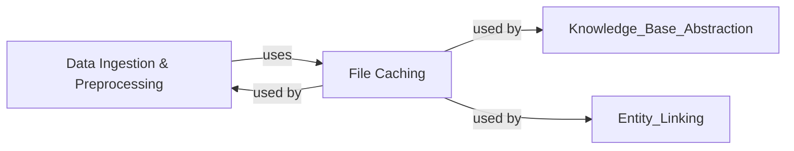

## Details

This subsystem provides the foundational capabilities for managing and accessing data and models within `scispacy`. It ensures efficient data handling, from parsing raw biomedical datasets to intelligently caching large files, which is critical for performance and usability in a biomedical NLP context.

### Data Ingestion & Preprocessing
This component is responsible for the intricate process of reading, parsing, and initially cleaning various biomedical datasets, such as MedMentions and NER annotations from TSV files. It encapsulates functionalities for iterating through examples, resolving entity overlaps, and performing sentence-level processing, ensuring data is in a suitable format for downstream NLP tasks.

**Related Classes/Methods**:

- <a href="https://github.com/allenai/scispacy/blob/main/scispacy/data_util.py#L1-L1" target="_blank" rel="noopener noreferrer">`scispacy/data_util.py` (1:1)</a>

### File Caching
This component provides a robust and efficient mechanism for managing local and remote files. Its primary purpose is to cache downloaded resources, such as large pre-trained models, knowledge base dumps, and other data files, to local storage. This prevents redundant downloads, significantly speeds up data access, and reduces network dependency, which is crucial for large biomedical datasets and models.

**Related Classes/Methods**:

- <a href="https://github.com/allenai/scispacy/blob/main/scispacy/file_cache.py#L1-L1" target="_blank" rel="noopener noreferrer">`scispacy/file_cache.py` (1:1)</a>

### [FAQ](https://github.com/CodeBoarding/GeneratedOnBoardings/tree/main?tab=readme-ov-file#faq)