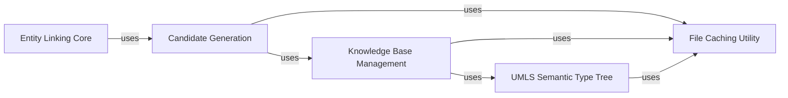

## Details

The `Entity Linking` subsystem is a critical part of `scispacy`, designed to identify and link detected entities in text to canonical concepts within biomedical knowledge bases. It adheres to the NLP Library/Framework Extension pattern, integrating seamlessly with spaCy pipelines. Its modular design emphasizes clear separation of concerns, allowing for flexible knowledge base integration and efficient candidate generation.

### Entity Linking Core
This is the primary interface for the entity linking process. It takes a spaCy `Doc` object, identifies relevant text spans (entities), and orchestrates the lookup and disambiguation against a specified knowledge base. It acts as the high-level coordinator, leveraging the `Candidate Generation` component to find potential matches.

**Related Classes/Methods**:

- `Entity Linking Core`

### Candidate Generation
Responsible for efficiently generating a set of potential candidate entities from a knowledge base for a given text span. It employs Approximate Nearest Neighbors (ANN) algorithms, typically on TF-IDF vectors, to quickly narrow down the vast number of possible concepts to a manageable set of candidates, significantly improving performance.

**Related Classes/Methods**:

- `Candidate Generation`

### Knowledge Base Management [[Expand]](./Knowledge_Base_Management.md)
This component provides an abstract interface (`KnowledgeBase`) and concrete implementations for loading, managing, and querying various biomedical knowledge bases (e.g., UMLS, Mesh, Gene Ontology, HPO, RxNorm). It handles the parsing, storage, and retrieval of knowledge base data, acting as the central repository for concept information.

**Related Classes/Methods**:

- `Knowledge Base Management`

### UMLS Semantic Type Tree
A specialized component specifically designed to handle the hierarchical structure and relationships of UMLS semantic types. It allows for more nuanced filtering and understanding of UMLS concepts based on their semantic categories, which is crucial for precise biomedical entity linking, especially when working with the UMLS knowledge base.

**Related Classes/Methods**:

- `UMLS Semantic Type Tree`

### File Caching Utility
This utility component manages the caching of external files, such as large knowledge base dumps, pre-trained models, or ANN indices. It ensures that these resources are downloaded and stored locally only once, improving performance and reducing network overhead for subsequent runs.

**Related Classes/Methods**:

- `File Caching Utility`

### [FAQ](https://github.com/CodeBoarding/GeneratedOnBoardings/tree/main?tab=readme-ov-file#faq)