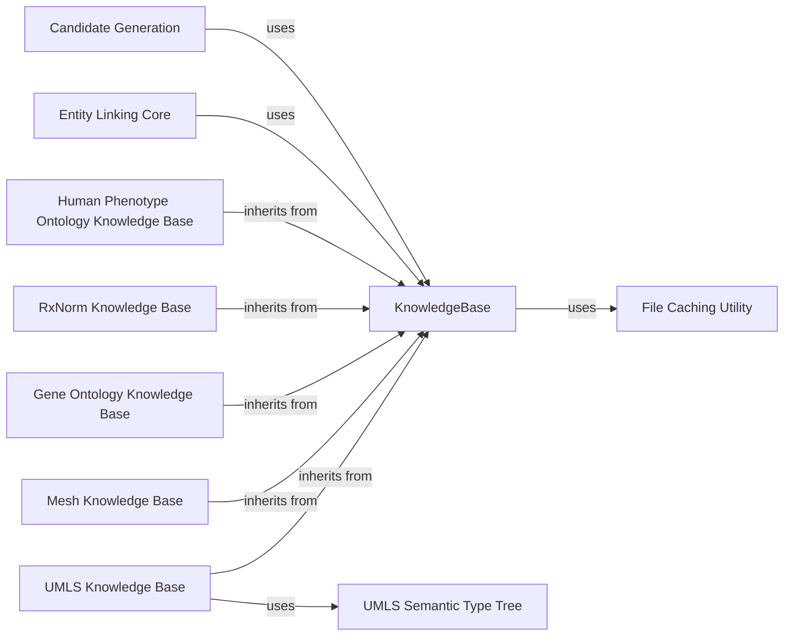

## Details

The `Knowledge Base Management` component provides a unified and extensible interface for loading, managing, and querying various biomedical knowledge bases (e.g., UMLS, Mesh, Gene Ontology, RxNorm, Human Phenotype Ontology). It defines an abstract `KnowledgeBase` interface and concrete implementations for each specific knowledge base, handling the parsing, storage, and retrieval of their respective data. It also integrates with the `File Caching Utility` for efficient resource management and leverages the `UMLS Semantic Type Tree` for specialized handling of UMLS semantic types and their hierarchical relationships.

### KnowledgeBase
Defines the fundamental structure and methods for loading and accessing biomedical knowledge base data. It provides a generic way to map concept IDs to detailed entity information and aliases to concept IDs.

**Related Classes/Methods**:

- `KnowledgeBase` (1:1)

### UMLS Knowledge Base
A concrete implementation of `KnowledgeBase` specifically for the UMLS Metathesaurus. It handles the loading and parsing of UMLS data and integrates the `UMLS Semantic Type Tree` for managing semantic type hierarchies.

**Related Classes/Methods**:

- `UmlsKnowledgeBase` (1:1)

### Mesh Knowledge Base
A concrete implementation of `KnowledgeBase` for the Medical Subject Headings (MeSH) knowledge base. It loads and provides access to MeSH concepts and their associated information.

**Related Classes/Methods**:

- `Mesh` (1:1)

### Gene Ontology Knowledge Base
A concrete implementation of `KnowledgeBase` for the Gene Ontology (GO). It provides access to GO terms, which describe gene product functions, cellular components, and biological processes.

**Related Classes/Methods**:

- `GeneOntology` (1:1)

### RxNorm Knowledge Base
A concrete implementation of `KnowledgeBase` for RxNorm, a standardized nomenclature for clinical drugs. It enables linking to drug concepts.

**Related Classes/Methods**:

- `RxNorm` (1:1)

### Human Phenotype Ontology Knowledge Base
A concrete implementation of `KnowledgeBase` for the Human Phenotype Ontology (HPO). It provides terms describing phenotypic abnormalities encountered in human disease.

**Related Classes/Methods**:

- `HumanPhenotypeOntology` (1:1)

### UMLS Semantic Type Tree
A specialized utility for managing and navigating the hierarchical structure of UMLS semantic types. It allows for querying relationships between semantic types (e.g., parent-child, depth) and collapsing the hierarchy to a coarser level.

**Related Classes/Methods**:

- <a href="https://github.com/allenai/scispacy/blob/main/scispacy/umls_semantic_type_tree.py#L13-L78" target="_blank" rel="noopener noreferrer">`UmlsSemanticTypeTree` (13:78)</a>

### File Caching Utility
Manages the downloading and local caching of large external files, such as knowledge base dumps. It ensures that these resources are retrieved only once, improving performance and reducing network overhead.

**Related Classes/Methods**:

- `cached_path` (1:1)

### Entity Linking Core
A core component for entity linking.

**Related Classes/Methods**: _None_

### Candidate Generation
A component for generating candidate entities.

**Related Classes/Methods**: _None_

### [FAQ](https://github.com/CodeBoarding/GeneratedOnBoardings/tree/main?tab=readme-ov-file#faq)