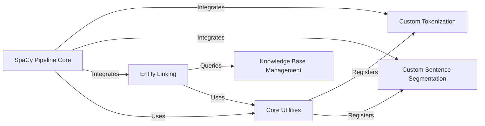

## Details

Component overview for `SpaCy Pipeline Core`, detailing its structure, flow, and purpose within the `scispacy` project.

### SpaCy Pipeline Core [[Expand]](./SpaCy_Pipeline_Core.md)
The primary entry point for constructing and configuring a spaCy `Language` object with `scispacy`'s biomedical NLP capabilities. It orchestrates the loading of pre-trained models, integrates custom tokenizers, sentence segmenters, and other specialized components (like entity linkers) into the spaCy processing pipeline. It ensures a coherent and extensible text processing workflow tailored for biomedical text.

**Related Classes/Methods**:

- `scispacy.load` (1:1)
- `scispacy.pipeline` (1:1)

### Knowledge Base Management [[Expand]](./Knowledge_Base_Management.md)
Manages the loading, access, and querying of various biomedical knowledge bases (e.g., UMLS, MeSH, GO, RxNorm). It provides the underlying data structures and methods for efficient lookup and retrieval of concepts, which are crucial for entity linking and semantic understanding in the biomedical domain.

**Related Classes/Methods**:

- <a href="https://github.com/allenai/scispacy/blob/main/scispacy/linking_utils.py#L40-L76" target="_blank" rel="noopener noreferrer">`scispacy.linking_utils.KnowledgeBase` (40:76)</a>

### Entity Linking [[Expand]](./Entity_Linking.md)
Responsible for identifying mentions of biomedical entities in text and linking them to concepts within the integrated knowledge bases. This involves candidate generation, disambiguation, and scoring to find the most appropriate concept for a given text span.

**Related Classes/Methods**:

- <a href="https://github.com/allenai/scispacy/blob/main/scispacy/linking.py#L9-L130" target="_blank" rel="noopener noreferrer">`scispacy.linking.EntityLinker` (9:130)</a>
- <a href="https://github.com/allenai/scispacy/blob/main/scispacy/candidate_generation.py#L148-L361" target="_blank" rel="noopener noreferrer">`scispacy.candidate_generation.CandidateGenerator` (148:361)</a>

### Custom Tokenization
Provides specialized tokenization rules and logic tailored for biomedical text. It handles domain-specific challenges such as chemical formulas, gene names, and medical abbreviations, ensuring accurate tokenization before further NLP processing.

**Related Classes/Methods**:

- <a href="https://github.com/allenai/scispacy/blob/main/scispacy/custom_tokenizer.py#L1-L1" target="_blank" rel="noopener noreferrer">`scispacy.custom_tokenizer` (1:1)</a>

### Custom Sentence Segmentation
Implements custom sentence boundary detection rules optimized for biomedical literature. It addresses the complexities of sentence structures in scientific texts, which often differ from general English, to ensure accurate segmentation for downstream tasks.

**Related Classes/Methods**:

- <a href="https://github.com/allenai/scispacy/blob/main/scispacy/custom_sentence_segmenter.py#L1-L1" target="_blank" rel="noopener noreferrer">`scispacy.custom_sentence_segmenter` (1:1)</a>

### Core Utilities
Provides a collection of general utility functions that support the integration and functionality of various `scispacy` components within the spaCy pipeline. It acts as an intermediary, bringing together functionalities like custom tokenization and sentence segmentation for use in the main pipeline, and handling common helper tasks.

**Related Classes/Methods**:

- <a href="https://github.com/allenai/scispacy/blob/main/scispacy/util.py#L1-L1" target="_blank" rel="noopener noreferrer">`scispacy.util` (1:1)</a>

### [FAQ](https://github.com/CodeBoarding/GeneratedOnBoardings/tree/main?tab=readme-ov-file#faq)