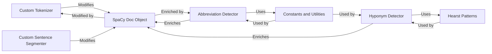

## Details

This component is responsible for specialized text preparation and enrichment within the spaCy pipeline, tailored for the biomedical domain. It includes custom tokenization rules to handle domain-specific terms, abbreviation detection for expanding or normalizing abbreviations, and hyponym identification to enrich the Doc object with hierarchical semantic relationships. It also encompasses custom sentence segmentation to accurately delineate sentences in biomedical text. These functionalities collectively enhance the Doc object with richer biomedical insights before further analysis.

### Custom Tokenizer
Implements domain-specific tokenization rules to accurately segment biomedical text, handling unique terms, symbols, and structures not typically covered by standard spaCy tokenizers.

**Related Classes/Methods**:

- <a href="https://github.com/allenai/scispacy/blob/main/scispacy/custom_tokenizer.py#L1-L100" target="_blank" rel="noopener noreferrer">`scispacy/custom_tokenizer.py` (1:100)</a>

### Abbreviation Detector
Identifies and resolves abbreviations within the text, linking them to their long-form definitions. This enriches the Doc object with normalized forms, crucial for consistent information extraction and analysis.

**Related Classes/Methods**:

- <a href="https://github.com/allenai/scispacy/blob/main/scispacy/abbreviation.py#L1-L100" target="_blank" rel="noopener noreferrer">`scispacy/abbreviation.py` (1:100)</a>

### Hyponym Detector
Utilizes linguistic patterns (e.g., Hearst patterns) to identify hyponym-hypernym relationships within the text, enriching the Doc object with semantic hierarchies.

**Related Classes/Methods**:

- <a href="https://github.com/allenai/scispacy/blob/main/scispacy/hyponym_detector.py#L1-L100" target="_blank" rel="noopener noreferrer">`scispacy/hyponym_detector.py` (1:100)</a>

### Custom Sentence Segmenter
Provides specialized rules for accurate sentence boundary detection in biomedical texts, which often contain complex sentence structures, lists, and abbreviations that can confuse standard segmenters.

**Related Classes/Methods**:

- <a href="https://github.com/allenai/scispacy/blob/main/scispacy/custom_sentence_segmenter.py#L1-L100" target="_blank" rel="noopener noreferrer">`scispacy/custom_sentence_segmenter.py` (1:100)</a>

### SpaCy Doc Object
The central data structure in spaCy that holds all processed text, tokens, annotations (like POS tags, NER, dependencies), and custom attributes. It is continuously enriched and modified by the preprocessing and augmentation components.

**Related Classes/Methods**:

- `spacy.tokens.doc.Doc` (1:100)

### Constants and Utilities
A module containing shared constants, helper functions, and utility classes used across various components, providing foundational data and common functionalities.

**Related Classes/Methods**:

- <a href="https://github.com/allenai/scispacy/blob/main/scispacy/consts.py#L1-L100" target="_blank" rel="noopener noreferrer">`scispacy/consts.py` (1:100)</a>

### Hearst Patterns
A collection of linguistic patterns (e.g., "X such as Y", "Y and other X") specifically designed to identify hyponym-hypernym relationships in text.

**Related Classes/Methods**:

- <a href="https://github.com/allenai/scispacy/blob/main/scispacy/hearst_patterns.py#L1-L100" target="_blank" rel="noopener noreferrer">`scispacy/hearst_patterns.py` (1:100)</a>

### [FAQ](https://github.com/CodeBoarding/GeneratedOnBoardings/tree/main?tab=readme-ov-file#faq)