```mermaid
graph LR
    SpaCy_Pipeline_Core["SpaCy Pipeline Core"]
    Text_Preprocessing_Augmentation["Text Preprocessing & Augmentation"]
    Knowledge_Base_Management["Knowledge Base Management"]
    Entity_Linking["Entity Linking"]
    Data_Model_Utilities["Data & Model Utilities"]
    Model_Training_Evaluation["Model Training & Evaluation"]
    SpaCy_Pipeline_Core -- "Integrates" --> Text_Preprocessing_Augmentation
    SpaCy_Pipeline_Core -- "Integrates" --> Entity_Linking
    Text_Preprocessing_Augmentation -- "Integrates into" --> SpaCy_Pipeline_Core
    Knowledge_Base_Management -- "Relies on" --> Data_Model_Utilities
    Knowledge_Base_Management -- "Provides data to" --> Entity_Linking
    Entity_Linking -- "Integrates into" --> SpaCy_Pipeline_Core
    Entity_Linking -- "Queries" --> Knowledge_Base_Management
    Data_Model_Utilities -- "Supports" --> Knowledge_Base_Management
    Data_Model_Utilities -- "Supports" --> Model_Training_Evaluation
    Model_Training_Evaluation -- "Utilizes" --> Data_Model_Utilities
    click SpaCy_Pipeline_Core href "https://github.com/CodeBoarding/GeneratedOnBoardings/blob/main/scispacy/SpaCy_Pipeline_Core.md" "Details"
    click Text_Preprocessing_Augmentation href "https://github.com/CodeBoarding/GeneratedOnBoardings/blob/main/scispacy/Text_Preprocessing_Augmentation.md" "Details"
    click Knowledge_Base_Management href "https://github.com/CodeBoarding/GeneratedOnBoardings/blob/main/scispacy/Knowledge_Base_Management.md" "Details"
    click Entity_Linking href "https://github.com/CodeBoarding/GeneratedOnBoardings/blob/main/scispacy/Entity_Linking.md" "Details"
    click Data_Model_Utilities href "https://github.com/CodeBoarding/GeneratedOnBoardings/blob/main/scispacy/Data_Model_Utilities.md" "Details"
```

## Details

The `scispacy` library, designed as an NLP Library/Framework Extension for the Biomedical Domain, exhibits a modular and pipeline-centric architecture built upon spaCy. The core data flow revolves around processing biomedical text through a series of specialized components, leveraging external knowledge bases, and providing utilities for model development.

### SpaCy Pipeline Core [[Expand]](./SpaCy_Pipeline_Core.md)
The foundational spaCy NLP processing pipeline that orchestrates the execution of various custom and standard components for biomedical text analysis. It serves as the primary integration point for all specialized `scispacy` functionalities, ensuring a sequential and extensible text processing workflow.

**Related Classes/Methods**: _None_

### Text Preprocessing & Augmentation [[Expand]](./Text_Preprocessing_Augmentation.md)
Handles domain-specific text preparation and enrichment within the spaCy pipeline. This includes specialized tokenization rules, abbreviation detection, and hyponym identification, all designed to enhance the `Doc` object with richer biomedical insights before further analysis.

**Related Classes/Methods**:

- <a href="https://github.com/allenai/scispacy/blob/main/scispacy/custom_tokenizer.py#L1-L1" target="_blank" rel="noopener noreferrer">`scispacy.custom_tokenizer` (1:1)</a>
- <a href="https://github.com/allenai/scispacy/blob/main/scispacy/abbreviation.py#L1-L1" target="_blank" rel="noopener noreferrer">`scispacy.abbreviation` (1:1)</a>
- <a href="https://github.com/allenai/scispacy/blob/main/scispacy/hyponym_detector.py#L1-L1" target="_blank" rel="noopener noreferrer">`scispacy.hyponym_detector` (1:1)</a>

### Knowledge Base Management [[Expand]](./Knowledge_Base_Management.md)
Provides a unified and extensible interface for loading, managing, and querying various biomedical knowledge bases (e.g., UMLS, Mesh, Gene Ontology, RxNorm). It also handles the hierarchical structure and relationships of UMLS semantic types, enabling efficient access to structured biomedical information.

**Related Classes/Methods**:

- <a href="https://github.com/allenai/scispacy/blob/main/scispacy/linking_utils.py#L1-L1" target="_blank" rel="noopener noreferrer">`scispacy.linking_utils` (1:1)</a>
- <a href="https://github.com/allenai/scispacy/blob/main/scispacy/umls_semantic_type_tree.py#L1-L1" target="_blank" rel="noopener noreferrer">`scispacy.umls_semantic_type_tree` (1:1)</a>

### Entity Linking [[Expand]](./Entity_Linking.md)
Identifies and links detected entities (spans) in the input text to canonical concepts within a specified biomedical knowledge base. It orchestrates the candidate generation process (often employing Approximate Nearest Neighbors algorithms) and disambiguation based on contextual information.

**Related Classes/Methods**:

- <a href="https://github.com/allenai/scispacy/blob/main/scispacy/linking.py#L1-L1" target="_blank" rel="noopener noreferrer">`scispacy.linking` (1:1)</a>
- <a href="https://github.com/allenai/scispacy/blob/main/scispacy/candidate_generation.py#L1-L1" target="_blank" rel="noopener noreferrer">`scispacy.candidate_generation` (1:1)</a>

### Data & Model Utilities [[Expand]](./Data_Model_Utilities.md)
Offers essential functionalities for handling data, including reading and parsing various biomedical datasets (e.g., MedMentions, NER annotations from TSV files). It also manages the caching of downloaded files, such as pre-trained models and large knowledge base dumps, to local storage, preventing redundant downloads and speeding up data access.

**Related Classes/Methods**:

- <a href="https://github.com/allenai/scispacy/blob/main/scispacy/data_util.py#L1-L1" target="_blank" rel="noopener noreferrer">`scispacy.data_util` (1:1)</a>
- <a href="https://github.com/allenai/scispacy/blob/main/scispacy/file_cache.py#L1-L1" target="_blank" rel="noopener noreferrer">`scispacy.file_cache` (1:1)</a>

### Model Training & Evaluation
Provides helper functions and workflows for training and evaluating spaCy models, with a particular focus on tasks like Named Entity Recognition. This includes functionalities for data preparation, model training loops, and comprehensive reporting of standard performance metrics (e.g., precision, recall, F1-score).

**Related Classes/Methods**:

- <a href="https://github.com/allenai/scispacy/blob/main/scispacy/train_utils.py#L1-L1" target="_blank" rel="noopener noreferrer">`scispacy.train_utils` (1:1)</a>
- <a href="https://github.com/allenai/scispacy/blob/main/scispacy/per_class_scorer.py#L1-L1" target="_blank" rel="noopener noreferrer">`scispacy.per_class_scorer` (1:1)</a>

### [FAQ](https://github.com/CodeBoarding/GeneratedOnBoardings/tree/main?tab=readme-ov-file#faq)