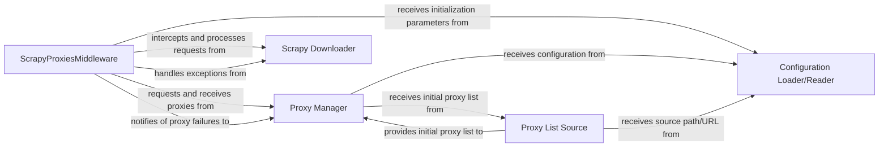

## Details

The `scrapy-proxies` subsystem integrates with the Scrapy framework to provide robust proxy management. At its core, the `ScrapyProxiesMiddleware` intercepts all outgoing requests from the `Scrapy Downloader`, dynamically assigning proxies obtained from the `Proxy Manager`. This middleware also plays a crucial role in handling proxy-related exceptions and notifying the `Proxy Manager` of failed proxies, enabling intelligent proxy rotation and blacklisting. The `Proxy Manager`, in turn, relies on the `Proxy List Source` to acquire its initial pool of proxies. All these components are initialized and configured through the `Configuration Loader/Reader`, which leverages Scrapy's standard settings mechanism to provide necessary parameters. This architecture ensures a seamless and resilient proxy integration for web scraping tasks.

### ScrapyProxiesMiddleware
The core Scrapy downloader middleware that intercepts outgoing requests, injects proxy settings, and manages proxy blacklisting and rotation by interacting with the Proxy Manager. It also handles responses and exceptions related to proxy usage.

**Related Classes/Methods**: _None_

### Proxy Manager
Manages the pool of available proxies, including their rotation strategy and blacklisting of failed proxies. It provides suitable proxies to the `ScrapyProxiesMiddleware` and receives failure notifications.

**Related Classes/Methods**: _None_

### Proxy List Source [[Expand]](./Proxy_List_Source.md)
Responsible for acquiring the initial list of proxies from a configured external source (e.g., a file or URL). It parses and prepares this raw list for use by the `Proxy Manager`.

**Related Classes/Methods**: _None_

### Configuration Loader/Reader
An implicit component representing Scrapy's settings mechanism, which reads and parses proxy-related settings from `settings.py`. It provides these settings to initialize the `ScrapyProxiesMiddleware` and the `Proxy Manager`/`Proxy List Source`.

**Related Classes/Methods**: _None_

### Scrapy Downloader
A core Scrapy framework component responsible for executing HTTP requests and receiving responses. It interacts with downloader middlewares like `ScrapyProxiesMiddleware` to process requests before sending and responses after receiving.

**Related Classes/Methods**: _None_

### [FAQ](https://github.com/CodeBoarding/GeneratedOnBoardings/tree/main?tab=readme-ov-file#faq)