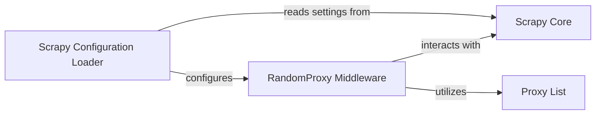

## Details

The `scrapy-proxies` library primarily functions through the `RandomProxy Middleware`. This middleware intercepts Scrapy requests, dynamically assigns proxies, and manages proxy-related failures. Its configuration is handled during initialization, where it loads settings from the Scrapy project's `settings.py` file. The middleware integrates with the core Scrapy framework by receiving a `Crawler` object, which provides access to the Scrapy engine and settings. The `Proxy List` serves as the data source for available proxies, which the middleware utilizes.

### RandomProxy Middleware
The primary component responsible for intercepting Scrapy requests, selecting a random proxy from a list, and assigning it to the request. It also handles proxy-related errors and re-tries. This component encapsulates the core logic of the `scrapy-proxies` library.

**Related Classes/Methods**:

- <a href="https://github.com/aivarsk/scrapy-proxies/blob/master/scrapy_proxies/randomproxy.py" target="_blank" rel="noopener noreferrer">`scrapy_proxies.randomproxy`</a>

### Scrapy Configuration Loader [[Expand]](./Scrapy_Configuration_Loader.md)
This component (or a distinct responsibility within `RandomProxy Middleware`) is dedicated to loading and interpreting `scrapy-proxies` specific settings (e.g., `PROXY_MODE`, `PROXY_LIST`, `PROXY_FAIL_OVER_RATIO`) from the Scrapy project's `settings.py` file during the middleware's initialization. It configures the behavior of the `RandomProxy Middleware`.

**Related Classes/Methods**:

- <a href="https://github.com/aivarsk/scrapy-proxies/blob/master/scrapy_proxies/randomproxy.py" target="_blank" rel="noopener noreferrer">`scrapy_proxies.randomproxy:__init__`</a>
- <a href="https://github.com/aivarsk/scrapy-proxies/blob/master/scrapy_proxies/randomproxy.py" target="_blank" rel="noopener noreferrer">`scrapy_proxies.randomproxy:from_crawler`</a>

### Scrapy Core
Represents the foundational Scrapy framework, providing the execution environment, request/response lifecycle management, and access to project-wide settings. The `RandomProxy Middleware` integrates with `Scrapy Core` via its middleware interface, primarily through the `scrapy.crawler.Crawler` object.

**Related Classes/Methods**:

- <a href="https://github.com/aivarsk/scrapy-proxies/blob/master/scrapy_proxies/randomproxy.py" target="_blank" rel="noopener noreferrer">`scrapy_proxies.randomproxy:from_crawler`</a>

### Proxy List
A data component representing the collection of available proxy servers. This list is consumed by the `RandomProxy Middleware` to select proxies for outgoing requests. It can be loaded from various sources (e.g., a file, a URL) as configured.

**Related Classes/Methods**:

- <a href="https://github.com/aivarsk/scrapy-proxies/blob/master/scrapy_proxies/randomproxy.py" target="_blank" rel="noopener noreferrer">`scrapy_proxies.randomproxy`</a>

### [FAQ](https://github.com/CodeBoarding/GeneratedOnBoardings/tree/main?tab=readme-ov-file#faq)