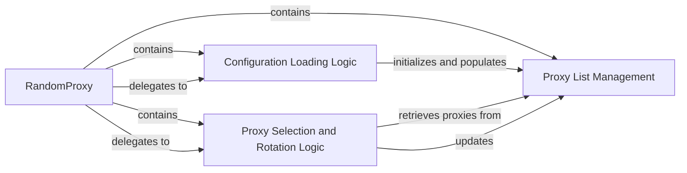

## Details

The `Scrapy Proxy Middleware (RandomProxy)` subsystem is a self-contained unit within the `scrapy-proxies` library, primarily focused on managing and rotating proxies for Scrapy requests.

### RandomProxy
The central component acting as a Scrapy downloader middleware. It intercepts requests and responses to inject proxy settings, manage proxy selection, rotation, and status tracking. It orchestrates the interactions between other internal components.

**Related Classes/Methods**:

- <a href="https://github.com/aivarsk/scrapy-proxies/blob/master/scrapy_proxies/randomproxy.py" target="_blank" rel="noopener noreferrer">`scrapy_proxies.randomproxy.RandomProxy:__init__`</a>
- <a href="https://github.com/aivarsk/scrapy-proxies/blob/master/scrapy_proxies/randomproxy.py" target="_blank" rel="noopener noreferrer">`scrapy_proxies.randomproxy.RandomProxy:from_crawler`</a>
- <a href="https://github.com/aivarsk/scrapy-proxies/blob/master/scrapy_proxies/randomproxy.py" target="_blank" rel="noopener noreferrer">`scrapy_proxies.randomproxy.RandomProxy:process_request`</a>
- <a href="https://github.com/aivarsk/scrapy-proxies/blob/master/scrapy_proxies/randomproxy.py" target="_blank" rel="noopener noreferrer">`scrapy_proxies.randomproxy.RandomProxy:process_exception`</a>

### Configuration Loading Logic
Responsible for reading and parsing proxy-related settings from Scrapy's configuration. This component ensures the middleware is initialized with the correct proxy list and operational parameters.

**Related Classes/Methods**:

- <a href="https://github.com/aivarsk/scrapy-proxies/blob/master/scrapy_proxies/randomproxy.py" target="_blank" rel="noopener noreferrer">`scrapy_proxies.randomproxy.RandomProxy:__init__`</a>
- <a href="https://github.com/aivarsk/scrapy-proxies/blob/master/scrapy_proxies/randomproxy.py" target="_blank" rel="noopener noreferrer">`scrapy_proxies.randomproxy.RandomProxy:from_crawler`</a>

### Proxy List Management
Manages the internal pool of available proxies. This component stores proxy addresses, credentials, and potentially their status (e.g., active, failed). It acts as the data repository for proxies.

**Related Classes/Methods**:

- <a href="https://github.com/aivarsk/scrapy-proxies/blob/master/scrapy_proxies/randomproxy.py" target="_blank" rel="noopener noreferrer">`scrapy_proxies.randomproxy.RandomProxy:self.proxies`</a>

### Proxy Selection and Rotation Logic
Implements the algorithms for selecting an appropriate proxy for an outgoing request and handling the rotation or removal of proxies that fail or become unresponsive. This component ensures dynamic proxy usage.

**Related Classes/Methods**:

- <a href="https://github.com/aivarsk/scrapy-proxies/blob/master/scrapy_proxies/randomproxy.py" target="_blank" rel="noopener noreferrer">`scrapy_proxies.randomproxy.RandomProxy:process_request`</a>
- <a href="https://github.com/aivarsk/scrapy-proxies/blob/master/scrapy_proxies/randomproxy.py" target="_blank" rel="noopener noreferrer">`scrapy_proxies.randomproxy.RandomProxy:process_exception`</a>

### [FAQ](https://github.com/CodeBoarding/GeneratedOnBoardings/tree/main?tab=readme-ov-file#faq)