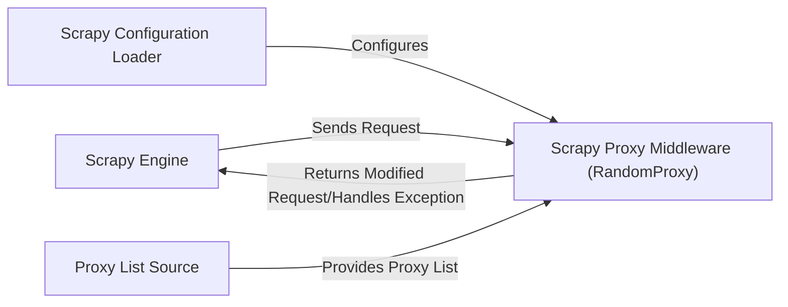

## Details

The `scrapy-proxies` library integrates seamlessly with the Scrapy framework, primarily through its `Scrapy Proxy Middleware (RandomProxy)` component. This middleware acts as a crucial intermediary, intercepting outgoing requests from the `Scrapy Engine` to inject proxy settings and managing proxy rotation and status. It relies on the `Scrapy Configuration Loader` to interpret proxy-related settings from the Scrapy project's configuration and obtains the list of available proxies from a `Proxy List Source`. The `Scrapy Engine` orchestrates the entire crawling process, sending requests that are modified by the middleware and receiving responses, thus enabling robust and flexible proxy management within Scrapy projects.

### Scrapy Engine
The core Scrapy framework responsible for orchestrating the crawling process, sending requests, receiving responses, and managing the middleware chain. It interacts with the `Scrapy Proxy Middleware` by invoking its `process_request` and `process_response` methods.

**Related Classes/Methods**: _None_

### Scrapy Proxy Middleware (RandomProxy) [[Expand]](./Scrapy_Proxy_Middleware_RandomProxy_.md)
The central component of `scrapy-proxies`. It acts as a Scrapy downloader middleware, intercepting requests and responses to inject proxy settings, manage proxy selection, rotation, and status tracking.

**Related Classes/Methods**:

- <a href="https://github.com/aivarsk/scrapy-proxies/blob/master/scrapy_proxies/randomproxy.py#L33-L118" target="_blank" rel="noopener noreferrer">`scrapy_proxies.randomproxy.RandomProxy`:33-118</a>

### Scrapy Configuration Loader [[Expand]](./Scrapy_Configuration_Loader.md)
Responsible for loading and interpreting `scrapy-proxies` specific settings (e.g., `PROXY_MODE`, `PROXY_LIST`) from the Scrapy project's `settings.py` file. This component configures the `Scrapy Proxy Middleware`.

**Related Classes/Methods**:

- <a href="https://github.com/aivarsk/scrapy-proxies/blob/master/scrapy_proxies/randomproxy.py#L40-L50" target="_blank" rel="noopener noreferrer">`scrapy_proxies.randomproxy.RandomProxy:__init__`:40-50</a>
- <a href="https://github.com/aivarsk/scrapy-proxies/blob/master/scrapy_proxies/randomproxy.py#L52-L68" target="_blank" rel="noopener noreferrer">`scrapy_proxies.randomproxy.RandomProxy:from_crawler`:52-68</a>

### Proxy List Source [[Expand]](./Proxy_List_Source.md)
Represents the external source (typically a file or a URL) from which the list of available proxies is obtained and provided to the middleware.

**Related Classes/Methods**:

- <a href="https://github.com/aivarsk/scrapy-proxies/blob/master/scrapy_prox_ies/randomproxy.py#L40-L50" target="_blank" rel="noopener noreferrer">`scrapy_proxies.randomproxy.RandomProxy:__init__`:40-50</a>

### [FAQ](https://github.com/CodeBoarding/GeneratedOnBoardings/tree/main?tab=readme-ov-file#faq)