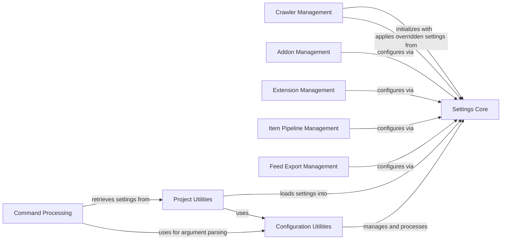

## Component Details

The 'Configuration & Settings' subsystem in Scrapy provides a robust and hierarchical system for managing all configurable parameters of a Scrapy project. It enables users to customize the behavior of various components, from core crawling logic to data processing and output. The system allows for settings to be defined at different priority levels, ensuring flexibility and control over the project's execution. This subsystem is crucial for initializing the Scrapy environment, loading project-specific configurations, and dynamically adjusting component behaviors based on user-defined or default settings. It underpins the adaptability and extensibility of Scrapy, allowing for tailored crawling solutions.

### Settings Core
This component is responsible for the fundamental storage, retrieval, and manipulation of Scrapy settings. It handles priority management for settings, allows for immutability, and provides various methods for accessing settings as different data types (boolean, int, float, list, dict). It also includes mechanisms for iterating through default settings and identifying overridden ones.

**Related Classes/Methods**:

- `scrapy.settings.Settings` (full file reference)
- `scrapy.settings.BaseSettings` (full file reference)
- `scrapy.settings.SettingsAttribute` (full file reference)
- `scrapy.settings.get_settings_priority` (full file reference)
- `scrapy.settings.iter_default_settings` (full file reference)
- `scrapy.settings.overridden_settings` (full file reference)

### Configuration Utilities
This component provides a set of utility functions primarily focused on handling Scrapy's configuration. It includes functionalities for building component lists based on settings, initializing the Scrapy environment, retrieving configuration files, finding the closest project configuration, and parsing command-line arguments into dictionary formats for settings.

**Related Classes/Methods**:

- <a href="https://github.com/scrapy/scrapy/blob/master/scrapy/utils/conf.py#L20-L63" target="_blank" rel="noopener noreferrer">`scrapy.utils.conf.build_component_list` (20:63)</a>
- <a href="https://github.com/scrapy/scrapy/blob/master/scrapy/utils/conf.py#L89-L101" target="_blank" rel="noopener noreferrer">`scrapy.utils.conf.init_env` (89:101)</a>
- <a href="https://github.com/scrapy/scrapy/blob/master/scrapy/utils/conf.py#L104-L109" target="_blank" rel="noopener noreferrer">`scrapy.utils.conf.get_config` (104:109)</a>
- <a href="https://github.com/scrapy/scrapy/blob/master/scrapy/utils/conf.py#L112-L124" target="_blank" rel="noopener noreferrer">`scrapy.utils.conf.get_sources` (112:124)</a>
- <a href="https://github.com/scrapy/scrapy/blob/master/scrapy/utils/conf.py#L73-L86" target="_blank" rel="noopener noreferrer">`scrapy.utils.conf.closest_scrapy_cfg` (73:86)</a>
- <a href="https://github.com/scrapy/scrapy/blob/master/scrapy/utils/conf.py#L127-L141" target="_blank" rel="noopener noreferrer">`scrapy.utils.conf.feed_complete_default_values_from_settings` (127:141)</a>
- <a href="https://github.com/scrapy/scrapy/blob/master/scrapy/utils/conf.py#L66-L70" target="_blank" rel="noopener noreferrer">`scrapy.utils.conf.arglist_to_dict` (66:70)</a>
- <a href="https://github.com/scrapy/scrapy/blob/master/scrapy/utils/conf.py#L144-L196" target="_blank" rel="noopener noreferrer">`scrapy.utils.conf.feed_process_params_from_cli` (144:196)</a>

### Project Utilities
This component offers utilities for managing Scrapy project-specific data and settings. It helps in determining if the current execution is within a Scrapy project, locating the project's data directory, and, most importantly, retrieving the project's settings, which often involves initializing the environment and loading settings modules.

**Related Classes/Methods**:

- <a href="https://github.com/scrapy/scrapy/blob/master/scrapy/utils/project.py#L16-L27" target="_blank" rel="noopener noreferrer">`scrapy.utils.project.inside_project` (16:27)</a>
- <a href="https://github.com/scrapy/scrapy/blob/master/scrapy/utils/project.py#L30-L46" target="_blank" rel="noopener noreferrer">`scrapy.utils.project.project_data_dir` (30:46)</a>
- <a href="https://github.com/scrapy/scrapy/blob/master/scrapy/utils/project.py#L65-L90" target="_blank" rel="noopener noreferrer">`scrapy.utils.project.get_project_settings` (65:90)</a>

### Crawler Management
This component is central to the Scrapy crawling process, responsible for initializing and managing the lifecycle of crawlers. It handles the initial setup of a crawler, including applying various settings that dictate its behavior during the crawl.

**Related Classes/Methods**:

- <a href="https://github.com/scrapy/scrapy/blob/master/scrapy/crawler.py#L58-L322" target="_blank" rel="noopener noreferrer">`scrapy.crawler.Crawler` (58:322)</a>
- <a href="https://github.com/scrapy/scrapy/blob/master/scrapy/crawler.py#L325-L375" target="_blank" rel="noopener noreferrer">`scrapy.crawler.CrawlerRunnerBase` (325:375)</a>

### Addon Management
This component is responsible for loading and managing Scrapy addons. Addons can extend Scrapy's functionality and often involve loading and applying specific settings during the crawler's initialization phase.

**Related Classes/Methods**:

- <a href="https://github.com/scrapy/scrapy/blob/master/scrapy/addons.py#L18-L72" target="_blank" rel="noopener noreferrer">`scrapy.addons.AddonManager` (18:72)</a>

### Extension Management
This component handles the discovery, loading, and management of Scrapy extensions. Extensions provide additional functionalities to Scrapy and are typically configured through settings, often requiring the retrieval of middleware lists from the settings.

**Related Classes/Methods**:

- <a href="https://github.com/scrapy/scrapy/blob/master/scrapy/extension.py#L18-L23" target="_blank" rel="noopener noreferrer">`scrapy.extension.ExtensionManager` (18:23)</a>

### Item Pipeline Management
This component manages the processing of scraped items through a series of item pipelines. It includes the core management of pipelines and specific implementations for handling images, media, and files, all of which rely on Scrapy settings for their configuration and behavior.

**Related Classes/Methods**:

- <a href="https://github.com/scrapy/scrapy/blob/master/scrapy/pipelines/images.py#L43-L274" target="_blank" rel="noopener noreferrer">`scrapy.pipelines.images.ImagesPipeline` (43:274)</a>
- <a href="https://github.com/scrapy/scrapy/blob/master/scrapy/pipelines/media.py#L48-L336" target="_blank" rel="noopener noreferrer">`scrapy.pipelines.media.MediaPipeline` (48:336)</a>
- <a href="https://github.com/scrapy/scrapy/blob/master/scrapy/pipelines/files.py#L414-L746" target="_blank" rel="noopener noreferrer">`scrapy.pipelines.files.FilesPipeline` (414:746)</a>
- `scrapy.pipelines.ItemPipelineManager` (full file reference)

### Command Processing
This component is responsible for handling and executing various Scrapy commands initiated from the command line. It involves parsing command-line arguments, processing options, and interacting with project settings to configure the command's execution.

**Related Classes/Methods**:

- `scrapy.cmdline` (full file reference)
- <a href="https://github.com/scrapy/scrapy/blob/master/scrapy/commands/check.py#L42-L115" target="_blank" rel="noopener noreferrer">`scrapy.commands.check.Command` (42:115)</a>
- `scrapy.commands.ScrapyCommand` (full file reference)
- `scrapy.commands.BaseRunSpiderCommand` (full file reference)

### Feed Export Management
This component is dedicated to managing the export of scraped data into various output formats. It relies on Scrapy settings to determine export configurations, including default values and specific parameters for the feed export process.

**Related Classes/Methods**:

- <a href="https://github.com/scrapy/scrapy/blob/master/scrapy/extensions/feedexport.py#L450-L744" target="_blank" rel="noopener noreferrer">`scrapy.extensions.feedexport.FeedExporter` (450:744)</a>

### [FAQ](https://github.com/CodeBoarding/GeneratedOnBoardings/tree/main?tab=readme-ov-file#faq)