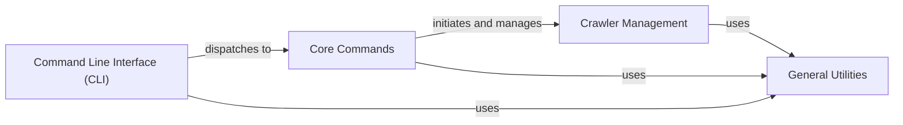

## Component Details

The Crawler Orchestration component is responsible for managing the entire lifecycle of web crawling processes within Scrapy. It provides the user-facing interface through the Command Line Interface (CLI) for initiating and controlling crawls, and internally orchestrates the execution of spiders via the Crawler Management sub-component. Core Commands handle specific actions requested by the user, leveraging various utilities to set up and run the crawling environment.

### Crawler Management
Orchestrates the execution and lifecycle of one or more crawling processes, providing an API to run spiders and manage the Scrapy runtime environment.

**Related Classes/Methods**:

- <a href="https://github.com/scrapy/scrapy/blob/master/scrapy/crawler.py#L325-L375" target="_blank" rel="noopener noreferrer">`scrapy.crawler.CrawlerRunnerBase` (325:375)</a>
- <a href="https://github.com/scrapy/scrapy/blob/master/scrapy/crawler.py#L378-L464" target="_blank" rel="noopener noreferrer">`scrapy.crawler.CrawlerRunner` (378:464)</a>
- <a href="https://github.com/scrapy/scrapy/blob/master/scrapy/crawler.py#L467-L560" target="_blank" rel="noopener noreferrer">`scrapy.crawler.AsyncCrawlerRunner` (467:560)</a>
- <a href="https://github.com/scrapy/scrapy/blob/master/scrapy/crawler.py#L563-L632" target="_blank" rel="noopener noreferrer">`scrapy.crawler.CrawlerProcessBase` (563:632)</a>
- <a href="https://github.com/scrapy/scrapy/blob/master/scrapy/crawler.py#L635-L707" target="_blank" rel="noopener noreferrer">`scrapy.crawler.CrawlerProcess` (635:707)</a>
- <a href="https://github.com/scrapy/scrapy/blob/master/scrapy/crawler.py#L710-L788" target="_blank" rel="noopener noreferrer">`scrapy.crawler.AsyncCrawlerProcess` (710:788)</a>

### Command Line Interface (CLI)
Serves as the primary user interface for interacting with Scrapy, responsible for parsing command-line arguments and dispatching requests to the appropriate core commands.

**Related Classes/Methods**:

- `scrapy.cmdline` (full file reference)
- `scrapy.commands.ScrapyCommand` (full file reference)
- `scrapy.commands.BaseRunSpiderCommand` (full file reference)

### Core Commands
Implements the specific actions and functionalities exposed through the Command Line Interface, such as initiating crawls, generating project structures, or inspecting data.

**Related Classes/Methods**:

- <a href="https://github.com/scrapy/scrapy/blob/master/scrapy/commands/bench.py#L19-L33" target="_blank" rel="noopener noreferrer">`scrapy.commands.bench.Command` (19:33)</a>
- <a href="https://github.com/scrapy/scrapy/blob/master/scrapy/commands/check.py#L42-L115" target="_blank" rel="noopener noreferrer">`scrapy.commands.check.Command` (42:115)</a>
- <a href="https://github.com/scrapy/scrapy/blob/master/scrapy/commands/crawl.py#L12-L34" target="_blank" rel="noopener noreferrer">`scrapy.commands.crawl.Command` (12:34)</a>
- <a href="https://github.com/scrapy/scrapy/blob/master/scrapy/commands/edit.py#L10-L47" target="_blank" rel="noopener noreferrer">`scrapy.commands.edit.Command` (10:47)</a>
- <a href="https://github.com/scrapy/scrapy/blob/master/scrapy/commands/fetch.py#L20-L97" target="_blank" rel="noopener noreferrer">`scrapy.commands.fetch.Command` (20:97)</a>
- <a href="https://github.com/scrapy/scrapy/blob/master/scrapy/commands/genspider.py#L48-L226" target="_blank" rel="noopener noreferrer">`scrapy.commands.genspider.Command` (48:226)</a>
- <a href="https://github.com/scrapy/scrapy/blob/master/scrapy/commands/list.py#L12-L24" target="_blank" rel="noopener noreferrer">`scrapy.commands.list.Command` (12:24)</a>
- <a href="https://github.com/scrapy/scrapy/blob/master/scrapy/commands/parse.py#L38-L410" target="_blank" rel="noopener noreferrer">`scrapy.commands.parse.Command` (38:410)</a>
- <a href="https://github.com/scrapy/scrapy/blob/master/scrapy/commands/runspider.py#L32-L64" target="_blank" rel="noopener noreferrer">`scrapy.commands.runspider.Command` (32:64)</a>
- <a href="https://github.com/scrapy/scrapy/blob/master/scrapy/commands/settings.py#L8-L64" target="_blank" rel="noopener noreferrer">`scrapy.commands.settings.Command` (8:64)</a>
- <a href="https://github.com/scrapy/scrapy/blob/master/scrapy/commands/shell.py#L24-L101" target="_blank" rel="noopener noreferrer">`scrapy.commands.shell.Command` (24:101)</a>
- <a href="https://github.com/scrapy/scrapy/blob/master/scrapy/commands/startproject.py#L35-L141" target="_blank" rel="noopener noreferrer">`scrapy.commands.startproject.Command` (35:141)</a>
- <a href="https://github.com/scrapy/scrapy/blob/master/scrapy/commands/version.py#L8-L35" target="_blank" rel="noopener noreferrer">`scrapy.commands.version.Command` (8:35)</a>
- <a href="https://github.com/scrapy/scrapy/blob/master/scrapy/commands/view.py#L11-L28" target="_blank" rel="noopener noreferrer">`scrapy.commands.view.Command` (11:28)</a>

### General Utilities
A collection of general-purpose utility functions used across different Scrapy components.

**Related Classes/Methods**:

- <a href="https://github.com/scrapy/scrapy/blob/master/scrapy/utils/misc.py#L48-L78" target="_blank" rel="noopener noreferrer">`scrapy.utils.misc.load_object` (48:78)</a>
- <a href="https://github.com/scrapy/scrapy/blob/master/scrapy/utils/misc.py#L175-L205" target="_blank" rel="noopener noreferrer">`scrapy.utils.misc.build_from_crawler` (175:205)</a>
- <a href="https://github.com/scrapy/scrapy/blob/master/scrapy/utils/misc.py#L209-L223" target="_blank" rel="noopener noreferrer">`scrapy.utils.misc.set_environ` (209:223)</a>
- <a href="https://github.com/scrapy/scrapy/blob/master/scrapy/utils/misc.py#L81-L100" target="_blank" rel="noopener noreferrer">`scrapy.utils.misc.walk_modules` (81:100)</a>
- <a href="https://github.com/scrapy/scrapy/blob/master/scrapy/utils/misc.py#L35-L45" target="_blank" rel="noopener noreferrer">`scrapy.utils.misc.arg_to_iter` (35:45)</a>
- <a href="https://github.com/scrapy/scrapy/blob/master/scrapy/utils/versions.py#L30-L34" target="_blank" rel="noopener noreferrer">`scrapy.utils.versions.get_versions` (30:34)</a>

### [FAQ](https://github.com/CodeBoarding/GeneratedOnBoardings/tree/main?tab=readme-ov-file#faq)