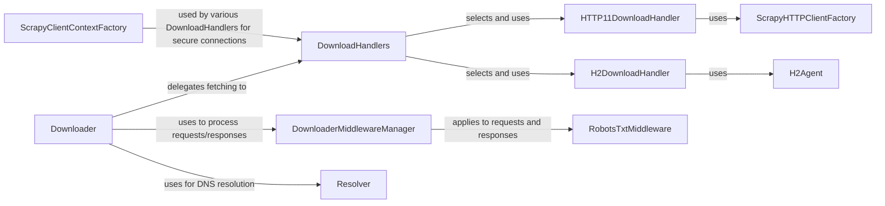

## Component Details

The Downloader System in Scrapy is responsible for efficiently fetching web content from various sources. It handles different network protocols (like HTTP/1.1, HTTP/2, FTP, File, Data URI) and applies a configurable chain of middlewares to requests before they are sent and to responses upon their reception. This system manages concurrency, respects politeness policies (like robots.txt), and optimizes network interactions through connection pooling and DNS caching, ensuring robust and scalable web crawling.

### Downloader
The core component responsible for fetching web pages. It orchestrates the download process, interacting with download handlers to perform actual network requests and managing concurrency and delays per domain/IP.

**Related Classes/Methods**:

- `scrapy.core.downloader.Downloader` (full file reference)

### DownloaderMiddlewareManager
Manages the execution of downloader middleware, ensuring requests and responses pass through the configured middleware chain before being sent to the downloader or passed back to the engine.

**Related Classes/Methods**:

- <a href="https://github.com/scrapy/scrapy/blob/master/scrapy/core/downloader/middleware.py#L27-L118" target="_blank" rel="noopener noreferrer">`scrapy.core.downloader.middleware.DownloaderMiddlewareManager` (27:118)</a>

### DownloadHandlers
A manager for various download handlers, which are responsible for fetching content based on the URL scheme (e.g., HTTP, HTTPS, FTP, File, Data URI). It selects the appropriate handler for a given request.

**Related Classes/Methods**:

- `scrapy.core.downloader.handlers.DownloadHandlers` (full file reference)

### HTTP11DownloadHandler
Handles the downloading of content using the HTTP/1.1 protocol, interacting with Twisted's HTTP client factories.

**Related Classes/Methods**:

- <a href="https://github.com/scrapy/scrapy/blob/master/scrapy/core/downloader/handlers/http11.py#L67-L125" target="_blank" rel="noopener noreferrer">`scrapy.core.downloader.handlers.http11.HTTP11DownloadHandler` (67:125)</a>

### H2DownloadHandler
Handles the downloading of content using the HTTP/2 protocol, leveraging an HTTP/2 agent for efficient multiplexed connections.

**Related Classes/Methods**:

- <a href="https://github.com/scrapy/scrapy/blob/master/scrapy/core/downloader/handlers/http2.py#L29-L51" target="_blank" rel="noopener noreferrer">`scrapy.core.downloader.handlers.http2.H2DownloadHandler` (29:51)</a>

### ScrapyHTTPClientFactory
A Twisted protocol factory for creating HTTP 1.1 clients, responsible for building HTTP requests and parsing responses.

**Related Classes/Methods**:

- <a href="https://github.com/scrapy/scrapy/blob/master/scrapy/core/downloader/webclient.py#L94-L239" target="_blank" rel="noopener noreferrer">`scrapy.core.downloader.webclient.ScrapyHTTPClientFactory` (94:239)</a>

### H2Agent
An HTTP/2 agent responsible for managing HTTP/2 connections and requests, built on top of Twisted.

**Related Classes/Methods**:

- <a href="https://github.com/scrapy/scrapy/blob/master/scrapy/core/http2/agent.py#L118-L158" target="_blank" rel="noopener noreferrer">`scrapy.core.http2.agent.H2Agent` (118:158)</a>

### ScrapyClientContextFactory
A factory for creating SSL/TLS contexts for secure connections, configuring options like certificate verification and supported protocols.

**Related Classes/Methods**:

- <a href="https://github.com/scrapy/scrapy/blob/master/scrapy/core/downloader/contextfactory.py#L39-L141" target="_blank" rel="noopener noreferrer">`scrapy.core.downloader.contextfactory.ScrapyClientContextFactory` (39:141)</a>

### RobotsTxtMiddleware
A downloader middleware that checks requests against robots.txt rules using a RobotsTxtParser to prevent crawling disallowed URLs.

**Related Classes/Methods**:

- <a href="https://github.com/scrapy/scrapy/blob/master/scrapy/downloadermiddlewares/robotstxt.py#L35-L158" target="_blank" rel="noopener noreferrer">`scrapy.downloadermiddlewares.robotstxt.RobotsTxtMiddleware` (35:158)</a>

### Resolver
Handles hostname resolution, potentially with caching, to convert hostnames into IP addresses for network requests, improving performance and reducing DNS lookups.

**Related Classes/Methods**:

- <a href="https://github.com/scrapy/scrapy/blob/master/scrapy/resolver.py#L33-L70" target="_blank" rel="noopener noreferrer">`scrapy.resolver.CachingThreadedResolver` (33:70)</a>

### [FAQ](https://github.com/CodeBoarding/GeneratedOnBoardings/tree/main?tab=readme-ov-file#faq)