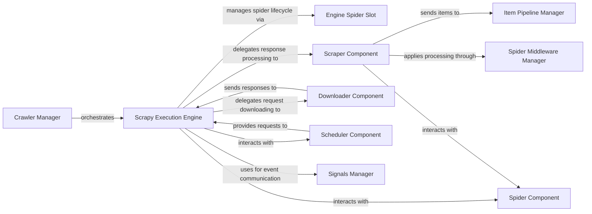

## Component Details

The Scrapy Execution Engine subsystem is the core of the Scrapy framework, orchestrating the entire web crawling process. It manages the flow of requests from the Scheduler to the Downloader, processes responses through the Scraper, and handles the lifecycle of individual spiders. This subsystem ensures efficient and concurrent operations by coordinating interactions between various components like the Scheduler, Downloader, Scraper, and Spider, while also utilizing a Signals Manager for inter-component communication and a Crawler Manager for overall crawl setup and execution.

### Scrapy Execution Engine
The central orchestrator of the Scrapy crawling process. It manages the lifecycle of spiders, coordinates between the Scheduler, Downloader, and Scraper, handles request processing, response handling, and spider output. It's responsible for starting, stopping, pausing, and resuming the crawl.

**Related Classes/Methods**:

- <a href="https://github.com/scrapy/scrapy/blob/master/scrapy/core/engine.py#L89-L520" target="_blank" rel="noopener noreferrer">`scrapy.core.engine.ExecutionEngine` (89:520)</a>
- <a href="https://github.com/scrapy/scrapy/blob/master/scrapy/core/engine.py#L92-L120" target="_blank" rel="noopener noreferrer">`scrapy.core.engine.ExecutionEngine.__init__` (92:120)</a>
- <a href="https://github.com/scrapy/scrapy/blob/master/scrapy/core/engine.py#L122-L131" target="_blank" rel="noopener noreferrer">`scrapy.core.engine.ExecutionEngine._get_scheduler_class` (122:131)</a>
- <a href="https://github.com/scrapy/scrapy/blob/master/scrapy/core/engine.py#L133-L134" target="_blank" rel="noopener noreferrer">`scrapy.core.engine.ExecutionEngine.start` (133:134)</a>
- <a href="https://github.com/scrapy/scrapy/blob/master/scrapy/core/engine.py#L136-L145" target="_blank" rel="noopener noreferrer">`scrapy.core.engine.ExecutionEngine.start_async` (136:145)</a>
- <a href="https://github.com/scrapy/scrapy/blob/master/scrapy/core/engine.py#L147-L164" target="_blank" rel="noopener noreferrer">`scrapy.core.engine.ExecutionEngine.stop` (147:164)</a>
- <a href="https://github.com/scrapy/scrapy/blob/master/scrapy/core/engine.py#L166-L178" target="_blank" rel="noopener noreferrer">`scrapy.core.engine.ExecutionEngine.close` (166:178)</a>
- <a href="https://github.com/scrapy/scrapy/blob/master/scrapy/core/engine.py#L186-L210" target="_blank" rel="noopener noreferrer">`scrapy.core.engine.ExecutionEngine._process_start_next` (186:210)</a>
- <a href="https://github.com/scrapy/scrapy/blob/master/scrapy/core/engine.py#L213-L229" target="_blank" rel="noopener noreferrer">`scrapy.core.engine.ExecutionEngine._start_request_processing` (213:229)</a>
- <a href="https://github.com/scrapy/scrapy/blob/master/scrapy/core/engine.py#L231-L240" target="_blank" rel="noopener noreferrer">`scrapy.core.engine.ExecutionEngine._start_scheduled_requests` (231:240)</a>
- <a href="https://github.com/scrapy/scrapy/blob/master/scrapy/core/engine.py#L242-L255" target="_blank" rel="noopener noreferrer">`scrapy.core.engine.ExecutionEngine.needs_backout` (242:255)</a>
- <a href="https://github.com/scrapy/scrapy/blob/master/scrapy/core/engine.py#L257-L297" target="_blank" rel="noopener noreferrer">`scrapy.core.engine.ExecutionEngine._start_scheduled_request` (257:297)</a>
- <a href="https://github.com/scrapy/scrapy/blob/master/scrapy/core/engine.py#L300-L321" target="_blank" rel="noopener noreferrer">`scrapy.core.engine.ExecutionEngine._handle_downloader_output` (300:321)</a>
- <a href="https://github.com/scrapy/scrapy/blob/master/scrapy/core/engine.py#L323-L332" target="_blank" rel="noopener noreferrer">`scrapy.core.engine.ExecutionEngine.spider_is_idle` (323:332)</a>
- <a href="https://github.com/scrapy/scrapy/blob/master/scrapy/core/engine.py#L334-L339" target="_blank" rel="noopener noreferrer">`scrapy.core.engine.ExecutionEngine.crawl` (334:339)</a>
- <a href="https://github.com/scrapy/scrapy/blob/master/scrapy/core/engine.py#L357-L368" target="_blank" rel="noopener noreferrer">`scrapy.core.engine.ExecutionEngine.download` (357:368)</a>
- <a href="https://github.com/scrapy/scrapy/blob/master/scrapy/core/engine.py#L371-L403" target="_blank" rel="noopener noreferrer">`scrapy.core.engine.ExecutionEngine._download` (371:403)</a>
- <a href="https://github.com/scrapy/scrapy/blob/master/scrapy/core/engine.py#L405-L408" target="_blank" rel="noopener noreferrer">`scrapy.core.engine.ExecutionEngine.open_spider` (405:408)</a>
- <a href="https://github.com/scrapy/scrapy/blob/master/scrapy/core/engine.py#L410-L429" target="_blank" rel="noopener noreferrer">`scrapy.core.engine.ExecutionEngine.open_spider_async` (410:429)</a>
- <a href="https://github.com/scrapy/scrapy/blob/master/scrapy/core/engine.py#L431-L454" target="_blank" rel="noopener noreferrer">`scrapy.core.engine.ExecutionEngine._spider_idle` (431:454)</a>
- <a href="https://github.com/scrapy/scrapy/blob/master/scrapy/core/engine.py#L456-L520" target="_blank" rel="noopener noreferrer">`scrapy.core.engine.ExecutionEngine.close_spider` (456:520)</a>
- `scrapy.utils.engine` (full file reference)

### Engine Spider Slot
A per-spider state management component used by the Scrapy Execution Engine. It tracks in-progress requests for a specific spider, manages the closing process when a spider becomes idle, and schedules subsequent processing calls.

**Related Classes/Methods**:

- <a href="https://github.com/scrapy/scrapy/blob/master/scrapy/core/engine.py#L52-L86" target="_blank" rel="noopener noreferrer">`scrapy.core.engine._Slot` (52:86)</a>
- <a href="https://github.com/scrapy/scrapy/blob/master/scrapy/core/engine.py#L53-L66" target="_blank" rel="noopener noreferrer">`scrapy.core.engine._Slot.__init__` (53:66)</a>
- <a href="https://github.com/scrapy/scrapy/blob/master/scrapy/core/engine.py#L68-L69" target="_blank" rel="noopener noreferrer">`scrapy.core.engine._Slot.add_request` (68:69)</a>
- <a href="https://github.com/scrapy/scrapy/blob/master/scrapy/core/engine.py#L71-L73" target="_blank" rel="noopener noreferrer">`scrapy.core.engine._Slot.remove_request` (71:73)</a>
- <a href="https://github.com/scrapy/scrapy/blob/master/scrapy/core/engine.py#L75-L78" target="_blank" rel="noopener noreferrer">`scrapy.core.engine._Slot.close` (75:78)</a>
- <a href="https://github.com/scrapy/scrapy/blob/master/scrapy/core/engine.py#L80-L86" target="_blank" rel="noopener noreferrer">`scrapy.core.engine._Slot._maybe_fire_closing` (80:86)</a>

### Crawler Manager
Responsible for the overall setup and execution of a single Scrapy spider. It handles the creation of the Execution Engine, applies project settings, and manages the high-level crawl lifecycle, including starting and stopping the crawl.

**Related Classes/Methods**:

- <a href="https://github.com/scrapy/scrapy/blob/master/scrapy/crawler.py#L58-L322" target="_blank" rel="noopener noreferrer">`scrapy.crawler.Crawler` (58:322)</a>
- <a href="https://github.com/scrapy/scrapy/blob/master/scrapy/crawler.py#L59-L88" target="_blank" rel="noopener noreferrer">`scrapy.crawler.Crawler.__init__` (59:88)</a>
- <a href="https://github.com/scrapy/scrapy/blob/master/scrapy/crawler.py#L90-L93" target="_blank" rel="noopener noreferrer">`scrapy.crawler.Crawler._update_root_log_handler` (90:93)</a>
- <a href="https://github.com/scrapy/scrapy/blob/master/scrapy/crawler.py#L95-L140" target="_blank" rel="noopener noreferrer">`scrapy.crawler.Crawler._apply_settings` (95:140)</a>
- <a href="https://github.com/scrapy/scrapy/blob/master/scrapy/crawler.py#L146-L172" target="_blank" rel="noopener noreferrer">`scrapy.crawler.Crawler.crawl` (146:172)</a>
- <a href="https://github.com/scrapy/scrapy/blob/master/scrapy/crawler.py#L174-L208" target="_blank" rel="noopener noreferrer">`scrapy.crawler.Crawler.crawl_async` (174:208)</a>
- <a href="https://github.com/scrapy/scrapy/blob/master/scrapy/crawler.py#L210-L211" target="_blank" rel="noopener noreferrer">`scrapy.crawler.Crawler._create_spider` (210:211)</a>
- <a href="https://github.com/scrapy/scrapy/blob/master/scrapy/crawler.py#L213-L214" target="_blank" rel="noopener noreferrer">`scrapy.crawler.Crawler._create_engine` (213:214)</a>
- <a href="https://github.com/scrapy/scrapy/blob/master/scrapy/crawler.py#L217-L223" target="_blank" rel="noopener noreferrer">`scrapy.crawler.Crawler.stop` (217:223)</a>
- <a href="https://github.com/scrapy/scrapy/blob/master/scrapy/crawler.py#L225-L236" target="_blank" rel="noopener noreferrer">`scrapy.crawler.Crawler.stop_async` (225:236)</a>

### Scraper Component
Processes downloaded responses, extracts data using spider callbacks, and sends extracted items to the item pipelines. It also handles errors during the scraping process and manages spider middleware.

**Related Classes/Methods**:

- <a href="https://github.com/scrapy/scrapy/blob/master/scrapy/core/scraper.py#L99-L453" target="_blank" rel="noopener noreferrer">`scrapy.core.scraper.Scraper` (99:453)</a>
- <a href="https://github.com/scrapy/scrapy/blob/master/scrapy/core/scraper.py#L100-L113" target="_blank" rel="noopener noreferrer">`scrapy.core.scraper.Scraper.__init__` (100:113)</a>
- <a href="https://github.com/scrapy/scrapy/blob/master/scrapy/core/scraper.py#L116-L119" target="_blank" rel="noopener noreferrer">`scrapy.core.scraper.Scraper.open_spider` (116:119)</a>
- <a href="https://github.com/scrapy/scrapy/blob/master/scrapy/core/scraper.py#L121-L135" target="_blank" rel="noopener noreferrer">`scrapy.core.scraper.Scraper.close_spider` (121:135)</a>
- <a href="https://github.com/scrapy/scrapy/blob/master/scrapy/core/scraper.py#L137-L139" target="_blank" rel="noopener noreferrer">`scrapy.core.scraper.Scraper.is_idle` (137:139)</a>
- <a href="https://github.com/scrapy/scrapy/blob/master/scrapy/core/scraper.py#L141-L146" target="_blank" rel="noopener noreferrer">`scrapy.core.scraper.Scraper._check_if_closing` (141:146)</a>
- <a href="https://github.com/scrapy/scrapy/blob/master/scrapy/core/scraper.py#L149-L175" target="_blank" rel="noopener noreferrer">`scrapy.core.scraper.Scraper.enqueue_scrape` (149:175)</a>
- <a href="https://github.com/scrapy/scrapy/blob/master/scrapy/core/scraper.py#L177-L181" target="_blank" rel="noopener noreferrer">`scrapy.core.scraper.Scraper._scrape_next` (177:181)</a>
- <a href="https://github.com/scrapy/scrapy/blob/master/scrapy/core/scraper.py#L184-L220" target="_blank" rel="noopener noreferrer">`scrapy.core.scraper.Scraper._scrape` (184:220)</a>
- <a href="https://github.com/scrapy/scrapy/blob/master/scrapy/core/scraper.py#L222-L231" target="_blank" rel="noopener noreferrer">`scrapy.core.scraper.Scraper.call_spider` (222:231)</a>
- <a href="https://github.com/scrapy/scrapy/blob/master/scrapy/core/scraper.py#L233-L259" target="_blank" rel="noopener noreferrer">`scrapy.core.scraper.Scraper.call_spider_async` (233:259)</a>
- <a href="https://github.com/scrapy/scrapy/blob/master/scrapy/core/scraper.py#L261-L305" target="_blank" rel="noopener noreferrer">`scrapy.core.scraper.Scraper.handle_spider_error` (261:305)</a>
- <a href="https://github.com/scrapy/scrapy/blob/master/scrapy/core/scraper.py#L307-L323" target="_blank" rel="noopener noreferrer">`scrapy.core.scraper.Scraper.handle_spider_output` (307:323)</a>
- <a href="https://github.com/scrapy/scrapy/blob/master/scrapy/core/scraper.py#L325-L361" target="_blank" rel="noopener noreferrer">`scrapy.core.scraper.Scraper.handle_spider_output_async` (325:361)</a>
- `scrapy.core.scraper._process_spidermw_output` (full file reference)
- `scrapy.core.scraper._process_spidermw_output_async` (full file reference)
- `scrapy.core.scraper.start_itemproc` (full file reference)
- `scrapy.core.scraper.start_itemproc_async` (full file reference)

### Downloader Component
Responsible for fetching web pages from remote servers. It handles HTTP requests, retries, redirects, and interacts with downloader middlewares.

**Related Classes/Methods**:

- `scrapy.core.downloader.Downloader` (full file reference)

### Scheduler Component
Stores and retrieves requests to be crawled. It manages the request queue and ensures that requests are unique (via a dupefilter).

**Related Classes/Methods**:

- <a href="https://github.com/scrapy/scrapy/blob/master/scrapy/core/scheduler.py#L130-L498" target="_blank" rel="noopener noreferrer">`scrapy.core.scheduler.Scheduler` (130:498)</a>
- <a href="https://github.com/scrapy/scrapy/blob/master/scrapy/core/scheduler.py#L55-L127" target="_blank" rel="noopener noreferrer">`scrapy.core.scheduler.BaseScheduler` (55:127)</a>

### Spider Component
Defines how to crawl a specific site (e.g., initial requests, how to follow links, and how to parse responses to extract data).

**Related Classes/Methods**:

- `scrapy.spiders.Spider` (full file reference)

### Signals Manager
Manages the dispatching and handling of signals throughout the Scrapy framework, allowing components to communicate without direct coupling.

**Related Classes/Methods**:

- <a href="https://github.com/scrapy/scrapy/blob/master/scrapy/signalmanager.py#L12-L106" target="_blank" rel="noopener noreferrer">`scrapy.signalmanager.SignalManager` (12:106)</a>

### Item Pipeline Manager
Manages the execution of item pipelines, which are components responsible for processing and storing scraped items.

**Related Classes/Methods**:

- `scrapy.pipelines.ItemPipelineManager` (full file reference)
- `scrapy.pipelines.ItemPipelineManager.from_crawler` (full file reference)
- `scrapy.pipelines.ItemPipelineManager.open_spider` (full file reference)
- `scrapy.pipelines.ItemPipelineManager.close_spider` (full file reference)
- `scrapy.pipelines.ItemPipelineManager.process_item` (full file reference)

### Spider Middleware Manager
Manages the execution of spider middlewares, which are hooks that process spider input (responses) and output (items and requests).

**Related Classes/Methods**:

- <a href="https://github.com/scrapy/scrapy/blob/master/scrapy/core/spidermw.py#L52-L524" target="_blank" rel="noopener noreferrer">`scrapy.core.spidermw.SpiderMiddlewareManager` (52:524)</a>
- <a href="https://github.com/scrapy/scrapy/blob/master/scrapy/core/spidermw.py#L401-L414" target="_blank" rel="noopener noreferrer">`scrapy.core.spidermw.SpiderMiddlewareManager.process_start` (401:414)</a>
- `scrapy.core.spidermw.SpiderMiddlewareManager.from_crawler` (full file reference)
- <a href="https://github.com/scrapy/scrapy/blob/master/scrapy/core/spidermw.py#L374-L399" target="_blank" rel="noopener noreferrer">`scrapy.core.spidermw.SpiderMiddlewareManager.scrape_response_async` (374:399)</a>

### [FAQ](https://github.com/CodeBoarding/GeneratedOnBoardings/tree/main?tab=readme-ov-file#faq)