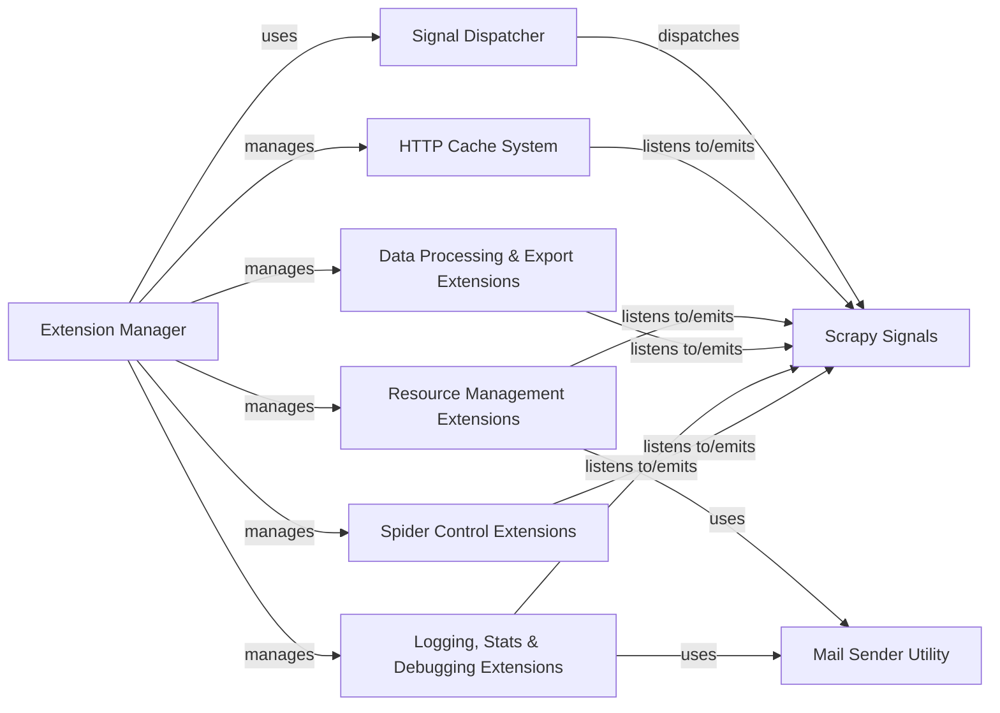

## Component Details

The Extensibility & Signals component in Scrapy provides a flexible and robust system for extending the framework's core functionality and enabling communication between its various parts. It achieves this through a signal dispatching mechanism, allowing extensions to hook into different stages of the crawling process and react to specific events. This architecture promotes a modular and decoupled design, where new features can be added or existing ones modified without altering the core codebase.

### Extension Manager
Manages the loading, enabling, and lifecycle of Scrapy extensions, integrating them into the crawling process.

**Related Classes/Methods**:

- <a href="https://github.com/scrapy/scrapy/blob/master/scrapy/extension.py#L18-L23" target="_blank" rel="noopener noreferrer">`scrapy.extension.ExtensionManager` (18:23)</a>

### Signal Dispatcher
Provides the core mechanism for signal emission and reception, enabling decoupled communication between various Scrapy components.

**Related Classes/Methods**:

- <a href="https://github.com/scrapy/scrapy/blob/master/scrapy/signalmanager.py#L12-L106" target="_blank" rel="noopener noreferrer">`scrapy.signalmanager.SignalManager` (12:106)</a>
- `scrapy.utils.signal` (full file reference)

### Scrapy Signals
Defines the set of events (signals) that various components in Scrapy can emit or listen to, forming the basis of the extensibility system.

**Related Classes/Methods**:

- `scrapy.signals` (full file reference)

### HTTP Cache System
Handles caching of HTTP responses to optimize crawling by reducing redundant requests and adhering to caching policies.

**Related Classes/Methods**:

- <a href="https://github.com/scrapy/scrapy/blob/master/scrapy/extensions/httpcache.py#L38-L59" target="_blank" rel="noopener noreferrer">`scrapy.extensions.httpcache.DummyPolicy` (38:59)</a>
- <a href="https://github.com/scrapy/scrapy/blob/master/scrapy/extensions/httpcache.py#L62-L247" target="_blank" rel="noopener noreferrer">`scrapy.extensions.httpcache.RFC2616Policy` (62:247)</a>
- <a href="https://github.com/scrapy/scrapy/blob/master/scrapy/extensions/httpcache.py#L250-L310" target="_blank" rel="noopener noreferrer">`scrapy.extensions.httpcache.DbmCacheStorage` (250:310)</a>
- <a href="https://github.com/scrapy/scrapy/blob/master/scrapy/extensions/httpcache.py#L313-L392" target="_blank" rel="noopener noreferrer">`scrapy.extensions.httpcache.FilesystemCacheStorage` (313:392)</a>

### Resource Management Extensions
Extensions responsible for monitoring and managing system resources like memory, and controlling crawl rate (throttling).

**Related Classes/Methods**:

- <a href="https://github.com/scrapy/scrapy/blob/master/scrapy/extensions/memusage.py#L37-L163" target="_blank" rel="noopener noreferrer">`scrapy.extensions.memusage.MemoryUsage` (37:163)</a>
- <a href="https://github.com/scrapy/scrapy/blob/master/scrapy/extensions/memdebug.py#L24-L47" target="_blank" rel="noopener noreferrer">`scrapy.extensions.memdebug.MemoryDebugger` (24:47)</a>
- <a href="https://github.com/scrapy/scrapy/blob/master/scrapy/extensions/throttle.py#L21-L129" target="_blank" rel="noopener noreferrer">`scrapy.extensions.throttle.AutoThrottle` (21:129)</a>

### Data Processing & Export Extensions
Extensions that handle post-processing of scraped data and its export to various formats and storage backends.

**Related Classes/Methods**:

- <a href="https://github.com/scrapy/scrapy/blob/master/scrapy/extensions/postprocessing.py#L118-L166" target="_blank" rel="noopener noreferrer">`scrapy.extensions.postprocessing.PostProcessingManager` (118:166)</a>
- <a href="https://github.com/scrapy/scrapy/blob/master/scrapy/extensions/feedexport.py#L450-L744" target="_blank" rel="noopener noreferrer">`scrapy.extensions.feedexport.FeedExporter` (450:744)</a>
- <a href="https://github.com/scrapy/scrapy/blob/master/scrapy/extensions/feedexport.py#L205-L275" target="_blank" rel="noopener noreferrer">`scrapy.extensions.feedexport.S3FeedStorage` (205:275)</a>
- <a href="https://github.com/scrapy/scrapy/blob/master/scrapy/extensions/feedexport.py#L278-L323" target="_blank" rel="noopener noreferrer">`scrapy.extensions.feedexport.GCSFeedStorage` (278:323)</a>
- <a href="https://github.com/scrapy/scrapy/blob/master/scrapy/extensions/feedexport.py#L326-L369" target="_blank" rel="noopener noreferrer">`scrapy.extensions.feedexport.FTPFeedStorage` (326:369)</a>

### Logging, Stats & Debugging Extensions
Provides extensions for periodic logging, debugging (stack traces), collecting and reporting crawl statistics, and sending stats via email, including a telnet console for runtime interaction.

**Related Classes/Methods**:

- <a href="https://github.com/scrapy/scrapy/blob/master/scrapy/extensions/periodic_log.py#L30-L163" target="_blank" rel="noopener noreferrer">`scrapy.extensions.periodic_log.PeriodicLog` (30:163)</a>
- <a href="https://github.com/scrapy/scrapy/blob/master/scrapy/extensions/debug.py#L33-L68" target="_blank" rel="noopener noreferrer">`scrapy.extensions.debug.StackTraceDump` (33:68)</a>
- <a href="https://github.com/scrapy/scrapy/blob/master/scrapy/extensions/logstats.py#L26-L103" target="_blank" rel="noopener noreferrer">`scrapy.extensions.logstats.LogStats` (26:103)</a>
- <a href="https://github.com/scrapy/scrapy/blob/master/scrapy/extensions/statsmailer.py#L25-L48" target="_blank" rel="noopener noreferrer">`scrapy.extensions.statsmailer.StatsMailer` (25:48)</a>
- <a href="https://github.com/scrapy/scrapy/blob/master/scrapy/extensions/corestats.py#L20-L60" target="_blank" rel="noopener noreferrer">`scrapy.extensions.corestats.CoreStats` (20:60)</a>
- <a href="https://github.com/scrapy/scrapy/blob/master/scrapy/statscollectors.py#L22-L68" target="_blank" rel="noopener noreferrer">`scrapy.statscollectors.StatsCollector` (22:68)</a>
- <a href="https://github.com/scrapy/scrapy/blob/master/scrapy/statscollectors.py#L71-L77" target="_blank" rel="noopener noreferrer">`scrapy.statscollectors.MemoryStatsCollector` (71:77)</a>
- `scrapy.utils.log` (full file reference)
- <a href="https://github.com/scrapy/scrapy/blob/master/scrapy/logformatter.py#L37-L202" target="_blank" rel="noopener noreferrer">`scrapy.logformatter.LogFormatter` (37:202)</a>
- <a href="https://github.com/scrapy/scrapy/blob/master/scrapy/extensions/telnet.py#L41-L118" target="_blank" rel="noopener noreferrer">`scrapy.extensions.telnet.TelnetConsole` (41:118)</a>

### Spider Control Extensions
Extensions that manage the state and closing conditions of a spider, allowing for persistence and automatic termination based on predefined criteria.

**Related Classes/Methods**:

- <a href="https://github.com/scrapy/scrapy/blob/master/scrapy/extensions/spiderstate.py#L18-L51" target="_blank" rel="noopener noreferrer">`scrapy.extensions.spiderstate.SpiderState` (18:51)</a>
- <a href="https://github.com/scrapy/scrapy/blob/master/scrapy/extensions/closespider.py#L36-L153" target="_blank" rel="noopener noreferrer">`scrapy.extensions.closespider.CloseSpider` (36:153)</a>

### Mail Sender Utility
Provides functionality for sending emails, used by various extensions for notifications and reports.

**Related Classes/Methods**:

- <a href="https://github.com/scrapy/scrapy/blob/master/scrapy/mail.py#L55-L245" target="_blank" rel="noopener noreferrer">`scrapy.mail.MailSender` (55:245)</a>

### [FAQ](https://github.com/CodeBoarding/GeneratedOnBoardings/tree/main?tab=readme-ov-file#faq)