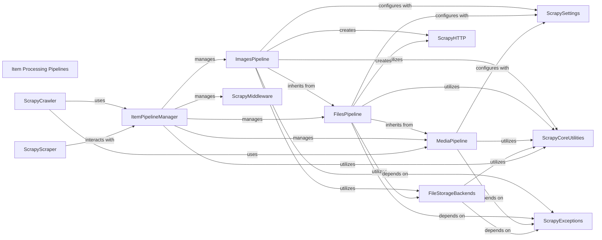

## Component Details

The Item Processing Pipelines subsystem in Scrapy is a series of sequential components responsible for processing extracted items. This includes crucial steps like data validation, cleaning, persistence to various storage backends (local filesystem, S3, GCS), and handling associated media files such as images and general files. The core purpose is to transform raw scraped data into a clean, validated, and stored format, ensuring data integrity and efficient media management within the Scrapy framework.

### Item Processing Pipelines
A series of components that process extracted items sequentially. This includes data validation, cleaning, persistence to various storage backends, and handling associated media files (images, files).

**Related Classes/Methods**:

- <a href="https://github.com/scrapy/scrapy/blob/master/scrapy/pipelines/images.py#L43-L274" target="_blank" rel="noopener noreferrer">`scrapy.pipelines.images.ImagesPipeline` (43:274)</a>
- <a href="https://github.com/scrapy/scrapy/blob/master/scrapy/pipelines/files.py#L414-L746" target="_blank" rel="noopener noreferrer">`scrapy.pipelines.files.FilesPipeline` (414:746)</a>
- <a href="https://github.com/scrapy/scrapy/blob/master/scrapy/pipelines/media.py#L48-L336" target="_blank" rel="noopener noreferrer">`scrapy.pipelines.media.MediaPipeline` (48:336)</a>
- <a href="https://github.com/scrapy/scrapy/blob/master/scrapy/pipelines/files.py#L104-L152" target="_blank" rel="noopener noreferrer">`scrapy.pipelines.files.FSFilesStore` (104:152)</a>
- <a href="https://github.com/scrapy/scrapy/blob/master/scrapy/pipelines/files.py#L155-L274" target="_blank" rel="noopener noreferrer">`scrapy.pipelines.files.S3FilesStore` (155:274)</a>
- <a href="https://github.com/scrapy/scrapy/blob/master/scrapy/pipelines/files.py#L277-L349" target="_blank" rel="noopener noreferrer">`scrapy.pipelines.files.GCSFilesStore` (277:349)</a>
- `scrapy.pipelines.ItemPipelineManager` (15:30)

### ImagesPipeline
This pipeline is responsible for downloading, processing (resizing, converting to JPEG, generating thumbnails), and storing images. It extends FilesPipeline and handles image-specific logic like minimum dimensions and thumbnail generation.

**Related Classes/Methods**:

- <a href="https://github.com/scrapy/scrapy/blob/master/scrapy/pipelines/images.py#L43-L274" target="_blank" rel="noopener noreferrer">`scrapy.pipelines.images.ImagesPipeline` (43:274)</a>
- <a href="https://github.com/scrapy/scrapy/blob/master/scrapy/pipelines/images.py#L39-L40" target="_blank" rel="noopener noreferrer">`scrapy.pipelines.images.ImageException` (39:40)</a>

### FilesPipeline
This pipeline is a base class for handling file downloads and storage. It manages the overall process of fetching files, checking their status, and persisting them using a configured file store. It extends MediaPipeline.

**Related Classes/Methods**:

- <a href="https://github.com/scrapy/scrapy/blob/master/scrapy/pipelines/files.py#L414-L746" target="_blank" rel="noopener noreferrer">`scrapy.pipelines.files.FilesPipeline` (414:746)</a>
- <a href="https://github.com/scrapy/scrapy/blob/master/scrapy/pipelines/files.py#L78-L79" target="_blank" rel="noopener noreferrer">`scrapy.pipelines.files.FileException` (78:79)</a>
- <a href="https://github.com/scrapy/scrapy/blob/master/scrapy/pipelines/files.py#L61-L75" target="_blank" rel="noopener noreferrer">`scrapy.pipelines.files._md5sum` (61:75)</a>
- <a href="https://github.com/scrapy/scrapy/blob/master/scrapy/pipelines/files.py#L57-L58" target="_blank" rel="noopener noreferrer">`scrapy.pipelines.files._to_string` (57:58)</a>
- <a href="https://github.com/scrapy/scrapy/blob/master/scrapy/pipelines/files.py#L87-L101" target="_blank" rel="noopener noreferrer">`scrapy.pipelines.files.FilesStoreProtocol` (87:101)</a>

### MediaPipeline
This is an abstract base pipeline for handling media files. It provides common functionality for managing media requests, processing items, and handling download statuses. Both FilesPipeline and ImagesPipeline inherit from this.

**Related Classes/Methods**:

- <a href="https://github.com/scrapy/scrapy/blob/master/scrapy/pipelines/media.py#L48-L336" target="_blank" rel="noopener noreferrer">`scrapy.pipelines.media.MediaPipeline` (48:336)</a>
- <a href="https://github.com/scrapy/scrapy/blob/master/scrapy/pipelines/media.py#L55-L62" target="_blank" rel="noopener noreferrer">`scrapy.pipelines.media.MediaPipeline.SpiderInfo` (55:62)</a>

### FileStorageBackends
This component encompasses various storage implementations for persisting downloaded files. It includes local filesystem storage (FSFilesStore), Amazon S3 storage (S3FilesStore), and Google Cloud Storage (GCSFilesStore), all adhering to the FilesStoreProtocol.

**Related Classes/Methods**:

- <a href="https://github.com/scrapy/scrapy/blob/master/scrapy/pipelines/files.py#L104-L152" target="_blank" rel="noopener noreferrer">`scrapy.pipelines.files.FSFilesStore` (104:152)</a>
- <a href="https://github.com/scrapy/scrapy/blob/master/scrapy/pipelines/files.py#L155-L274" target="_blank" rel="noopener noreferrer">`scrapy.pipelines.files.S3FilesStore` (155:274)</a>
- <a href="https://github.com/scrapy/scrapy/blob/master/scrapy/pipelines/files.py#L277-L349" target="_blank" rel="noopener noreferrer">`scrapy.pipelines.files.GCSFilesStore` (277:349)</a>

### ItemPipelineManager
This component is responsible for managing and executing the configured item pipelines. It handles the loading of pipelines from settings and orchestrates the process_item calls through the pipeline chain. It extends Scrapy's MiddlewareManager.

**Related Classes/Methods**:

- `scrapy.pipelines.ItemPipelineManager` (15:30)
- <a href="https://github.com/scrapy/scrapy/blob/master/scrapy/middleware.py#L35-L135" target="_blank" rel="noopener noreferrer">`scrapy.middleware.MiddlewareManager` (35:135)</a>
- <a href="https://github.com/scrapy/scrapy/blob/master/scrapy/utils/conf.py#L20-L63" target="_blank" rel="noopener noreferrer">`scrapy.utils.conf.build_component_list` (20:63)</a>
- <a href="https://github.com/scrapy/scrapy/blob/master/scrapy/utils/defer.py#L391-L404" target="_blank" rel="noopener noreferrer">`scrapy.utils.defer.deferred_f_from_coro_f` (391:404)</a>

### ScrapyCoreUtilities
This component groups various utility functions and classes from the scrapy.utils module that are used across different parts of the pipelines. These utilities provide common functionalities like Python object introspection, deferred execution, logging, data type manipulation, and configuration building.

**Related Classes/Methods**:

- `scrapy.utils.python` (full file reference)
- `scrapy.utils.defer` (full file reference)
- <a href="https://github.com/scrapy/scrapy/blob/master/scrapy/utils/log.py#L26-L38" target="_blank" rel="noopener noreferrer">`scrapy.utils.log.failure_to_exc_info` (26:38)</a>
- <a href="https://github.com/scrapy/scrapy/blob/master/scrapy/utils/misc.py#L35-L45" target="_blank" rel="noopener noreferrer">`scrapy.utils.misc.arg_to_iter` (35:45)</a>
- <a href="https://github.com/scrapy/scrapy/blob/master/scrapy/utils/request.py#L175-L180" target="_blank" rel="noopener noreferrer">`scrapy.utils.request.referer_str` (175:180)</a>
- <a href="https://github.com/scrapy/scrapy/blob/master/scrapy/utils/datatypes.py#L188-L195" target="_blank" rel="noopener noreferrer">`scrapy.utils.datatypes.SequenceExclude` (188:195)</a>
- <a href="https://github.com/scrapy/scrapy/blob/master/scrapy/utils/datatypes.py#L101-L140" target="_blank" rel="noopener noreferrer">`scrapy.utils.datatypes.CaseInsensitiveDict` (101:140)</a>
- <a href="https://github.com/scrapy/scrapy/blob/master/scrapy/utils/conf.py#L20-L63" target="_blank" rel="noopener noreferrer">`scrapy.utils.conf.build_component_list` (20:63)</a>
- <a href="https://github.com/scrapy/scrapy/blob/master/scrapy/utils/deprecate.py#L164-L193" target="_blank" rel="noopener noreferrer">`scrapy.utils.deprecate.method_is_overridden` (164:193)</a>
- <a href="https://github.com/scrapy/scrapy/blob/master/scrapy/utils/boto.py#L4-L10" target="_blank" rel="noopener noreferrer">`scrapy.utils.boto.is_botocore_available` (4:10)</a>

### ScrapyHTTP
This component represents the HTTP-related functionalities, primarily the Request object, which is used by pipelines to generate download requests for media files.

**Related Classes/Methods**:

- `scrapy.http.request.Request` (full file reference)

### ScrapySettings
This component handles the configuration and settings management for Scrapy, allowing pipelines to retrieve their operational parameters.

**Related Classes/Methods**:

- `scrapy.settings.Settings` (full file reference)

### ScrapyExceptions
This component includes general Scrapy exceptions that can be raised by pipelines, indicating configuration issues or other operational errors.

**Related Classes/Methods**:

- <a href="https://github.com/scrapy/scrapy/blob/master/scrapy/exceptions.py#L15-L16" target="_blank" rel="noopener noreferrer">`scrapy.exceptions.NotConfigured` (15:16)</a>

### ScrapyMiddleware
This component represents the middleware management system, specifically how the ItemPipelineManager interacts with it to process items through a chain of operations.

**Related Classes/Methods**:

- <a href="https://github.com/scrapy/scrapy/blob/master/scrapy/middleware.py#L35-L135" target="_blank" rel="noopener noreferrer">`scrapy.middleware.MiddlewareManager` (35:135)</a>

### ScrapyCrawler
The central component of Scrapy that orchestrates the entire scraping process, including the interaction with item pipelines.

**Related Classes/Methods**:

- <a href="https://github.com/scrapy/scrapy/blob/master/scrapy/crawler.py#L58-L322" target="_blank" rel="noopener noreferrer">`scrapy.crawler.Crawler` (58:322)</a>

### ScrapyScraper
This component is responsible for the actual scraping of items and passing them to the item pipelines for further processing.

**Related Classes/Methods**:

- <a href="https://github.com/scrapy/scrapy/blob/master/scrapy/core/scraper.py#L99-L453" target="_blank" rel="noopener noreferrer">`scrapy.core.scraper.Scraper` (99:453)</a>

### [FAQ](https://github.com/CodeBoarding/GeneratedOnBoardings/tree/main?tab=readme-ov-file#faq)