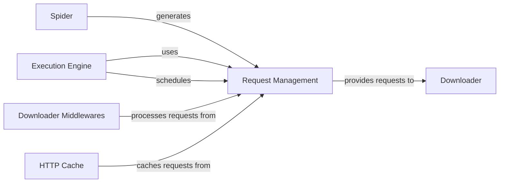

## Component Details

The Request Management component in Scrapy is responsible for handling the lifecycle of web requests, including their queuing, prioritization, and deduplication. It acts as a central hub for managing requests before they are sent to the Downloader and ensures that only unique and relevant requests are processed. It interacts closely with the Execution Engine, which orchestrates the overall crawl, and receives requests generated by Spiders. Downloader Middlewares and the HTTP Cache also interact with this component to modify or optimize the request flow.

### Request Management
Handles the queuing, prioritization, and deduplication of web requests. It ensures that only unique and relevant requests are processed by the Downloader, utilizing specific data structures for HTTP communication.

**Related Classes/Methods**:

- <a href="https://github.com/scrapy/scrapy/blob/master/scrapy/core/scheduler.py#L55-L127" target="_blank" rel="noopener noreferrer">`scrapy.core.scheduler.BaseScheduler` (55:127)</a>
- <a href="https://github.com/scrapy/scrapy/blob/master/scrapy/core/scheduler.py#L130-L498" target="_blank" rel="noopener noreferrer">`scrapy.core.scheduler.Scheduler` (130:498)</a>
- <a href="https://github.com/scrapy/scrapy/blob/master/scrapy/pqueues.py#L52-L233" target="_blank" rel="noopener noreferrer">`scrapy.pqueues.ScrapyPriorityQueue` (52:233)</a>
- <a href="https://github.com/scrapy/scrapy/blob/master/scrapy/pqueues.py#L254-L367" target="_blank" rel="noopener noreferrer">`scrapy.pqueues.DownloaderAwarePriorityQueue` (254:367)</a>
- <a href="https://github.com/scrapy/scrapy/blob/master/scrapy/dupefilters.py#L29-L61" target="_blank" rel="noopener noreferrer">`scrapy.dupefilters.BaseDupeFilter` (29:61)</a>
- <a href="https://github.com/scrapy/scrapy/blob/master/scrapy/dupefilters.py#L64-L155" target="_blank" rel="noopener noreferrer">`scrapy.dupefilters.RFPDupeFilter` (64:155)</a>
- `scrapy.http.request.Request` (full file reference)
- <a href="https://github.com/scrapy/scrapy/blob/master/scrapy/http/request/form.py#L38-L93" target="_blank" rel="noopener noreferrer">`scrapy.http.request.form.FormRequest` (38:93)</a>
- <a href="https://github.com/scrapy/scrapy/blob/master/scrapy/http/request/json_request.py#L22-L77" target="_blank" rel="noopener noreferrer">`scrapy.http.request.json_request.JsonRequest` (22:77)</a>
- <a href="https://github.com/scrapy/scrapy/blob/master/scrapy/http/request/rpc.py#L23-L40" target="_blank" rel="noopener noreferrer">`scrapy.http.request.rpc.XmlRpcRequest` (23:40)</a>
- `scrapy.http.response.Response` (full file reference)
- <a href="https://github.com/scrapy/scrapy/blob/master/scrapy/http/response/text.py#L42-L294" target="_blank" rel="noopener noreferrer">`scrapy.http.response.text.TextResponse` (42:294)</a>
- <a href="https://github.com/scrapy/scrapy/blob/master/scrapy/http/response/html.py#L11-L12" target="_blank" rel="noopener noreferrer">`scrapy.http.response.html.HtmlResponse` (11:12)</a>
- <a href="https://github.com/scrapy/scrapy/blob/master/scrapy/http/response/json.py#L11-L12" target="_blank" rel="noopener noreferrer">`scrapy.http.response.json.JsonResponse` (11:12)</a>
- <a href="https://github.com/scrapy/scrapy/blob/master/scrapy/http/response/xml.py#L11-L12" target="_blank" rel="noopener noreferrer">`scrapy.http.response.xml.XmlResponse` (11:12)</a>
- <a href="https://github.com/scrapy/scrapy/blob/master/scrapy/http/headers.py#L23-L130" target="_blank" rel="noopener noreferrer">`scrapy.http.headers.Headers` (23:130)</a>
- <a href="https://github.com/scrapy/scrapy/blob/master/scrapy/http/cookies.py#L27-L108" target="_blank" rel="noopener noreferrer">`scrapy.http.cookies.CookieJar` (27:108)</a>
- `scrapy.utils.request` (full file reference)
- `scrapy.utils.response` (full file reference)
- `scrapy.utils.url` (full file reference)
- `scrapy.utils.httpobj` (full file reference)

### Execution Engine
The core component that controls the data flow between the Scheduler, Downloader, and Scraper. It orchestrates the concurrent execution of requests and processes responses.

**Related Classes/Methods**:

- <a href="https://github.com/scrapy/scrapy/blob/master/scrapy/core/engine.py#L89-L520" target="_blank" rel="noopener noreferrer">`scrapy.core.engine.ExecutionEngine` (89:520)</a>
- <a href="https://github.com/scrapy/scrapy/blob/master/scrapy/core/engine.py#L52-L86" target="_blank" rel="noopener noreferrer">`scrapy.core.engine._Slot` (52:86)</a>

### Downloader
Handles fetching web pages from remote servers. It interacts with various download handlers and downloader middlewares to process requests and receive responses.

**Related Classes/Methods**:

- `scrapy.core.downloader.Downloader` (full file reference)
- `scrapy.core.downloader.Slot` (full file reference)

### Spider
Defines how to crawl a specific website or set of websites. It contains the logic for making requests, parsing responses, and extracting data (items) and new requests.

**Related Classes/Methods**:

- <a href="https://github.com/scrapy/scrapy/blob/master/scrapy/spiders/crawl.py#L93-L219" target="_blank" rel="noopener noreferrer">`scrapy.spiders.crawl.CrawlSpider` (93:219)</a>
- <a href="https://github.com/scrapy/scrapy/blob/master/scrapy/spiders/sitemap.py#L26-L132" target="_blank" rel="noopener noreferrer">`scrapy.spiders.sitemap.SitemapSpider` (26:132)</a>
- <a href="https://github.com/scrapy/scrapy/blob/master/scrapy/spiders/sitemap.py#L141-L147" target="_blank" rel="noopener noreferrer">`scrapy.spiders.sitemap.iterloc` (141:147)</a>
- <a href="https://github.com/scrapy/scrapy/blob/master/scrapy/spiders/init.py#L16-L63" target="_blank" rel="noopener noreferrer">`scrapy.spiders.init.InitSpider` (16:63)</a>
- `scrapy.spiders.Spider` (full file reference)

### Downloader Middlewares
A framework of hooks that process requests before they are sent to the Downloader and responses before they are sent to the Spiders. They can modify, drop, or generate new requests/responses.

**Related Classes/Methods**:

- <a href="https://github.com/scrapy/scrapy/blob/master/scrapy/downloadermiddlewares/httpcompression.py#L49-L193" target="_blank" rel="noopener noreferrer">`scrapy.downloadermiddlewares.httpcompression.HttpCompressionMiddleware` (49:193)</a>
- <a href="https://github.com/scrapy/scrapy/blob/master/scrapy/downloadermiddlewares/offsite.py#L23-L93" target="_blank" rel="noopener noreferrer">`scrapy.downloadermiddlewares.offsite.OffsiteMiddleware` (23:93)</a>
- <a href="https://github.com/scrapy/scrapy/blob/master/scrapy/downloadermiddlewares/httpproxy.py#L25-L104" target="_blank" rel="noopener noreferrer">`scrapy.downloadermiddlewares.httpproxy.HttpProxyMiddleware` (25:104)</a>
- <a href="https://github.com/scrapy/scrapy/blob/master/scrapy/downloadermiddlewares/redirect.py#L26-L78" target="_blank" rel="noopener noreferrer">`scrapy.downloadermiddlewares.redirect._build_redirect_request` (26:78)</a>
- <a href="https://github.com/scrapy/scrapy/blob/master/scrapy/downloadermiddlewares/redirect.py#L81-L138" target="_blank" rel="noopener noreferrer">`scrapy.downloadermiddlewares.redirect.BaseRedirectMiddleware` (81:138)</a>
- <a href="https://github.com/scrapy/scrapy/blob/master/scrapy/downloadermiddlewares/redirect.py#L141-L177" target="_blank" rel="noopener noreferrer">`scrapy.downloadermiddlewares.redirect.RedirectMiddleware` (141:177)</a>
- <a href="https://github.com/scrapy/scrapy/blob/master/scrapy/downloadermiddlewares/redirect.py#L180-L207" target="_blank" rel="noopener noreferrer">`scrapy.downloadermiddlewares.redirect.MetaRefreshMiddleware` (180:207)</a>
- <a href="https://github.com/scrapy/scrapy/blob/master/scrapy/downloadermiddlewares/robotstxt.py#L35-L158" target="_blank" rel="noopener noreferrer">`scrapy.downloadermiddlewares.robotstxt.RobotsTxtMiddleware` (35:158)</a>
- <a href="https://github.com/scrapy/scrapy/blob/master/scrapy/downloadermiddlewares/cookies.py#L39-L182" target="_blank" rel="noopener noreferrer">`scrapy.downloadermiddlewares.cookies.CookiesMiddleware` (39:182)</a>

### HTTP Cache
Provides caching functionality for HTTP requests and responses, allowing Scrapy to avoid re-downloading previously fetched content.

**Related Classes/Methods**:

- <a href="https://github.com/scrapy/scrapy/blob/master/scrapy/extensions/httpcache.py#L38-L59" target="_blank" rel="noopener noreferrer">`scrapy.extensions.httpcache.DummyPolicy` (38:59)</a>
- <a href="https://github.com/scrapy/scrapy/blob/master/scrapy/extensions/httpcache.py#L62-L247" target="_blank" rel="noopener noreferrer">`scrapy.extensions.httpcache.RFC2616Policy` (62:247)</a>
- <a href="https://github.com/scrapy/scrapy/blob/master/scrapy/extensions/httpcache.py#L250-L310" target="_blank" rel="noopener noreferrer">`scrapy.extensions.httpcache.DbmCacheStorage` (250:310)</a>
- <a href="https://github.com/scrapy/scrapy/blob/master/scrapy/extensions/httpcache.py#L313-L392" target="_blank" rel="noopener noreferrer">`scrapy.extensions.httpcache.FilesystemCacheStorage` (313:392)</a>

### [FAQ](https://github.com/CodeBoarding/GeneratedOnBoardings/tree/main?tab=readme-ov-file#faq)