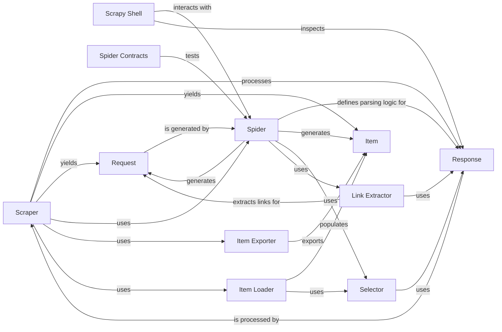

## Component Details

The Scraping & Parsing subsystem processes downloaded responses, extracts structured data (items) based on spider logic, and can generate new requests for further crawling. It also includes tools for selecting data from HTML/XML.

### Scraper
The Scraper is a core component responsible for processing responses received from the Downloader. It orchestrates the parsing of responses by the spider, handles the items yielded by the spider, and enqueues new requests generated during the scraping process. It interacts with Spider Middlewares for input/output processing and with Item Pipelines for item handling.

**Related Classes/Methods**:

- <a href="https://github.com/scrapy/scrapy/blob/master/scrapy/core/scraper.py#L99-L453" target="_blank" rel="noopener noreferrer">`scrapy.core.scraper.Scraper` (99:453)</a>
- <a href="https://github.com/scrapy/scrapy/blob/master/scrapy/core/scraper.py#L55-L96" target="_blank" rel="noopener noreferrer">`scrapy.core.scraper.Slot` (55:96)</a>

### Link Extractor
The Link Extractor component is responsible for identifying and extracting links from parsed responses. It typically uses rules defined within the spider to determine which links to follow, generating new requests for the Scraper to process.

**Related Classes/Methods**:

- <a href="https://github.com/scrapy/scrapy/blob/master/scrapy/linkextractors/lxmlhtml.py#L164-L284" target="_blank" rel="noopener noreferrer">`scrapy.linkextractors.lxmlhtml.LxmlLinkExtractor` (164:284)</a>
- <a href="https://github.com/scrapy/scrapy/blob/master/scrapy/linkextractors/lxmlhtml.py#L60-L157" target="_blank" rel="noopener noreferrer">`scrapy.linkextractors.lxmlhtml.LxmlParserLinkExtractor` (60:157)</a>

### Selector
The Selector component provides powerful methods for extracting data from HTML, XML, and JSON responses using XPath and CSS selectors. It allows spiders to precisely locate and retrieve desired information from the web page content.

**Related Classes/Methods**:

- <a href="https://github.com/scrapy/scrapy/blob/master/scrapy/selector/unified.py#L39-L101" target="_blank" rel="noopener noreferrer">`scrapy.selector.unified.Selector` (39:101)</a>
- <a href="https://github.com/scrapy/scrapy/blob/master/scrapy/selector/unified.py#L32-L36" target="_blank" rel="noopener noreferrer">`scrapy.selector.unified.SelectorList` (32:36)</a>

### Item Loader
The Item Loader component simplifies the process of populating Scrapy Item objects. It provides a convenient way to extract data using selectors and assign it to item fields, handling common tasks like input/output processing and default values.

**Related Classes/Methods**:

- `scrapy.loader.ItemLoader` (full file reference)

### Item Exporter
The Item Exporter component is responsible for serializing and writing scraped items to various output formats, such as JSON, CSV, XML, or Pickle. It provides a flexible interface for defining how items are exported.

**Related Classes/Methods**:

- <a href="https://github.com/scrapy/scrapy/blob/master/scrapy/exporters.py#L38-L108" target="_blank" rel="noopener noreferrer">`scrapy.exporters.BaseItemExporter` (38:108)</a>
- <a href="https://github.com/scrapy/scrapy/blob/master/scrapy/exporters.py#L111-L121" target="_blank" rel="noopener noreferrer">`scrapy.exporters.JsonLinesItemExporter` (111:121)</a>
- <a href="https://github.com/scrapy/scrapy/blob/master/scrapy/exporters.py#L124-L162" target="_blank" rel="noopener noreferrer">`scrapy.exporters.JsonItemExporter` (124:162)</a>
- <a href="https://github.com/scrapy/scrapy/blob/master/scrapy/exporters.py#L165-L219" target="_blank" rel="noopener noreferrer">`scrapy.exporters.XmlItemExporter` (165:219)</a>
- <a href="https://github.com/scrapy/scrapy/blob/master/scrapy/exporters.py#L222-L292" target="_blank" rel="noopener noreferrer">`scrapy.exporters.CsvItemExporter` (222:292)</a>
- <a href="https://github.com/scrapy/scrapy/blob/master/scrapy/exporters.py#L295-L303" target="_blank" rel="noopener noreferrer">`scrapy.exporters.PickleItemExporter` (295:303)</a>
- <a href="https://github.com/scrapy/scrapy/blob/master/scrapy/exporters.py#L306-L320" target="_blank" rel="noopener noreferrer">`scrapy.exporters.MarshalItemExporter` (306:320)</a>
- <a href="https://github.com/scrapy/scrapy/blob/master/scrapy/exporters.py#L323-L330" target="_blank" rel="noopener noreferrer">`scrapy.exporters.PprintItemExporter` (323:330)</a>
- <a href="https://github.com/scrapy/scrapy/blob/master/scrapy/exporters.py#L333-L373" target="_blank" rel="noopener noreferrer">`scrapy.exporters.PythonItemExporter` (333:373)</a>

### Scrapy Shell
The Scrapy Shell provides an interactive environment for testing and debugging spider logic, especially for response parsing and data extraction. It allows developers to inspect responses, try out selectors, and test item loading in real-time.

**Related Classes/Methods**:

- <a href="https://github.com/scrapy/scrapy/blob/master/scrapy/shell.py#L36-L212" target="_blank" rel="noopener noreferrer">`scrapy.shell.Shell` (36:212)</a>

### Spider Contracts
Spider Contracts provide a mechanism for defining and testing expectations about a spider's output. They allow developers to write assertions about the items and requests yielded by a spider, ensuring its correctness and consistency.

**Related Classes/Methods**:

- `scrapy.contracts.Contract` (full file reference)
- `scrapy.contracts.ContractsManager` (full file reference)

### Spider
The Spider component is the user-defined class that defines how to crawl a website and extract data. It contains the logic for making requests, parsing responses, and yielding items.

**Related Classes/Methods**:

- `scrapy.spiders.Spider` (full file reference)

### Item
The Item component represents a container for scraped data. It is a simple class that provides a dictionary-like API for declaring and storing structured data extracted from web pages.

**Related Classes/Methods**:

- <a href="https://github.com/scrapy/scrapy/blob/master/scrapy/item.py#L57-L132" target="_blank" rel="noopener noreferrer">`scrapy.item.Item` (57:132)</a>

### Request
The Request component represents an HTTP request that will be sent to a website. It contains information such as the URL, HTTP method, headers, body, and callback function for processing the response.

**Related Classes/Methods**:

- `scrapy.http.request.Request` (full file reference)

### Response
The Response component encapsulates the HTTP response received from a website. It contains the response body, headers, status code, and the original request that generated it. It also provides methods for parsing and extracting data from the response content.

**Related Classes/Methods**:

- `scrapy.http.response.Response` (full file reference)

### [FAQ](https://github.com/CodeBoarding/GeneratedOnBoardings/tree/main?tab=readme-ov-file#faq)