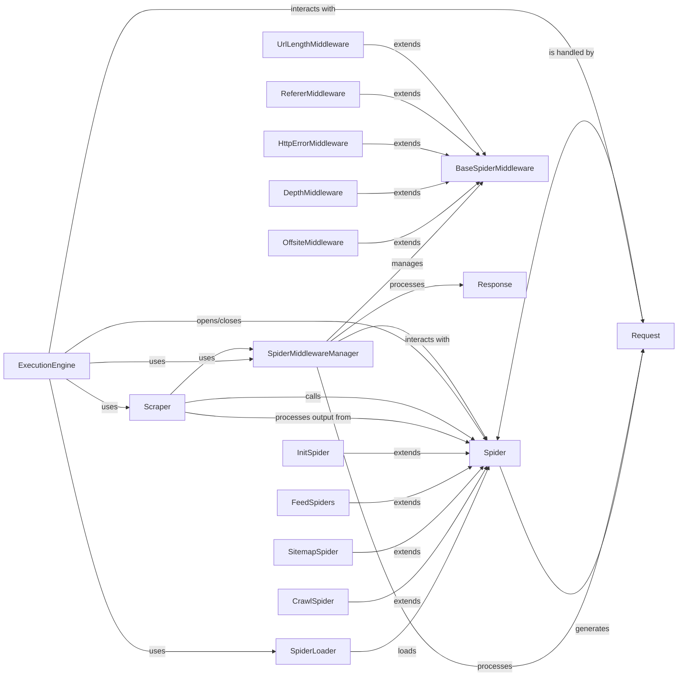

## Component Details

The 'Spider Logic' subsystem in Scrapy is responsible for defining and executing the custom crawling behavior for specific websites. It encompasses the core Spider classes that specify how to initiate requests, parse responses, and yield extracted items or new requests. This subsystem also includes various Spider Middlewares that allow for pre- and post-processing of the spider's input (responses) and output (items and requests), enabling functionalities like offsite filtering, depth limiting, and HTTP error handling. The SpiderLoader manages the discovery and loading of these spider classes, while the Scraper and ExecutionEngine interact with spiders and middlewares to orchestrate the overall data extraction and request scheduling process.

### Spider
The fundamental class for all Scrapy spiders. It provides the basic structure and methods for defining how to crawl a site and extract data. Spiders inherit from this class to implement their specific crawling logic.

**Related Classes/Methods**:

- `scrapy.spiders.Spider` (full file reference)

### SpiderLoader
Responsible for locating and loading spider classes within a Scrapy project. It manages a registry of available spiders by their names and provides methods to retrieve spider classes or find spiders that can handle a given request. It also handles duplicate spider names.

**Related Classes/Methods**:

- <a href="https://github.com/scrapy/scrapy/blob/master/scrapy/spiderloader.py#L25-L30" target="_blank" rel="noopener noreferrer">`scrapy.spiderloader.get_spider_loader` (25:30)</a>
- <a href="https://github.com/scrapy/scrapy/blob/master/scrapy/spiderloader.py#L51-L131" target="_blank" rel="noopener noreferrer">`scrapy.spiderloader.SpiderLoader` (51:131)</a>
- <a href="https://github.com/scrapy/scrapy/blob/master/scrapy/spiderloader.py#L135-L149" target="_blank" rel="noopener noreferrer">`scrapy.spiderloader.DummySpiderLoader` (135:149)</a>

### SpiderMiddlewareManager
Manages the execution of all configured Spider Middlewares. It orchestrates the process_spider_input, process_spider_output, and process_spider_exception methods of the middlewares, ensuring they are applied in the correct order.

**Related Classes/Methods**:

- <a href="https://github.com/scrapy/scrapy/blob/master/scrapy/core/spidermw.py#L52-L524" target="_blank" rel="noopener noreferrer">`scrapy.core.spidermw.SpiderMiddlewareManager` (52:524)</a>

### BaseSpiderMiddleware
The base class for all Spider Middlewares. Spider Middlewares are hooks that process spider's input (responses) and output (items and requests). They provide a mechanism to modify or filter the data flow between the engine and the spider.

**Related Classes/Methods**:

- <a href="https://github.com/scrapy/scrapy/blob/master/scrapy/spidermiddlewares/base.py#L17-L110" target="_blank" rel="noopener noreferrer">`scrapy.spidermiddlewares.base.BaseSpiderMiddleware` (17:110)</a>

### OffsiteMiddleware
A spider middleware that filters out requests for URLs that are not within the allowed domains of the spider. This prevents the spider from crawling external websites.

**Related Classes/Methods**:

- <a href="https://github.com/scrapy/scrapy/blob/master/scrapy/spidermiddlewares/offsite.py#L37-L112" target="_blank" rel="noopener noreferrer">`scrapy.spidermiddlewares.offsite.OffsiteMiddleware` (37:112)</a>

### DepthMiddleware
A spider middleware that tracks the depth of requests and can filter requests based on a maximum allowed depth. This helps in controlling the breadth of the crawl.

**Related Classes/Methods**:

- <a href="https://github.com/scrapy/scrapy/blob/master/scrapy/spidermiddlewares/depth.py#L29-L97" target="_blank" rel="noopener noreferrer">`scrapy.spidermiddlewares.depth.DepthMiddleware` (29:97)</a>

### HttpErrorMiddleware
A spider middleware that converts HTTP error responses (e.g., 404, 500) into exceptions that can be caught and handled by the spider's error callbacks.

**Related Classes/Methods**:

- <a href="https://github.com/scrapy/scrapy/blob/master/scrapy/spidermiddlewares/httperror.py#L37-L81" target="_blank" rel="noopener noreferrer">`scrapy.spidermiddlewares.httperror.HttpErrorMiddleware` (37:81)</a>

### RefererMiddleware
A spider middleware that adds the Referer header to outgoing requests based on the Referrer-Policy settings. It ensures that requests include the appropriate referrer information.

**Related Classes/Methods**:

- <a href="https://github.com/scrapy/scrapy/blob/master/scrapy/spidermiddlewares/referer.py#L329-L403" target="_blank" rel="noopener noreferrer">`scrapy.spidermiddlewares.referer.RefererMiddleware` (329:403)</a>

### UrlLengthMiddleware
A spider middleware that checks and enforces a maximum URL length for outgoing requests, preventing excessively long URLs from being processed.

**Related Classes/Methods**:

- <a href="https://github.com/scrapy/scrapy/blob/master/scrapy/spidermiddlewares/urllength.py#L26-L55" target="_blank" rel="noopener noreferrer">`scrapy.spidermiddlewares.urllength.UrlLengthMiddleware` (26:55)</a>

### CrawlSpider
A specialized spider designed for crawling websites by following links. It extends the Spider and uses a set of Rule objects to define how to extract links and which callback methods to use for processing responses.

**Related Classes/Methods**:

- <a href="https://github.com/scrapy/scrapy/blob/master/scrapy/spiders/crawl.py#L93-L219" target="_blank" rel="noopener noreferrer">`scrapy.spiders.crawl.CrawlSpider` (93:219)</a>

### SitemapSpider
A spider that can discover URLs to crawl by reading sitemap files (XML sitemaps or robots.txt files containing sitemap links). It parses sitemap entries and generates requests for the URLs found.

**Related Classes/Methods**:

- <a href="https://github.com/scrapy/scrapy/blob/master/scrapy/spiders/sitemap.py#L26-L132" target="_blank" rel="noopener noreferrer">`scrapy.spiders.sitemap.SitemapSpider` (26:132)</a>

### FeedSpiders
A group of specialized spiders (XMLFeedSpider and CSVFeedSpider) designed to parse data from XML and CSV feeds, respectively. They provide methods to iterate over nodes/rows and process them into items.

**Related Classes/Methods**:

- <a href="https://github.com/scrapy/scrapy/blob/master/scrapy/spiders/feed.py#L23-L108" target="_blank" rel="noopener noreferrer">`scrapy.spiders.feed.XMLFeedSpider` (23:108)</a>
- <a href="https://github.com/scrapy/scrapy/blob/master/scrapy/spiders/feed.py#L111-L161" target="_blank" rel="noopener noreferrer">`scrapy.spiders.feed.CSVFeedSpider` (111:161)</a>

### InitSpider
A spider that performs an initial request and waits for it to be processed before starting the main crawling process. This is useful for scenarios where an initial login or session setup is required.

**Related Classes/Methods**:

- <a href="https://github.com/scrapy/scrapy/blob/master/scrapy/spiders/init.py#L16-L63" target="_blank" rel="noopener noreferrer">`scrapy.spiders.init.InitSpider` (16:63)</a>

### Request
Represents an HTTP request that will be processed by the Scrapy engine. It encapsulates the URL, HTTP method, headers, body, and callback information.

**Related Classes/Methods**:

- `scrapy.http.Request` (full file reference)

### Scraper
The core component responsible for handling the scraping process. It takes responses, passes them to the spider for parsing, and then processes the output (items and requests) generated by the spider. It interacts with the Spider Middleware Manager.

**Related Classes/Methods**:

- <a href="https://github.com/scrapy/scrapy/blob/master/scrapy/core/scraper.py#L99-L453" target="_blank" rel="noopener noreferrer">`scrapy.core.scraper.Scraper` (99:453)</a>

### ExecutionEngine
The central orchestrator of the Scrapy crawling process. It manages the flow of requests, responses, and items, coordinating interactions between the scheduler, downloader, spiders, and middlewares. It's responsible for opening and closing spiders and initiating the crawling loop.

**Related Classes/Methods**:

- <a href="https://github.com/scrapy/scrapy/blob/master/scrapy/core/engine.py#L89-L520" target="_blank" rel="noopener noreferrer">`scrapy.core.engine.ExecutionEngine` (89:520)</a>

### [FAQ](https://github.com/CodeBoarding/GeneratedOnBoardings/tree/main?tab=readme-ov-file#faq)