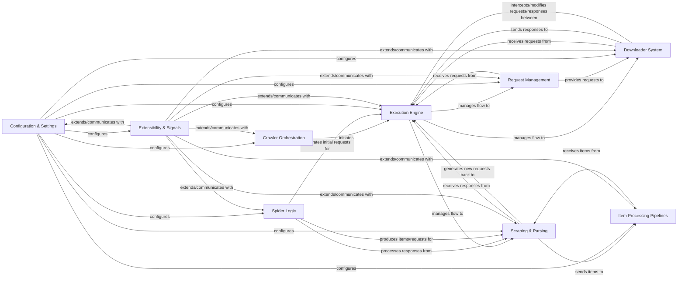

## Component Details

Scrapy is an open-source web crawling framework designed for fast, high-level screen scraping and web crawling. It allows users to define how to crawl websites and extract structured data using Spiders, which interact with a core Execution Engine that manages requests, responses, and item processing through a series of pluggable components like Downloader Middlewares and Item Pipelines. The framework is highly extensible via signals and extensions, and its behavior is controlled through a comprehensive settings system.

### Crawler Orchestration
Manages the overall lifecycle of crawling processes, including initiating, executing, and terminating crawls. It provides the user interface for starting and managing Scrapy projects and individual spiders.

**Related Classes/Methods**:

- <a href="https://github.com/scrapy/scrapy/blob/master/scrapy/crawler.py#L58-L322" target="_blank" rel="noopener noreferrer">`scrapy.crawler.Crawler` (58:322)</a>
- <a href="https://github.com/scrapy/scrapy/blob/master/scrapy/crawler.py#L325-L375" target="_blank" rel="noopener noreferrer">`scrapy.crawler.CrawlerRunnerBase` (325:375)</a>
- <a href="https://github.com/scrapy/scrapy/blob/master/scrapy/crawler.py#L378-L464" target="_blank" rel="noopener noreferrer">`scrapy.crawler.CrawlerRunner` (378:464)</a>
- <a href="https://github.com/scrapy/scrapy/blob/master/scrapy/crawler.py#L467-L560" target="_blank" rel="noopener noreferrer">`scrapy.crawler.AsyncCrawlerRunner` (467:560)</a>
- <a href="https://github.com/scrapy/scrapy/blob/master/scrapy/crawler.py#L563-L632" target="_blank" rel="noopener noreferrer">`scrapy.crawler.CrawlerProcessBase` (563:632)</a>
- <a href="https://github.com/scrapy/scrapy/blob/master/scrapy/crawler.py#L635-L707" target="_blank" rel="noopener noreferrer">`scrapy.crawler.CrawlerProcess` (635:707)</a>
- <a href="https://github.com/scrapy/scrapy/blob/master/scrapy/crawler.py#L710-L788" target="_blank" rel="noopener noreferrer">`scrapy.crawler.AsyncCrawlerProcess` (710:788)</a>
- `scrapy.cmdline` (full file reference)
- <a href="https://github.com/scrapy/scrapy/blob/master/scrapy/commands/bench.py#L19-L33" target="_blank" rel="noopener noreferrer">`scrapy.commands.bench.Command` (19:33)</a>
- <a href="https://github.com/scrapy/scrapy/blob/master/scrapy/commands/check.py#L42-L115" target="_blank" rel="noopener noreferrer">`scrapy.commands.check.Command` (42:115)</a>
- <a href="https://github.com/scrapy/scrapy/blob/master/scrapy/commands/crawl.py#L12-L34" target="_blank" rel="noopener noreferrer">`scrapy.commands.crawl.Command` (12:34)</a>
- <a href="https://github.com/scrapy/scrapy/blob/master/scrapy/commands/edit.py#L10-L47" target="_blank" rel="noopener noreferrer">`scrapy.commands.edit.Command` (10:47)</a>
- <a href="https://github.com/scrapy/scrapy/blob/master/scrapy/commands/fetch.py#L20-L97" target="_blank" rel="noopener noreferrer">`scrapy.commands.fetch.Command` (20:97)</a>
- <a href="https://github.com/scrapy/scrapy/blob/master/scrapy/commands/genspider.py#L48-L226" target="_blank" rel="noopener noreferrer">`scrapy.commands.genspider.Command` (48:226)</a>
- <a href="https://github.com/scrapy/scrapy/blob/master/scrapy/commands/list.py#L12-L24" target="_blank" rel="noopener noreferrer">`scrapy.commands.list.Command` (12:24)</a>
- <a href="https://github.com/scrapy/scrapy/blob/master/scrapy/commands/parse.py#L38-L410" target="_blank" rel="noopener noreferrer">`scrapy.commands.parse.Command` (38:410)</a>
- <a href="https://github.com/scrapy/scrapy/blob/master/scrapy/commands/runspider.py#L32-L64" target="_blank" rel="noopener noreferrer">`scrapy.commands.runspider.Command` (32:64)</a>
- <a href="https://github.com/scrapy/scrapy/blob/master/scrapy/commands/settings.py#L8-L64" target="_blank" rel="noopener noreferrer">`scrapy.commands.settings.Command` (8:64)</a>
- <a href="https://github.com/scrapy/scrapy/blob/master/scrapy/commands/shell.py#L24-L101" target="_blank" rel="noopener noreferrer">`scrapy.commands.shell.Command` (24:101)</a>
- <a href="https://github.com/scrapy/scrapy/blob/master/scrapy/commands/startproject.py#L35-L141" target="_blank" rel="noopener noreferrer">`scrapy.commands.startproject.Command` (35:141)</a>
- <a href="https://github.com/scrapy/scrapy/blob/master/scrapy/commands/version.py#L8-L35" target="_blank" rel="noopener noreferrer">`scrapy.commands.version.Command` (8:35)</a>
- <a href="https://github.com/scrapy/scrapy/blob/master/scrapy/commands/view.py#L11-L28" target="_blank" rel="noopener noreferrer">`scrapy.commands.view.Command` (11:28)</a>
- `scrapy.commands.ScrapyCommand` (full file reference)
- `scrapy.commands.BaseRunSpiderCommand` (full file reference)

### Execution Engine
The central orchestrator of the Scrapy framework. It manages the flow of requests and responses between the Scheduler, Downloader, and Scraper, ensuring efficient and concurrent crawling operations.

**Related Classes/Methods**:

- <a href="https://github.com/scrapy/scrapy/blob/master/scrapy/core/engine.py#L89-L520" target="_blank" rel="noopener noreferrer">`scrapy.core.engine.ExecutionEngine` (89:520)</a>
- <a href="https://github.com/scrapy/scrapy/blob/master/scrapy/core/engine.py#L52-L86" target="_blank" rel="noopener noreferrer">`scrapy.core.engine._Slot` (52:86)</a>
- `scrapy.utils.engine` (full file reference)

### Request Management
Handles the queuing, prioritization, and deduplication of web requests. It ensures that only unique and relevant requests are processed by the Downloader, utilizing specific data structures for HTTP communication.

**Related Classes/Methods**:

- <a href="https://github.com/scrapy/scrapy/blob/master/scrapy/core/scheduler.py#L55-L127" target="_blank" rel="noopener noreferrer">`scrapy.core.scheduler.BaseScheduler` (55:127)</a>
- <a href="https://github.com/scrapy/scrapy/blob/master/scrapy/core/scheduler.py#L130-L498" target="_blank" rel="noopener noreferrer">`scrapy.core.scheduler.Scheduler` (130:498)</a>
- <a href="https://github.com/scrapy/scrapy/blob/master/scrapy/pqueues.py#L52-L233" target="_blank" rel="noopener noreferrer">`scrapy.pqueues.ScrapyPriorityQueue` (52:233)</a>
- <a href="https://github.com/scrapy/scrapy/blob/master/scrapy/pqueues.py#L254-L367" target="_blank" rel="noopener noreferrer">`scrapy.pqueues.DownloaderAwarePriorityQueue` (254:367)</a>
- <a href="https://github.com/scrapy/scrapy/blob/master/scrapy/dupefilters.py#L29-L61" target="_blank" rel="noopener noreferrer">`scrapy.dupefilters.BaseDupeFilter` (29:61)</a>
- <a href="https://github.com/scrapy/scrapy/blob/master/scrapy/dupefilters.py#L64-L155" target="_blank" rel="noopener noreferrer">`scrapy.dupefilters.RFPDupeFilter` (64:155)</a>
- `scrapy.http.request.Request` (full file reference)
- <a href="https://github.com/scrapy/scrapy/blob/master/scrapy/http/request/form.py#L38-L93" target="_blank" rel="noopener noreferrer">`scrapy.http.request.form.FormRequest` (38:93)</a>
- <a href="https://github.com/scrapy/scrapy/blob/master/scrapy/http/request/json_request.py#L22-L77" target="_blank" rel="noopener noreferrer">`scrapy.http.request.json_request.JsonRequest` (22:77)</a>
- <a href="https://github.com/scrapy/scrapy/blob/master/scrapy/http/request/rpc.py#L23-L40" target="_blank" rel="noopener noreferrer">`scrapy.http.request.rpc.XmlRpcRequest` (23:40)</a>
- `scrapy.http.response.Response` (full file reference)
- <a href="https://github.com/scrapy/scrapy/blob/master/scrapy/http/response/text.py#L42-L294" target="_blank" rel="noopener noreferrer">`scrapy.http.response.text.TextResponse` (42:294)</a>
- <a href="https://github.com/scrapy/scrapy/blob/master/scrapy/http/response/html.py#L11-L12" target="_blank" rel="noopener noreferrer">`scrapy.http.response.html.HtmlResponse` (11:12)</a>
- <a href="https://github.com/scrapy/scrapy/blob/master/scrapy/http/response/json.py#L11-L12" target="_blank" rel="noopener noreferrer">`scrapy.http.response.json.JsonResponse` (11:12)</a>
- <a href="https://github.com/scrapy/scrapy/blob/master/scrapy/http/response/xml.py#L11-L12" target="_blank" rel="noopener noreferrer">`scrapy.http.response.xml.XmlResponse` (11:12)</a>
- <a href="https://github.com/scrapy/scrapy/blob/master/scrapy/http/headers.py#L23-L130" target="_blank" rel="noopener noreferrer">`scrapy.http.headers.Headers` (23:130)</a>
- <a href="https://github.com/scrapy/scrapy/blob/master/scrapy/http/cookies.py#L27-L108" target="_blank" rel="noopener noreferrer">`scrapy.http.cookies.CookieJar` (27:108)</a>
- `scrapy.utils.request` (full file reference)
- `scrapy.utils.response` (full file reference)
- `scrapy.utils.url` (full file reference)
- `scrapy.utils.httpobj` (full file reference)

### Downloader System
Responsible for fetching web content from various sources, handling different protocols, and applying a chain of middlewares to requests before sending them and to responses upon receiving them.

**Related Classes/Methods**:

- `scrapy.core.downloader.Downloader` (full file reference)
- `scrapy.core.downloader.handlers.DownloadHandlers` (full file reference)
- <a href="https://github.com/scrapy/scrapy/blob/master/scrapy/core/downloader/handlers/http11.py#L67-L125" target="_blank" rel="noopener noreferrer">`scrapy.core.downloader.handlers.http11.HTTP11DownloadHandler` (67:125)</a>
- <a href="https://github.com/scrapy/scrapy/blob/master/scrapy/core/downloader/handlers/http2.py#L29-L51" target="_blank" rel="noopener noreferrer">`scrapy.core.downloader.handlers.http2.H2DownloadHandler` (29:51)</a>
- <a href="https://github.com/scrapy/scrapy/blob/master/scrapy/core/downloader/handlers/ftp.py#L85-L151" target="_blank" rel="noopener noreferrer">`scrapy.core.downloader.handlers.ftp.FTPDownloadHandler` (85:151)</a>
- <a href="https://github.com/scrapy/scrapy/blob/master/scrapy/core/downloader/handlers/file.py#L16-L24" target="_blank" rel="noopener noreferrer">`scrapy.core.downloader.handlers.file.FileDownloadHandler` (16:24)</a>
- <a href="https://github.com/scrapy/scrapy/blob/master/scrapy/core/downloader/handlers/datauri.py#L15-L28" target="_blank" rel="noopener noreferrer">`scrapy.core.downloader.handlers.datauri.DataURIDownloadHandler` (15:28)</a>
- <a href="https://github.com/scrapy/scrapy/blob/master/scrapy/core/downloader/webclient.py#L94-L239" target="_blank" rel="noopener noreferrer">`scrapy.core.downloader.webclient.ScrapyHTTPClientFactory` (94:239)</a>
- <a href="https://github.com/scrapy/scrapy/blob/master/scrapy/core/downloader/webclient.py#L24-L87" target="_blank" rel="noopener noreferrer">`scrapy.core.downloader.webclient.ScrapyHTTPPageGetter` (24:87)</a>
- <a href="https://github.com/scrapy/scrapy/blob/master/scrapy/core/http2/agent.py#L118-L158" target="_blank" rel="noopener noreferrer">`scrapy.core.http2.agent.H2Agent` (118:158)</a>
- <a href="https://github.com/scrapy/scrapy/blob/master/scrapy/core/http2/agent.py#L32-L115" target="_blank" rel="noopener noreferrer">`scrapy.core.http2.agent.H2ConnectionPool` (32:115)</a>
- <a href="https://github.com/scrapy/scrapy/blob/master/scrapy/core/http2/protocol.py#L85-L434" target="_blank" rel="noopener noreferrer">`scrapy.core.http2.protocol.H2ClientProtocol` (85:434)</a>
- <a href="https://github.com/scrapy/scrapy/blob/master/scrapy/core/http2/stream.py#L78-L495" target="_blank" rel="noopener noreferrer">`scrapy.core.http2.stream.Stream` (78:495)</a>
- <a href="https://github.com/scrapy/scrapy/blob/master/scrapy/core/downloader/middleware.py#L27-L118" target="_blank" rel="noopener noreferrer">`scrapy.core.downloader.middleware.DownloaderMiddlewareManager` (27:118)</a>
- <a href="https://github.com/scrapy/scrapy/blob/master/scrapy/downloadermiddlewares/stats.py#L37-L84" target="_blank" rel="noopener noreferrer">`scrapy.downloadermiddlewares.stats.DownloaderStats` (37:84)</a>
- <a href="https://github.com/scrapy/scrapy/blob/master/scrapy/downloadermiddlewares/httpcompression.py#L49-L193" target="_blank" rel="noopener noreferrer">`scrapy.downloadermiddlewares.httpcompression.HttpCompressionMiddleware` (49:193)</a>
- <a href="https://github.com/scrapy/scrapy/blob/master/scrapy/downloadermiddlewares/httpcache.py#L34-L157" target="_blank" rel="noopener noreferrer">`scrapy.downloadermiddlewares.httpcache.HttpCacheMiddleware` (34:157)</a>
- <a href="https://github.com/scrapy/scrapy/blob/master/scrapy/downloadermiddlewares/downloadtimeout.py#L21-L39" target="_blank" rel="noopener noreferrer">`scrapy.downloadermiddlewares.downloadtimeout.DownloadTimeoutMiddleware` (21:39)</a>
- <a href="https://github.com/scrapy/scrapy/blob/master/scrapy/downloadermiddlewares/offsite.py#L23-L93" target="_blank" rel="noopener noreferrer">`scrapy.downloadermiddlewares.offsite.OffsiteMiddleware` (23:93)</a>
- <a href="https://github.com/scrapy/scrapy/blob/master/scrapy/downloadermiddlewares/httpproxy.py#L25-L104" target="_blank" rel="noopener noreferrer">`scrapy.downloadermiddlewares.httpproxy.HttpProxyMiddleware` (25:104)</a>
- <a href="https://github.com/scrapy/scrapy/blob/master/scrapy/downloadermiddlewares/ajaxcrawl.py#L26-L83" target="_blank" rel="noopener noreferrer">`scrapy.downloadermiddlewares.ajaxcrawl.AjaxCrawlMiddleware` (26:83)</a>
- <a href="https://github.com/scrapy/scrapy/blob/master/scrapy/downloadermiddlewares/redirect.py#L81-L138" target="_blank" rel="noopener noreferrer">`scrapy.downloadermiddlewares.redirect.BaseRedirectMiddleware` (81:138)</a>
- <a href="https://github.com/scrapy/scrapy/blob/master/scrapy/downloadermiddlewares/redirect.py#L141-L177" target="_blank" rel="noopener noreferrer">`scrapy.downloadermiddlewares.redirect.RedirectMiddleware` (141:177)</a>
- <a href="https://github.com/scrapy/scrapy/blob/master/scrapy/downloadermiddlewares/redirect.py#L180-L207" target="_blank" rel="noopener noreferrer">`scrapy.downloadermiddlewares.redirect.MetaRefreshMiddleware` (180:207)</a>
- <a href="https://github.com/scrapy/scrapy/blob/master/scrapy/downloadermiddlewares/robotstxt.py#L35-L158" target="_blank" rel="noopener noreferrer">`scrapy.downloadermiddlewares.robotstxt.RobotsTxtMiddleware` (35:158)</a>
- <a href="https://github.com/scrapy/scrapy/blob/master/scrapy/downloadermiddlewares/httpauth.py#L24-L51" target="_blank" rel="noopener noreferrer">`scrapy.downloadermiddlewares.httpauth.HttpAuthMiddleware` (24:51)</a>
- <a href="https://github.com/scrapy/scrapy/blob/master/scrapy/downloadermiddlewares/retry.py#L125-L174" target="_blank" rel="noopener noreferrer">`scrapy.downloadermiddlewares.retry.RetryMiddleware` (125:174)</a>
- <a href="https://github.com/scrapy/scrapy/blob/master/scrapy/downloadermiddlewares/useragent.py#L17-L37" target="_blank" rel="noopener noreferrer">`scrapy.downloadermiddlewares.useragent.UserAgentMiddleware` (17:37)</a>
- <a href="https://github.com/scrapy/scrapy/blob/master/scrapy/downloadermiddlewares/cookies.py#L39-L182" target="_blank" rel="noopener noreferrer">`scrapy.downloadermiddlewares.cookies.CookiesMiddleware` (39:182)</a>
- <a href="https://github.com/scrapy/scrapy/blob/master/scrapy/downloadermiddlewares/defaultheaders.py#L24-L38" target="_blank" rel="noopener noreferrer">`scrapy.downloadermiddlewares.defaultheaders.DefaultHeadersMiddleware` (24:38)</a>
- <a href="https://github.com/scrapy/scrapy/blob/master/scrapy/robotstxt.py#L68-L85" target="_blank" rel="noopener noreferrer">`scrapy.robotstxt.PythonRobotParser` (68:85)</a>
- <a href="https://github.com/scrapy/scrapy/blob/master/scrapy/robotstxt.py#L88-L105" target="_blank" rel="noopener noreferrer">`scrapy.robotstxt.RerpRobotParser` (88:105)</a>
- <a href="https://github.com/scrapy/scrapy/blob/master/scrapy/robotstxt.py#L108-L124" target="_blank" rel="noopener noreferrer">`scrapy.robotstxt.ProtegoRobotParser` (108:124)</a>
- <a href="https://github.com/scrapy/scrapy/blob/master/scrapy/resolver.py#L33-L70" target="_blank" rel="noopener noreferrer">`scrapy.resolver.CachingThreadedResolver` (33:70)</a>
- <a href="https://github.com/scrapy/scrapy/blob/master/scrapy/resolver.py#L104-L148" target="_blank" rel="noopener noreferrer">`scrapy.resolver.CachingHostnameResolver` (104:148)</a>

### Scraping & Parsing
Processes downloaded responses, extracts structured data (items) based on spider logic, and can generate new requests for further crawling. It also includes tools for selecting data from HTML/XML.

**Related Classes/Methods**:

- <a href="https://github.com/scrapy/scrapy/blob/master/scrapy/core/scraper.py#L99-L453" target="_blank" rel="noopener noreferrer">`scrapy.core.scraper.Scraper` (99:453)</a>
- <a href="https://github.com/scrapy/scrapy/blob/master/scrapy/core/scraper.py#L55-L96" target="_blank" rel="noopener noreferrer">`scrapy.core.scraper.Slot` (55:96)</a>
- <a href="https://github.com/scrapy/scrapy/blob/master/scrapy/linkextractors/lxmlhtml.py#L164-L284" target="_blank" rel="noopener noreferrer">`scrapy.linkextractors.lxmlhtml.LxmlLinkExtractor` (164:284)</a>
- <a href="https://github.com/scrapy/scrapy/blob/master/scrapy/linkextractors/lxmlhtml.py#L60-L157" target="_blank" rel="noopener noreferrer">`scrapy.linkextractors.lxmlhtml.LxmlParserLinkExtractor` (60:157)</a>
- <a href="https://github.com/scrapy/scrapy/blob/master/scrapy/selector/unified.py#L39-L101" target="_blank" rel="noopener noreferrer">`scrapy.selector.unified.Selector` (39:101)</a>
- <a href="https://github.com/scrapy/scrapy/blob/master/scrapy/selector/unified.py#L32-L36" target="_blank" rel="noopener noreferrer">`scrapy.selector.unified.SelectorList` (32:36)</a>
- `scrapy.loader.ItemLoader` (full file reference)
- <a href="https://github.com/scrapy/scrapy/blob/master/scrapy/exporters.py#L38-L108" target="_blank" rel="noopener noreferrer">`scrapy.exporters.BaseItemExporter` (38:108)</a>
- <a href="https://github.com/scrapy/scrapy/blob/master/scrapy/exporters.py#L111-L121" target="_blank" rel="noopener noreferrer">`scrapy.exporters.JsonLinesItemExporter` (111:121)</a>
- <a href="https://github.com/scrapy/scrapy/blob/master/scrapy/exporters.py#L124-L162" target="_blank" rel="noopener noreferrer">`scrapy.exporters.JsonItemExporter` (124:162)</a>
- <a href="https://github.com/scrapy/scrapy/blob/master/scrapy/exporters.py#L165-L219" target="_blank" rel="noopener noreferrer">`scrapy.exporters.XmlItemExporter` (165:219)</a>
- <a href="https://github.com/scrapy/scrapy/blob/master/scrapy/exporters.py#L222-L292" target="_blank" rel="noopener noreferrer">`scrapy.exporters.CsvItemExporter` (222:292)</a>
- <a href="https://github.com/scrapy/scrapy/blob/master/scrapy/exporters.py#L295-L303" target="_blank" rel="noopener noreferrer">`scrapy.exporters.PickleItemExporter` (295:303)</a>
- <a href="https://github.com/scrapy/scrapy/blob/master/scrapy/exporters.py#L306-L320" target="_blank" rel="noopener noreferrer">`scrapy.exporters.MarshalItemExporter` (306:320)</a>
- <a href="https://github.com/scrapy/scrapy/blob/master/scrapy/exporters.py#L323-L330" target="_blank" rel="noopener noreferrer">`scrapy.exporters.PprintItemExporter` (323:330)</a>
- <a href="https://github.com/scrapy/scrapy/blob/master/scrapy/exporters.py#L333-L373" target="_blank" rel="noopener noreferrer">`scrapy.exporters.PythonItemExporter` (333:373)</a>
- <a href="https://github.com/scrapy/scrapy/blob/master/scrapy/shell.py#L36-L212" target="_blank" rel="noopener noreferrer">`scrapy.shell.Shell` (36:212)</a>
- `scrapy.contracts.Contract` (full file reference)
- `scrapy.contracts.ContractsManager` (full file reference)

### Spider Logic
Defines the custom crawling behavior for specific websites. Spiders specify how to initiate requests, parse responses, and yield extracted items or new requests. Spider middlewares allow for pre- and post-processing of spider input/output.

**Related Classes/Methods**:

- `scrapy.spiders.Spider` (full file reference)
- <a href="https://github.com/scrapy/scrapy/blob/master/scrapy/spiders/feed.py#L23-L108" target="_blank" rel="noopener noreferrer">`scrapy.spiders.feed.XMLFeedSpider` (23:108)</a>
- <a href="https://github.com/scrapy/scrapy/blob/master/scrapy/spiders/feed.py#L111-L161" target="_blank" rel="noopener noreferrer">`scrapy.spiders.feed.CSVFeedSpider` (111:161)</a>
- <a href="https://github.com/scrapy/scrapy/blob/master/scrapy/spiders/crawl.py#L93-L219" target="_blank" rel="noopener noreferrer">`scrapy.spiders.crawl.CrawlSpider` (93:219)</a>
- <a href="https://github.com/scrapy/scrapy/blob/master/scrapy/spiders/sitemap.py#L26-L132" target="_blank" rel="noopener noreferrer">`scrapy.spiders.sitemap.SitemapSpider` (26:132)</a>
- <a href="https://github.com/scrapy/scrapy/blob/master/scrapy/spiders/init.py#L16-L63" target="_blank" rel="noopener noreferrer">`scrapy.spiders.init.InitSpider` (16:63)</a>
- <a href="https://github.com/scrapy/scrapy/blob/master/scrapy/core/spidermw.py#L52-L524" target="_blank" rel="noopener noreferrer">`scrapy.core.spidermw.SpiderMiddlewareManager` (52:524)</a>
- <a href="https://github.com/scrapy/scrapy/blob/master/scrapy/spidermiddlewares/offsite.py#L37-L112" target="_blank" rel="noopener noreferrer">`scrapy.spidermiddlewares.offsite.OffsiteMiddleware` (37:112)</a>
- <a href="https://github.com/scrapy/scrapy/blob/master/scrapy/spidermiddlewares/depth.py#L29-L97" target="_blank" rel="noopener noreferrer">`scrapy.spidermiddlewares.depth.DepthMiddleware` (29:97)</a>
- <a href="https://github.com/scrapy/scrapy/blob/master/scrapy/spidermiddlewares/base.py#L17-L110" target="_blank" rel="noopener noreferrer">`scrapy.spidermiddlewares.base.BaseSpiderMiddleware` (17:110)</a>
- <a href="https://github.com/scrapy/scrapy/blob/master/scrapy/spidermiddlewares/httperror.py#L37-L81" target="_blank" rel="noopener noreferrer">`scrapy.spidermiddlewares.httperror.HttpErrorMiddleware` (37:81)</a>
- <a href="https://github.com/scrapy/scrapy/blob/master/scrapy/spidermiddlewares/referer.py#L329-L403" target="_blank" rel="noopener noreferrer">`scrapy.spidermiddlewares.referer.RefererMiddleware` (329:403)</a>
- <a href="https://github.com/scrapy/scrapy/blob/master/scrapy/spidermiddlewares/urllength.py#L26-L55" target="_blank" rel="noopener noreferrer">`scrapy.spidermiddlewares.urllength.UrlLengthMiddleware` (26:55)</a>
- <a href="https://github.com/scrapy/scrapy/blob/master/scrapy/spiderloader.py#L25-L30" target="_blank" rel="noopener noreferrer">`scrapy.spiderloader.get_spider_loader` (25:30)</a>
- <a href="https://github.com/scrapy/scrapy/blob/master/scrapy/spiderloader.py#L51-L131" target="_blank" rel="noopener noreferrer">`scrapy.spiderloader.SpiderLoader` (51:131)</a>
- <a href="https://github.com/scrapy/scrapy/blob/master/scrapy/spiderloader.py#L135-L149" target="_blank" rel="noopener noreferrer">`scrapy.spiderloader.DummySpiderLoader` (135:149)</a>

### Item Processing Pipelines
A series of components that process extracted items sequentially. This includes data validation, cleaning, persistence to various storage backends, and handling associated media files (images, files).

**Related Classes/Methods**:

- <a href="https://github.com/scrapy/scrapy/blob/master/scrapy/pipelines/images.py#L43-L274" target="_blank" rel="noopener noreferrer">`scrapy.pipelines.images.ImagesPipeline` (43:274)</a>
- <a href="https://github.com/scrapy/scrapy/blob/master/scrapy/pipelines/files.py#L414-L746" target="_blank" rel="noopener noreferrer">`scrapy.pipelines.files.FilesPipeline` (414:746)</a>
- <a href="https://github.com/scrapy/scrapy/blob/master/scrapy/pipelines/media.py#L48-L336" target="_blank" rel="noopener noreferrer">`scrapy.pipelines.media.MediaPipeline` (48:336)</a>
- <a href="https://github.com/scrapy/scrapy/blob/master/scrapy/pipelines/files.py#L104-L152" target="_blank" rel="noopener noreferrer">`scrapy.pipelines.files.FSFilesStore` (104:152)</a>
- <a href="https://github.com/scrapy/scrapy/blob/master/scrapy/pipelines/files.py#L155-L274" target="_blank" rel="noopener noreferrer">`scrapy.pipelines.files.S3FilesStore` (155:274)</a>
- <a href="https://github.com/scrapy/scrapy/blob/master/scrapy/pipelines/files.py#L277-L349" target="_blank" rel="noopener noreferrer">`scrapy.pipelines.files.GCSFilesStore` (277:349)</a>
- `scrapy.pipelines.ItemPipelineManager` (full file reference)

### Configuration & Settings
Centralized management of all configurable parameters for a Scrapy project. It allows users to customize the behavior of various components through a hierarchical settings system.

**Related Classes/Methods**:

- `scrapy.settings.Settings` (full file reference)
- `scrapy.settings.BaseSettings` (full file reference)
- `scrapy.utils.conf` (full file reference)

### Extensibility & Signals
Provides a flexible system for extending Scrapy's core functionality and enabling communication between different components through a robust signal dispatching mechanism. Extensions can hook into various stages of the crawling process.

**Related Classes/Methods**:

- <a href="https://github.com/scrapy/scrapy/blob/master/scrapy/extension.py#L18-L23" target="_blank" rel="noopener noreferrer">`scrapy.extension.ExtensionManager` (18:23)</a>
- <a href="https://github.com/scrapy/scrapy/blob/master/scrapy/signalmanager.py#L12-L106" target="_blank" rel="noopener noreferrer">`scrapy.signalmanager.SignalManager` (12:106)</a>
- `scrapy.signals` (full file reference)
- <a href="https://github.com/scrapy/scrapy/blob/master/scrapy/extensions/telnet.py#L41-L118" target="_blank" rel="noopener noreferrer">`scrapy.extensions.telnet.TelnetConsole` (41:118)</a>
- <a href="https://github.com/scrapy/scrapy/blob/master/scrapy/extensions/memusage.py#L37-L163" target="_blank" rel="noopener noreferrer">`scrapy.extensions.memusage.MemoryUsage` (37:163)</a>
- <a href="https://github.com/scrapy/scrapy/blob/master/scrapy/extensions/httpcache.py#L38-L59" target="_blank" rel="noopener noreferrer">`scrapy.extensions.httpcache.DummyPolicy` (38:59)</a>
- <a href="https://github.com/scrapy/scrapy/blob/master/scrapy/extensions/httpcache.py#L62-L247" target="_blank" rel="noopener noreferrer">`scrapy.extensions.httpcache.RFC2616Policy` (62:247)</a>
- <a href="https://github.com/scrapy/scrapy/blob/master/scrapy/extensions/httpcache.py#L250-L310" target="_blank" rel="noopener noreferrer">`scrapy.extensions.httpcache.DbmCacheStorage` (250:310)</a>
- <a href="https://github.com/scrapy/scrapy/blob/master/scrapy/extensions/httpcache.py#L313-L392" target="_blank" rel="noopener noreferrer">`scrapy.extensions.httpcache.FilesystemCacheStorage` (313:392)</a>
- <a href="https://github.com/scrapy/scrapy/blob/master/scrapy/extensions/postprocessing.py#L118-L166" target="_blank" rel="noopener noreferrer">`scrapy.extensions.postprocessing.PostProcessingManager` (118:166)</a>
- <a href="https://github.com/scrapy/scrapy/blob/master/scrapy/extensions/spiderstate.py#L18-L51" target="_blank" rel="noopener noreferrer">`scrapy.extensions.spiderstate.SpiderState` (18:51)</a>
- <a href="https://github.com/scrapy/scrapy/blob/master/scrapy/extensions/throttle.py#L21-L129" target="_blank" rel="noopener noreferrer">`scrapy.extensions.throttle.AutoThrottle` (21:129)</a>
- <a href="https://github.com/scrapy/scrapy/blob/master/scrapy/extensions/periodic_log.py#L30-L163" target="_blank" rel="noopener noreferrer">`scrapy.extensions.periodic_log.PeriodicLog` (30:163)</a>
- <a href="https://github.com/scrapy/scrapy/blob/master/scrapy/extensions/debug.py#L33-L68" target="_blank" rel="noopener noreferrer">`scrapy.extensions.debug.StackTraceDump` (33:68)</a>
- <a href="https://github.com/scrapy/scrapy/blob/master/scrapy/extensions/logstats.py#L26-L103" target="_blank" rel="noopener noreferrer">`scrapy.extensions.logstats.LogStats` (26:103)</a>
- <a href="https://github.com/scrapy/scrapy/blob/master/scrapy/extensions/statsmailer.py#L25-L48" target="_blank" rel="noopener noreferrer">`scrapy.extensions.statsmailer.StatsMailer` (25:48)</a>
- <a href="https://github.com/scrapy/scrapy/blob/master/scrapy/extensions/corestats.py#L20-L60" target="_blank" rel="noopener noreferrer">`scrapy.extensions.corestats.CoreStats` (20:60)</a>
- <a href="https://github.com/scrapy/scrapy/blob/master/scrapy/extensions/closespider.py#L36-L153" target="_blank" rel="noopener noreferrer">`scrapy.extensions.closespider.CloseSpider` (36:153)</a>
- <a href="https://github.com/scrapy/scrapy/blob/master/scrapy/extensions/feedexport.py#L450-L744" target="_blank" rel="noopener noreferrer">`scrapy.extensions.feedexport.FeedExporter` (450:744)</a>
- <a href="https://github.com/scrapy/scrapy/blob/master/scrapy/extensions/feedexport.py#L205-L275" target="_blank" rel="noopener noreferrer">`scrapy.extensions.feedexport.S3FeedStorage` (205:275)</a>
- <a href="https://github.com/scrapy/scrapy/blob/master/scrapy/extensions/feedexport.py#L278-L323" target="_blank" rel="noopener noreferrer">`scrapy.extensions.feedexport.GCSFeedStorage` (278:323)</a>
- <a href="https://github.com/scrapy/scrapy/blob/master/scrapy/extensions/feedexport.py#L326-L369" target="_blank" rel="noopener noreferrer">`scrapy.extensions.feedexport.FTPFeedStorage` (326:369)</a>
- <a href="https://github.com/scrapy/scrapy/blob/master/scrapy/extensions/memdebug.py#L24-L47" target="_blank" rel="noopener noreferrer">`scrapy.extensions.memdebug.MemoryDebugger` (24:47)</a>
- `scrapy.utils.signal` (full file reference)
- `scrapy.utils.log` (full file reference)
- <a href="https://github.com/scrapy/scrapy/blob/master/scrapy/mail.py#L55-L245" target="_blank" rel="noopener noreferrer">`scrapy.mail.MailSender` (55:245)</a>
- <a href="https://github.com/scrapy/scrapy/blob/master/scrapy/logformatter.py#L37-L202" target="_blank" rel="noopener noreferrer">`scrapy.logformatter.LogFormatter` (37:202)</a>
- <a href="https://github.com/scrapy/scrapy/blob/master/scrapy/statscollectors.py#L22-L68" target="_blank" rel="noopener noreferrer">`scrapy.statscollectors.StatsCollector` (22:68)</a>
- <a href="https://github.com/scrapy/scrapy/blob/master/scrapy/statscollectors.py#L71-L77" target="_blank" rel="noopener noreferrer">`scrapy.statscollectors.MemoryStatsCollector` (71:77)</a>

### [FAQ](https://github.com/CodeBoarding/GeneratedOnBoardings/tree/main?tab=readme-ov-file#faq)