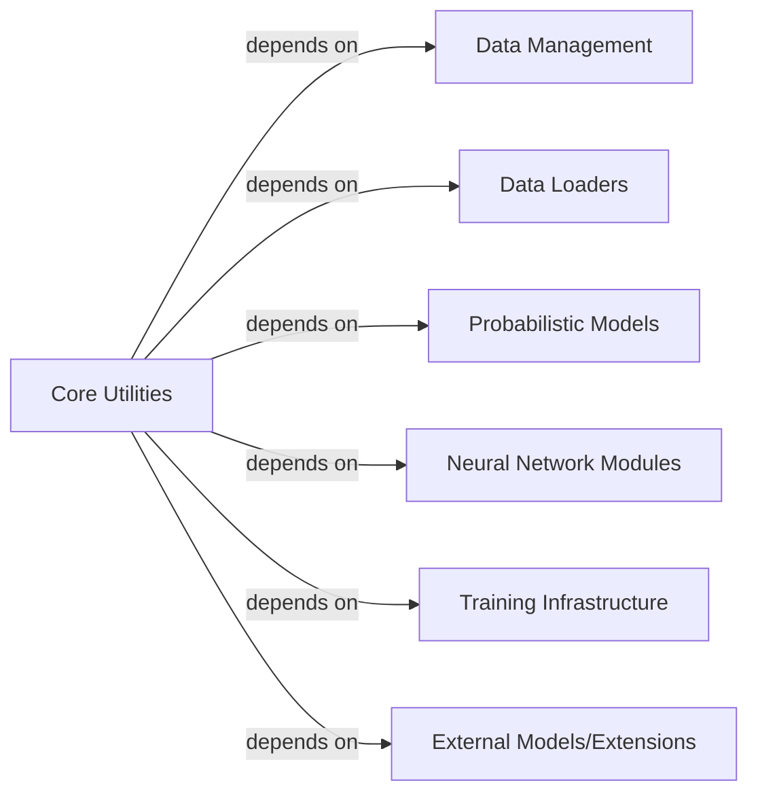

## Details

Abstract Components Overview

### Core Utilities [[Expand]](./Core_Utilities.md)
This component serves as a foundational collection of general-purpose utility functions and helper classes that support various operations across the entire scvi-tools framework. It encapsulates cross-cutting concerns such as flexible data structure handling, code enhancement through decorators, managing external software requirements, standardizing documentation, facilitating integration with JAX for high-performance computing, and offering progress tracking mechanisms. These utilities are designed to be highly reusable and are leveraged by numerous other components, ensuring consistency, efficiency, and maintainability throughout the scvi-tools ecosystem.

**Related Classes/Methods**:

- <a href="https://github.com/scverse/scvi-tools/blob/main/src/scvi/utils/_attrdict.py#L3-L11" target="_blank" rel="noopener noreferrer">`scvi.utils._attrdict.attrdict` (3:11)</a>
- <a href="https://github.com/scverse/scvi-tools/blob/main/src/scvi/utils/_decorators.py#L1-L9999" target="_blank" rel="noopener noreferrer">`scvi.utils._decorators` (1:9999)</a>
- <a href="https://github.com/scverse/scvi-tools/blob/main/src/scvi/utils/_dependencies.py#L1-L9999" target="_blank" rel="noopener noreferrer">`scvi.utils._dependencies` (1:9999)</a>
- <a href="https://github.com/scverse/scvi-tools/blob/main/src/scvi/utils/_docstrings.py#L1-L9999" target="_blank" rel="noopener noreferrer">`scvi.utils._docstrings` (1:9999)</a>
- <a href="https://github.com/scverse/scvi-tools/blob/main/src/scvi/utils/_jax.py#L1-L9999" target="_blank" rel="noopener noreferrer">`scvi.utils._jax` (1:9999)</a>
- <a href="https://github.com/scverse/scvi-tools/blob/main/src/scvi/utils/_track.py#L1-L9999" target="_blank" rel="noopener noreferrer">`scvi.utils._track` (1:9999)</a>

### Data Management
A component responsible for data management within the scvi-tools framework.

**Related Classes/Methods**: _None_

### Data Loaders
A component responsible for loading and preparing data within the scvi-tools framework.

**Related Classes/Methods**: _None_

### Probabilistic Models
A component responsible for probabilistic models within the scvi-tools framework.

**Related Classes/Methods**: _None_

### Neural Network Modules
A component responsible for neural network modules within the scvi-tools framework.

**Related Classes/Methods**: _None_

### Training Infrastructure
A component responsible for training infrastructure within the scvi-tools framework.

**Related Classes/Methods**: _None_

### External Models/Extensions
A component responsible for external models and extensions within the scvi-tools framework.

**Related Classes/Methods**: _None_

### [FAQ](https://github.com/CodeBoarding/GeneratedOnBoardings/tree/main?tab=readme-ov-file#faq)