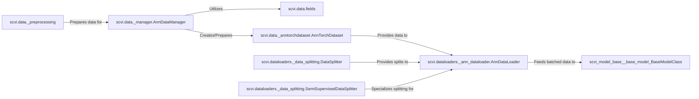

## Details

This subsystem is the backbone for handling single-cell data within `scvi-tools`, ensuring data integrity, proper formatting, and efficient delivery for model training and inference. It orchestrates the journey of `AnnData` objects from raw input to ready-to-use mini-batches.

### scvi.data._manager.AnnDataManager
This is the central orchestrator for `AnnData` objects. It's responsible for registering data fields, validating the `AnnData` structure against predefined schemas, and preparing the data for subsequent loading and processing steps. It acts as a crucial gatekeeper for data quality and consistency.

**Related Classes/Methods**: _None_

### scvi.data.fields
This package defines the expected structure and types of data within an `AnnData` object. It contains various field classes (e.g., `ArrayLikeField`, `DataFrameField`, `LayerField`) that `AnnDataManager` utilizes to enforce data validation rules, ensuring that the input data conforms to the requirements of `scvi-tools` models.

**Related Classes/Methods**: _None_

### scvi.data._anntorchdataset.AnnTorchDataset
This class serves as an essential adapter, transforming the `AnnData` object into a PyTorch-compatible `Dataset`. It allows `AnnDataLoader` to seamlessly interact with `AnnData`, providing an efficient interface for accessing and iterating over the data in a format suitable for neural network operations.

**Related Classes/Methods**: _None_

### scvi.dataloaders._data_splitting.DataSplitter
This component is responsible for dividing the dataset into distinct subsets, typically for training, validation, and testing. It provides flexible strategies for data partitioning, which is critical for robust model evaluation and preventing overfitting.

**Related Classes/Methods**: _None_

### scvi.dataloaders._data_splitting.SemiSupervisedDataSplitter
A specialized extension of `DataSplitter`, this component handles the unique requirements of splitting data for semi-supervised learning scenarios. It ensures that both labeled and unlabeled data are correctly partitioned for models that leverage both types of information.

**Related Classes/Methods**: _None_

### scvi.dataloaders._ann_dataloader.AnnDataLoader
This is the primary component for efficient data loading and batching. It takes the `AnnTorchDataset` and transforms it into mini-batches, which are then fed to the neural network models during training and inference, optimizing computational performance.

**Related Classes/Methods**: _None_

### scvi.data._preprocessing
This module provides a collection of utility functions for common preprocessing steps applied to single-cell `AnnData` objects. These transformations, such as normalization, scaling, and feature selection, are crucial for preparing raw data into a format that is optimal for input into `scvi-tools` models.

**Related Classes/Methods**: _None_

### [FAQ](https://github.com/CodeBoarding/GeneratedOnBoardings/tree/main?tab=readme-ov-file#faq)