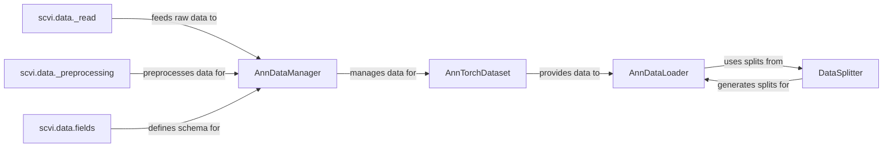

## Details

This component is responsible for the entire lifecycle of single-cell data, from initial loading and preprocessing to validation, standardized registration, and efficient batching for model consumption. It ensures data integrity and provides a unified interface for various scvi-tools models.

### AnnDataManager
The central orchestrator for managing and validating AnnData objects. It ensures data consistency across different models and provides a unified interface for data registration, making it accessible and interpretable by various scvi-tools models. It acts as the single source of truth for the registered data.

**Related Classes/Methods**:

- <a href="https://github.com/scverse/scvi-tools/src/scvi/data/_manager.py#L54-L562" target="_blank" rel="noopener noreferrer">`scvi.data._manager.AnnDataManager` (54:562)</a>

### scvi.data._read
This package provides functions for reading single-cell data from various common file formats (e.g., H5AD, CSV, Loom) into the AnnData object structure. It is the initial entry point for external data into the scvi-tools ecosystem.

**Related Classes/Methods**:

- <a href="https://github.com/scverse/scvi-tools/src/scvi/data/_read.py#L0-L0" target="_blank" rel="noopener noreferrer">`scvi.data._read` (0:0)</a>

### scvi.data._preprocessing
This package contains a suite of utilities and functions for preprocessing single-cell data. This includes essential steps like normalization, filtering of low-quality cells or genes, and batch correction, all aimed at preparing the data for optimal model input.

**Related Classes/Methods**:

- <a href="https://github.com/scverse/scvi-tools/src/scvi/data/_preprocessing.py#L0-L0" target="_blank" rel="noopener noreferrer">`scvi.data._preprocessing` (0:0)</a>

### scvi.data.fields
This sub-package defines a set of classes that represent and validate different types of data fields within an AnnData object (e.g., gene expression layers, observation metadata, variable annotations). These classes enforce data integrity and provide a structured, standardized way to access and manipulate specific data attributes.

**Related Classes/Methods**:

- `scvi.data.fields` (0:0)

### AnnTorchDataset
This class acts as an adapter, wrapping AnnData objects into a PyTorch Dataset. This enables seamless integration with PyTorch's data loading utilities, allowing for efficient iteration and batching of single-cell data during model training.

**Related Classes/Methods**:

- <a href="https://github.com/scverse/scvi-tools/src/scvi/data/_anntorchdataset.py#L26-L166" target="_blank" rel="noopener noreferrer">`scvi.data._anntorchdataset.AnnTorchDataset` (26:166)</a>

### DataSplitter
This component, including its abstract base class and various concrete implementations, is responsible for partitioning the dataset into training, validation, and test sets. This separation is vital for unbiased model evaluation and preventing overfitting.

**Related Classes/Methods**:

- <a href="https://github.com/scverse/scvi-tools/src/scvi/dataloaders/_data_splitting.py#L181-L338" target="_blank" rel="noopener noreferrer">`scvi.dataloaders._data_splitting.DataSplitter` (181:338)</a>

### AnnDataLoader
A specialized PyTorch DataLoader designed to work with AnnData objects via AnnTorchDataset. It handles the efficient batching, shuffling, and sampling of data, which is critical for optimizing the training process of deep learning models.

**Related Classes/Methods**:

- <a href="https://github.com/scverse/scvi-tools/src/scvi/dataloaders/_ann_dataloader.py#L20-L137" target="_blank" rel="noopener noreferrer">`scvi.dataloaders._ann_dataloader.AnnDataLoader` (20:137)</a>

### [FAQ](https://github.com/CodeBoarding/GeneratedOnBoardings/tree/main?tab=readme-ov-file#faq)