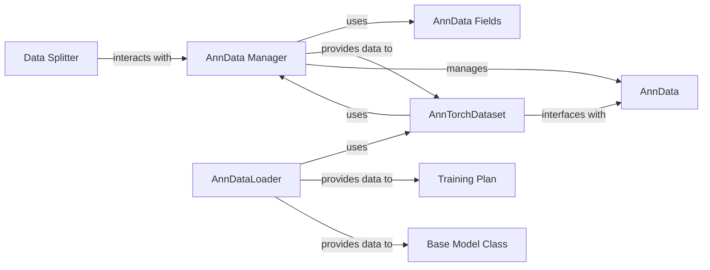

## Details

Abstract Components Overview

### AnnData Manager
This component, primarily embodied by `scvi.data._manager.AnnDataManager`, is the central registry and validator for `AnnData` objects. It ensures that the input data conforms to the expected structure and types defined by the `scvi.data.fields` system. It's crucial for maintaining data consistency across different models and analyses within `scvi-tools`.

**Related Classes/Methods**:

- <a href="https://github.com/scverse/scvi-tools/blob/main/src/scvi/data/_manager.py#L54-L562" target="_blank" rel="noopener noreferrer">`scvi.data._manager.AnnDataManager` (54:562)</a>

### AnnData Fields
Represented by the `scvi.data.fields` module, this component defines a flexible system of classes (e.g., `ArrayLikeField`, `DataFrameField`, `LayerField`, `CategoricalObsField`, `NumericalObsField`, `ObsmField`, `ObspField`, `UnstructuredField`, `AnnDataField`) that specify the expected structure and types of data within an `AnnData` object. These fields are used by the `AnnData Manager` for data validation and registration.

**Related Classes/Methods**: _None_

### AnnTorchDataset
This component, implemented as `scvi.data._anntorchdataset.AnnTorchDataset`, provides a PyTorch-compatible dataset interface for `AnnData` objects. It enables efficient iteration, batching, and transformation of data, making it ready for consumption by PyTorch-based deep learning models.

**Related Classes/Methods**:

- <a href="https://github.com/scverse/scvi-tools/blob/main/src/scvi/data/_anntorchdataset.py#L26-L166" target="_blank" rel="noopener noreferrer">`scvi.data._anntorchdataset.AnnTorchDataset` (26:166)</a>

### Data Splitter
This component, primarily `scvi.dataloaders._data_splitting.DataSplitter` and its subclasses (e.g., `DeviceBackedDataSplitter`, `SemiSupervisedDataSplitter`), is responsible for dividing the dataset into training, validation, and test sets. This is a crucial step for proper model evaluation and preventing overfitting.

**Related Classes/Methods**:

- <a href="https://github.com/scverse/scvi-tools/blob/main/src/scvi/dataloaders/_data_splitting.py#L181-L338" target="_blank" rel="noopener noreferrer">`scvi.dataloaders._data_splitting.DataSplitter` (181:338)</a>

### AnnDataLoader
The `scvi.dataloaders._ann_dataloader.AnnDataLoader` component is a specialized PyTorch `DataLoader` that leverages `AnnTorchDataset` to provide batched and shuffled data to the training loop. It handles the actual loading and preparation of data batches for model input.

**Related Classes/Methods**:

- <a href="https://github.com/scverse/scvi-tools/blob/main/src/scvi/dataloaders/_ann_dataloader.py#L20-L137" target="_blank" rel="noopener noreferrer">`scvi.dataloaders._ann_dataloader.AnnDataLoader` (20:137)</a>

### AnnData
While external to `scvi-tools`, `AnnData` is the primary data structure used for single-cell omics data. It's a highly optimized data container that stores expression matrices, annotations, and other related information.

**Related Classes/Methods**: _None_

### Base Model Class
This component, `scvi.model.base._base_model.BaseModelClass`, represents the abstract base for all probabilistic models within `scvi-tools`. It interacts with the `Data Management & Loading` components to receive processed data for model consumption.

**Related Classes/Methods**:

- <a href="https://github.com/scverse/scvi-tools/blob/main/src/scvi/model/base/_base_model.py#L99-L1167" target="_blank" rel="noopener noreferrer">`scvi.model.base._base_model.BaseModelClass` (99:1167)</a>

### Training Plan
The `scvi.train._trainingplans.TrainingPlan` and its subclasses (e.g., `AdversarialTrainingPlan`, `SemiSupervisedTrainingPlan`) define the training logic and optimization strategies for the models. They receive processed data from the `Data Management & Loading` component and orchestrate the training process.

**Related Classes/Methods**:

- <a href="https://github.com/scverse/scvi-tools/blob/main/src/scvi/train/_trainingplans.py#L80-L517" target="_blank" rel="noopener noreferrer">`scvi.train._trainingplans.TrainingPlan` (80:517)</a>

### [FAQ](https://github.com/CodeBoarding/GeneratedOnBoardings/tree/main?tab=readme-ov-file#faq)