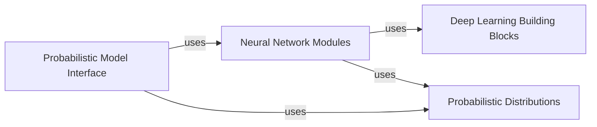

## Details

The 'Model Core' subsystem in `scvi-tools` provides a robust and extensible framework for probabilistic modeling in single-cell omics, adhering to a layered and modular architecture with clear separation of concerns.

### Probabilistic Model Interface
This component serves as the primary user-facing API for defining, configuring, and interacting with probabilistic models. It provides the high-level abstraction for data registration, model training, and inference. Concrete model implementations inherit from `BaseModelClass`, extending its functionalities to specific probabilistic graphical models.

**Related Classes/Methods**:

- `scvi.model.base.BaseModelClass` (1:1)
- `scvi.model.SCVI` (1:1)
- `scvi.model.TOTALVI` (1:1)

### Neural Network Modules
This component encapsulates the core deep learning architectures, implemented as PyTorch `nn.Module` instances. These modules represent the variational and generative networks (e.g., VAEs, autoencoders) that learn latent representations from the input data and output parameters for the probabilistic distributions.

**Related Classes/Methods**:

- `scvi.module.base.BaseModuleClass` (1:1)
- <a href="https://github.com/scverse/scvi-tools/blob/main/src/scvi/module/_vae.py#L30-L746" target="_blank" rel="noopener noreferrer">`scvi.module._vae.VAE` (30:746)</a>
- <a href="https://github.com/scverse/scvi-tools/blob/main/src/scvi/module/_totalvae.py#L30-L884" target="_blank" rel="noopener noreferrer">`scvi.module._totalvae.TOTALVAE` (30:884)</a>

### Deep Learning Building Blocks
This component provides fundamental, reusable neural network layers and architectural patterns. These are the atomic units (e.g., generic encoders, decoders, fully connected layers) that are composed together to construct the more complex `Neural Network Modules`. This promotes code reuse, modularity, and simplifies the creation of new model architectures.

**Related Classes/Methods**:

- <a href="https://github.com/scverse/scvi-tools/blob/main/src/scvi/nn/_base_components.py#L206-L307" target="_blank" rel="noopener noreferrer">`scvi.nn._base_components.Encoder` (206:307)</a>
- <a href="https://github.com/scverse/scvi-tools/blob/main/src/scvi/nn/_base_components.py#L488-L561" target="_blank" rel="noopener noreferrer">`scvi.nn._base_components.Decoder` (488:561)</a>
- <a href="https://github.com/scverse/scvi-tools/blob/main/src/scvi/nn/_base_components.py#L16-L202" target="_blank" rel="noopener noreferrer">`scvi.nn._base_components.FCLayers` (16:202)</a>

### Probabilistic Distributions
This component defines the mathematical probability distributions essential for constructing the likelihood and prior components of the probabilistic models. These distributions are crucial for defining the generative process of the data and for calculating the variational lower bound (ELBO), which is optimized during training.

**Related Classes/Methods**:

- `scvi.distributions.NegativeBinomial` (1:1)
- `scvi.distributions.ZeroInflatedNegativeBinomial` (1:1)

### [FAQ](https://github.com/CodeBoarding/GeneratedOnBoardings/tree/main?tab=readme-ov-file#faq)