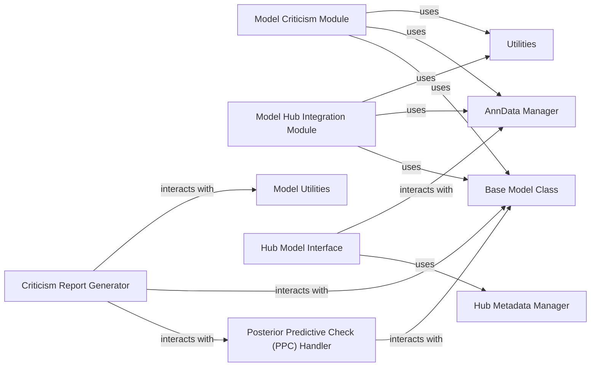

## Details

This component provides essential tools for post-training model assessment and management within `scvi-tools`. It encompasses functionalities for generating comprehensive criticism reports to evaluate model performance and biological insights, as well as facilitating the seamless sharing, downloading, and management of pre-trained models through integration with external model hubs. This aligns with the project's emphasis on modularity, data-centric design, and robust model evaluation.

### Model Criticism Module
This module provides a suite of tools for post-training model assessment and diagnostics. It enables users to generate comprehensive criticism reports and perform statistical checks on model predictions to ensure their validity and biological relevance.

**Related Classes/Methods**:

- `scvi.criticism`

### Model Hub Integration Module
This module facilitates the seamless sharing, downloading, and management of pre-trained models. It integrates with external model hubs (e.g., Hugging Face Hub, S3) to enable collaborative model development and dissemination.

**Related Classes/Methods**:

- `scvi.hub`

### Criticism Report Generator
Responsible for orchestrating the generation of comprehensive criticism reports. It aggregates various evaluation metrics and formats them into a readable output, providing a holistic view of model performance.

**Related Classes/Methods**:

- <a href="https://github.com/scverse/scvi-tools/blob/main/src/scvi/criticism/_create_criticism_report.py" target="_blank" rel="noopener noreferrer">`scvi.criticism._create_criticism_report`</a>

### Posterior Predictive Check (PPC) Handler
Performs statistical checks on the posterior predictive distribution of models. It calculates key metrics such as coefficient of variation, zero fraction, and calibration error to assess the model's fit and predictive accuracy against observed data.

**Related Classes/Methods**:

- <a href="https://github.com/scverse/scvi-tools/blob/main/src/scvi/criticism/_ppc.py" target="_blank" rel="noopener noreferrer">`scvi.criticism._ppc`</a>

### Hub Metadata Manager
Manages the metadata associated with models intended for or retrieved from the `scvi-tools` model hub. It handles the loading, parsing, and representation of essential model information, ensuring proper versioning and discoverability.

**Related Classes/Methods**:

- <a href="https://github.com/scverse/scvi-tools/blob/main/src/scvi/hub/_metadata.py" target="_blank" rel="noopener noreferrer">`scvi.hub._metadata`</a>

### Hub Model Interface
Provides a unified interface for interacting with models stored in the `scvi-tools` model hub. It supports core operations such as pushing models to and pulling models from external platforms and provides convenient access to the loaded model and its associated AnnData object.

**Related Classes/Methods**:

- <a href="https://github.com/scverse/scvi-tools/blob/main/src/scvi/hub/_model.py" target="_blank" rel="noopener noreferrer">`scvi.hub._model`</a>

### Base Model Class
Provides the foundational structure and common functionalities for all probabilistic models within `scvi-tools`. All specific models inherit from this class, ensuring a consistent interface for training, inference, and data handling.

**Related Classes/Methods**:

- <a href="https://github.com/scverse/scvi-tools/blob/main/src/scvi/model/base/_base_model.py" target="_blank" rel="noopener noreferrer">`scvi.model.base._base_model`</a>

### AnnData Manager
Manages the AnnData objects, which are the primary data structure for single-cell omics data in `scvi-tools`. It handles data registration, validation, and access, ensuring data integrity and consistency across different model operations.

**Related Classes/Methods**:

- <a href="https://github.com/scverse/scvi-tools/blob/main/src/scvi/data/_manager.py" target="_blank" rel="noopener noreferrer">`scvi.data._manager`</a>

### Utilities [[Expand]](./Utilities.md)
Provides common helper functions and general utilities used across the `scvi-tools` project. These include various data manipulation functions, statistical helpers, and general-purpose tools that support the core functionalities.

**Related Classes/Methods**:

- `scvi.utils`

### Model Utilities
Contains internal utility functions specifically designed to support operations related to `scvi-tools` models. These functions often assist in model-specific data transformations or calculations.

**Related Classes/Methods**:

- <a href="https://github.com/scverse/scvi-tools/blob/main/src/scvi/model/_utils.py" target="_blank" rel="noopener noreferrer">`scvi.model._utils`</a>

### [FAQ](https://github.com/CodeBoarding/GeneratedOnBoardings/tree/main?tab=readme-ov-file#faq)