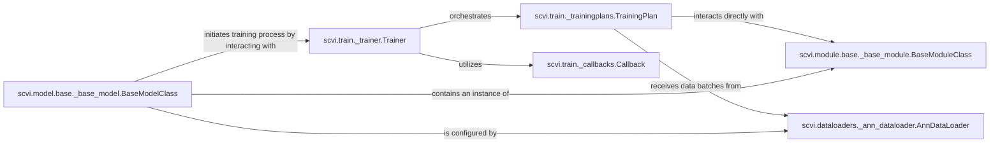

## Details

The `Model Training & Execution` component in `scvi-tools` is a sophisticated system designed to manage the entire lifecycle of training probabilistic models for single-cell data. It ensures efficient data flow, robust optimization, and flexible monitoring through a well-defined architecture.

### scvi.train._trainer.Trainer
This is the central orchestrator of the training process. It manages the training loop, handles epochs and iterations, and coordinates the interactions between the model, data, optimizers, and callbacks. It provides the high-level control flow for training any `scvi-tools` model.

**Related Classes/Methods**:

- <a href="https://github.com/scverse/scvi-tools/src/scvi/train/_trainer.py#L21-L222" target="_blank" rel="noopener noreferrer">`scvi.train._trainer.Trainer` (21:222)</a>

### scvi.train._trainingplans.TrainingPlan
This abstract base class defines the core training logic, including how the model's loss is computed, how optimization steps are performed, and how metrics are logged. Concrete implementations of `TrainingPlan` (e.g., `AdversarialTrainingPlan`, `SemiSupervisedTrainingPlan`) provide specific training strategies for different model types.

**Related Classes/Methods**:

- <a href="https://github.com/scverse/scvi-tools/src/scvi/train/_trainingplans.py#L80-L517" target="_blank" rel="noopener noreferrer">`scvi.train._trainingplans.TrainingPlan` (80:517)</a>

### scvi.train._callbacks.Callback
Callbacks are a powerful mechanism to inject custom logic at various stages of the training process (e.g., at the start/end of an epoch, before/after a training step). They are used for features like early stopping, model checkpointing, learning rate scheduling, and custom metric logging.

**Related Classes/Methods**:

- <a href="https://github.com/scverse/scvi-tools/src/scvi/train/_callbacks.py#L1-L1" target="_blank" rel="noopener noreferrer">`scvi.train._callbacks.Callback` (1:1)</a>

### scvi.dataloaders._ann_dataloader.AnnDataLoader
This component is responsible for efficiently loading and batching data from `AnnData` objects, which are the standard data structures in `scvi-tools`. It prepares and delivers data in manageable chunks to the `TrainingPlan` for model consumption during training.

**Related Classes/Methods**:

- <a href="https://github.com/scverse/scvi-tools/src/scvi/dataloaders/_ann_dataloader.py#L20-L137" target="_blank" rel="noopener noreferrer">`scvi.dataloaders._ann_dataloader.AnnDataLoader` (20:137)</a>

### scvi.model.base._base_model.BaseModelClass
This is the foundational abstract class for all user-facing `scvi-tools` models. It provides the high-level API for interacting with models, including the `train` method, which internally leverages the `Trainer` and `TrainingPlan`. It also manages data registration and model saving/loading.

**Related Classes/Methods**:

- <a href="https://github.com/scverse/scvi-tools/src/scvi/model/base/_base_model.py#L99-L1167" target="_blank" rel="noopener noreferrer">`scvi.model.base._base_model.BaseModelClass` (99:1167)</a>

### scvi.module.base._base_module.BaseModuleClass
This abstract base class serves as the blueprint for all neural network architectures (modules) within `scvi-tools`. These modules define the forward pass, the core computational graph, and the parameters that are optimized during training.

**Related Classes/Methods**:

- <a href="https://github.com/scverse/scvi-tools/src/scvi/module/base/_base_module.py#L153-L272" target="_blank" rel="noopener noreferrer">`scvi.module.base._base_module.BaseModuleClass` (153:272)</a>

### [FAQ](https://github.com/CodeBoarding/GeneratedOnBoardings/tree/main?tab=readme-ov-file#faq)