```mermaid
graph LR
    scvi_module_base__base_module_BaseModuleClass["scvi.module.base._base_module.BaseModuleClass"]
    scvi_nn__base_components_Encoder["scvi.nn._base_components.Encoder"]
    scvi_nn__base_components_Decoder["scvi.nn._base_components.Decoder"]
    scvi_nn__base_components_FCLayers["scvi.nn._base_components.FCLayers"]
    scvi_module__vae_VAE["scvi.module._vae.VAE"]
    scvi_model_base__base_model_BaseModelClass["scvi.model.base._base_model.BaseModelClass"]
    scvi_model__scvi_SCVI["scvi.model._scvi.SCVI"]
    scvi_distributions["scvi.distributions"]
    scvi_train__trainingplans_TrainingPlan["scvi.train._trainingplans.TrainingPlan"]
    scvi_train__trainer_Trainer["scvi.train._trainer.Trainer"]
    scvi_module_base__base_module_BaseModuleClass -- "is inherited by" --> scvi_module__vae_VAE
    scvi_module_base__base_module_BaseModuleClass -- "defines interface for" --> scvi_nn__base_components_Encoder
    scvi_module_base__base_module_BaseModuleClass -- "defines interface for" --> scvi_nn__base_components_Decoder
    scvi_module__vae_VAE -- "is composed within" --> scvi_nn__base_components_Encoder
    scvi_nn__base_components_Encoder -- "utilizes" --> scvi_nn__base_components_FCLayers
    scvi_module__vae_VAE -- "is composed within" --> scvi_nn__base_components_Decoder
    scvi_nn__base_components_Decoder -- "utilizes" --> scvi_nn__base_components_FCLayers
    scvi_nn__base_components_Encoder -- "is composed within" --> scvi_nn__base_components_FCLayers
    scvi_nn__base_components_Decoder -- "is composed within" --> scvi_nn__base_components_FCLayers
    scvi_module__vae_VAE -- "inherits from" --> scvi_module_base__base_module_BaseModuleClass
    scvi_model__scvi_SCVI -- "is used by" --> scvi_module__vae_VAE
    scvi_model_base__base_model_BaseModuleClass -- "is inherited by" --> scvi_model__scvi_SCVI
    scvi_model_base__base_model_BaseModelClass -- "encapsulates and utilizes" --> scvi_module_base__base_module_BaseModuleClass
    scvi_model__scvi_SCVI -- "inherits from" --> scvi_model_base__base_model_BaseModelClass
    scvi_model__scvi_SCVI -- "is implemented using" --> scvi_module__vae_VAE
    scvi_module_base__base_module_BaseModuleClass -- "uses" --> scvi_distributions
    scvi_train__trainer_Trainer -- "is used by" --> scvi_train__trainingplans_TrainingPlan
    scvi_train__trainingplans_TrainingPlan -- "configures" --> scvi_model_base__base_model_BaseModelClass
    scvi_train__trainer_Trainer -- "manages" --> scvi_train__trainingplans_TrainingPlan
    scvi_train__trainer_Trainer -- "interacts with" --> scvi_model_base__base_model_BaseModelClass
```

## Details

This analysis describes the Neural Network Architecture component in `scvi-tools`, focusing on its fundamental building blocks and their interrelationships. It highlights how modular components are combined to construct complex probabilistic models like Variational Autoencoders (VAEs) for single-cell data analysis.

### scvi.module.base._base_module.BaseModuleClass
This is the abstract base class for all neural network modules in `scvi-tools`. It provides a standardized interface and common functionalities, ensuring consistency across different module implementations. It's the foundation upon which all other neural network modules are built.

**Related Classes/Methods**:

- <a href="https://github.com/scverse/scvi-tools/src/scvi/module/base/_base_module.py#L153-L272" target="_blank" rel="noopener noreferrer">`scvi.module.base._base_module.BaseModuleClass` (153:272)</a>

### scvi.nn._base_components.Encoder
This component represents a generic neural network encoder. Its primary role is to transform high-dimensional input data into a lower-dimensional latent representation. This is a crucial step in many probabilistic models, including VAEs, for dimensionality reduction and feature extraction.

**Related Classes/Methods**:

- <a href="https://github.com/scverse/scvi-tools/src/scvi/nn/_base_components.py#L206-L307" target="_blank" rel="noopener noreferrer">`scvi.nn._base_components.Encoder` (206:307)</a>

### scvi.nn._base_components.Decoder
This component represents a generic neural network decoder. It takes a lower-dimensional latent representation and reconstructs the original high-dimensional data. Decoders are vital for generative modeling, allowing the model to simulate new data or infer underlying biological processes.

**Related Classes/Methods**:

- <a href="https://github.com/scverse/scvi-tools/src/scvi/nn/_base_components.py#L488-L561" target="_blank" rel="noopener noreferrer">`scvi.nn._base_components.Decoder` (488:561)</a>

### scvi.nn._base_components.FCLayers
This component provides a flexible and reusable stack of fully connected (dense) layers. It often includes activation functions, batch normalization, and dropout, making it a versatile building block for constructing the internal architecture of both encoders and decoders.

**Related Classes/Methods**:

- <a href="https://github.com/scverse/scvi-tools/src/scvi/nn/_base_components.py#L16-L202" target="_blank" rel="noopener noreferrer">`scvi.nn._base_components.FCLayers` (16:202)</a>

### scvi.module._vae.VAE
This is a concrete implementation of a Variational Autoencoder (VAE) module. It combines an `Encoder` and a `Decoder` to form a complete VAE architecture. The VAE is a powerful generative model used for unsupervised learning of latent representations and data generation.

**Related Classes/Methods**:

- <a href="https://github.com/scverse/scvi-tools/src/scvi/module/_vae.py#L30-L746" target="_blank" rel="noopener noreferrer">`scvi.module._vae.VAE` (30:746)</a>

### scvi.model.base._base_model.BaseModelClass
This is the abstract base class for all high-level probabilistic models in `scvi-tools`. It defines the common interface for users to interact with models, handling data management, training loops, and inference procedures. It orchestrates the underlying neural network modules.

**Related Classes/Methods**:

- <a href="https://github.com/scverse/scvi-tools/src/scvi/model/base/_base_model.py#L99-L1167" target="_blank" rel="noopener noreferrer">`scvi.model.base._base_model.BaseModelClass` (99:1167)</a>

### scvi.model._scvi.SCVI
This is a specific probabilistic model tailored for single-cell RNA sequencing data. It is built upon the `VAE` module and provides a user-friendly interface for various single-cell analysis tasks, including dimensionality reduction, batch correction, and differential expression analysis.

**Related Classes/Methods**:

- <a href="https://github.com/scverse/scvi-tools/src/scvi/model/_scvi.py#L37-L258" target="_blank" rel="noopener noreferrer">`scvi.model._scvi.SCVI` (37:258)</a>

### scvi.distributions
This package provides implementations of various probabilistic distributions (e.g., Negative Binomial, Zero-Inflated Negative Binomial, Normal). These distributions are crucial for defining the likelihood functions of the observed data and the prior distributions of latent variables within the probabilistic models, forming a core part of generative modeling.

**Related Classes/Methods**:

- `scvi.distributions` (1:1)

### scvi.train._trainingplans.TrainingPlan
This component defines the training loop and optimization strategy for models. It orchestrates how data is fed to the model, how losses are computed, and how model parameters are updated during training.

**Related Classes/Methods**:

- <a href="https://github.com/scverse/scvi-tools/src/scvi/train/_trainingplans.py#L80-L517" target="_blank" rel="noopener noreferrer">`scvi.train._trainingplans.TrainingPlan` (80:517)</a>

### scvi.train._trainer.Trainer
This component manages the overall training process, including logging, checkpointing, and early stopping. It utilizes a `TrainingPlan` to execute the training loop.

**Related Classes/Methods**:

- <a href="https://github.com/scverse/scvi-tools/src/scvi/train/_trainer.py#L21-L222" target="_blank" rel="noopener noreferrer">`scvi.train._trainer.Trainer` (21:222)</a>

### [FAQ](https://github.com/CodeBoarding/GeneratedOnBoardings/tree/main?tab=readme-ov-file#faq)