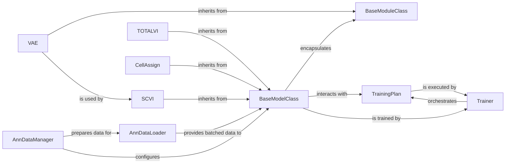

## Details

One paragraph explaining the functionality which is represented by this graph. What the main flow is and what is its purpose.

### BaseModelClass
The foundational abstract base class for all probabilistic models in `scvi-tools`. It establishes a consistent interface and core functionalities (e.g., `train`, `save`, `load`) that all specific models inherit and extend. This abstraction is crucial for maintaining uniformity across diverse models and enabling generic training pipelines.

**Related Classes/Methods**:

- <a href="https://github.com/scverse/scvi-tools/src/scvi/model/base/_base_model.py#L1-L1" target="_blank" rel="noopener noreferrer">`scvi.model.base._base_model` (1:1)</a>

### BaseModuleClass
The abstract base class for all neural network modules that form the computational backbone of the probabilistic models. It provides the fundamental building blocks for defining encoder and decoder networks and the forward pass logic, where the actual neural network computations are defined.

**Related Classes/Methods**:

- <a href="https://github.com/scverse/scvi-tools/src/scvi/module/base/_base_module.py#L1-L1" target="_blank" rel="noopener noreferrer">`scvi.module.base._base_module` (1:1)</a>

### VAE
A concrete implementation of a Variational Autoencoder module, inheriting from `BaseModuleClass`. It combines generic `Encoder` and `Decoder` components to form a complete VAE architecture. This module serves as a fundamental and widely used building block for many scvi-tools models, including `SCVI`.

**Related Classes/Methods**:

- <a href="https://github.com/scverse/scvi-tools/src/scvi/module/_vae.py#L1-L1" target="_blank" rel="noopener noreferrer">`scvi.module._vae` (1:1)</a>

### SCVI
A specific and foundational probabilistic model for single-cell RNA sequencing data, built directly upon the `VAE` module. It provides a high-level interface for users to interact with the VAE model, offering methods for training, inference, and data transformation tailored for gene expression data.

**Related Classes/Methods**:

- <a href="https://github.com/scverse/scvi-tools/src/scvi/model/_scvi.py#L1-L1" target="_blank" rel="noopener noreferrer">`scvi.model._scvi` (1:1)</a>

### TOTALVI
A specific probabilistic model designed for multi-modal single-cell data, such as simultaneous gene expression and protein abundance measurements. It extends the VAE framework to jointly model different data modalities, providing integrated insights and demonstrating the framework's adaptability.

**Related Classes/Methods**:

- <a href="https://github.com/scverse/scvi-tools/src/scvi/model/_totalvi.py#L1-L1" target="_blank" rel="noopener noreferrer">`scvi.model._totalvi` (1:1)</a>

### CellAssign
An example of a specialized external probabilistic model integrated into `scvi-tools`. It focuses on automatic cell type annotation based on marker gene expression, showcasing the extensibility of the `BaseModelClass` to incorporate diverse probabilistic frameworks beyond the core VAE-based models. Its implementation involves both a model definition and an underlying module.

**Related Classes/Methods**:

- <a href="https://github.com/scverse/scvi-tools/src/scvi/external/cellassign/_model.py#L1-L1" target="_blank" rel="noopener noreferrer">`scvi.external.cellassign._model` (1:1)</a>
- <a href="https://github.com/scverse/scvi-tools/src/scvi/external/cellassign/_module.py#L1-L1" target="_blank" rel="noopener noreferrer">`scvi.external.cellassign._module` (1:1)</a>

### AnnDataManager
Manages and validates AnnData objects, ensuring that input data conforms to the expected structures required by `scvi-tools` models. It acts as the crucial entry point for data into the `scvi-tools` ecosystem, preparing it for subsequent processing.

**Related Classes/Methods**:

- <a href="https://github.com/scverse/scvi-tools/src/scvi/data/_manager.py#L1-L1" target="_blank" rel="noopener noreferrer">`scvi.data._manager` (1:1)</a>

### AnnDataLoader
Efficiently loads and batches data from AnnData objects, preparing it for consumption by neural network models during training and inference. It optimizes data flow, ensuring that models receive data in a format suitable for efficient computation.

**Related Classes/Methods**:

- <a href="https://github.com/scverse/scvi-tools/src/scvi/dataloaders/_ann_dataloader.py#L1-L1" target="_blank" rel="noopener noreferrer">`scvi.dataloaders._ann_dataloader` (1:1)</a>

### TrainingPlan
This abstract base class defines the training loop and optimization strategy for models. Specific training plans (e.g., `AdversarialTrainingPlan`, `SemiSupervisedTrainingPlan`) inherit from this to implement different training objectives, loss functions, and optimization routines.

**Related Classes/Methods**:

- <a href="https://github.com/scverse/scvi-tools/src/scvi/train/_trainingplans.py#L1-L1" target="_blank" rel="noopener noreferrer">`scvi.train._trainingplans` (1:1)</a>

### Trainer
This component orchestrates the entire training process. It takes a model and a training plan, manages epochs, batches, and calls the necessary methods for optimization, logging, and checkpointing. It is the central orchestrator of the training pipeline, bringing together the model, data, and training strategy.

**Related Classes/Methods**:

- <a href="https://github.com/scverse/scvi-tools/src/scvi/train/_trainer.py#L1-L1" target="_blank" rel="noopener noreferrer">`scvi.train._trainer` (1:1)</a>

### [FAQ](https://github.com/CodeBoarding/GeneratedOnBoardings/tree/main?tab=readme-ov-file#faq)