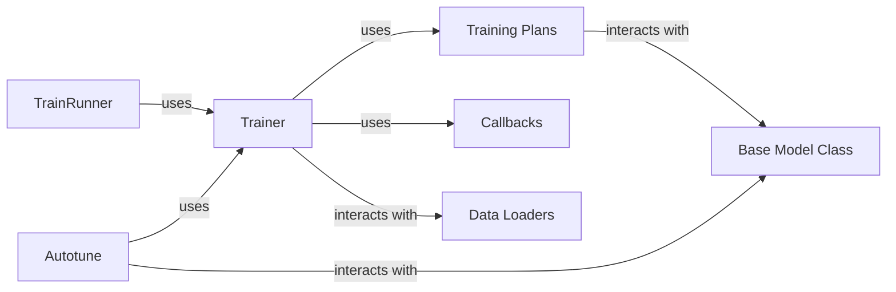

## Details

The `Training & Optimization` component in `scvi` is a critical subsystem responsible for orchestrating the entire model training lifecycle, from defining training strategies to optimizing hyperparameters. It embodies the project's modular and layered architectural patterns, providing a flexible and extensible framework for training diverse probabilistic models in single-cell omics.

### Trainer
The `Trainer` class is the core orchestrator of the model training loop. It manages the overall training process, including device placement (CPU/GPU), logging of metrics, and the execution of training plans and callbacks. It acts as the primary interface for initiating and controlling model training, abstracting away the complexities of the underlying PyTorch Lightning framework.

**Related Classes/Methods**:

- <a href="https://github.com/scverse/scvi-tools/blob/main/src/scvi/train/_trainer.py#L21-L222" target="_blank" rel="noopener noreferrer">`scvi.train._trainer.Trainer` (21:222)</a>

### TrainRunner
The `TrainRunner` class provides a higher-level abstraction for executing training. It often handles the initial setup, such as preparing data loaders and models, before delegating the actual training execution to the `Trainer`. It simplifies the user interface for common training scenarios, making the training process more accessible.

**Related Classes/Methods**:

- <a href="https://github.com/scverse/scvi-tools/blob/main/src/scvi/train/_trainrunner.py#L16-L169" target="_blank" rel="noopener noreferrer">`scvi.train._trainrunner.TrainRunner` (16:169)</a>

### Training Plans
This component encompasses various `TrainingPlan` subclasses, defining specific training strategies, including forward/backward passes, loss calculations, and optimization routines tailored for different model architectures and learning paradigms.

**Related Classes/Methods**:

- <a href="https://github.com/scverse/scvi-tools/blob/main/src/scvi/train/_trainingplans.py#L80-L517" target="_blank" rel="noopener noreferrer">`scvi.train._trainingplans.TrainingPlan` (80:517)</a>

### Callbacks
The `_callbacks` module provides extensible functionalities injected into the training loop for features like model checkpointing, learning rate scheduling, early stopping, and custom metric logging.

**Related Classes/Methods**:

- <a href="https://github.com/scverse/scvi-tools/blob/main/src/scvi/train/_callbacks.py#L1-L1" target="_blank" rel="noopener noreferrer">`scvi.train._callbacks` (1:1)</a>

### Autotune
The `autotune` component provides a framework for efficient hyperparameter optimization, including defining search spaces, running experiments, and evaluating model performance.

**Related Classes/Methods**:

- `scvi.autotune.AutotuneExperiment` (1:1)
- <a href="https://github.com/scverse/scvi-tools/blob/main/src/scvi/autotune/_tune.py#L1-L1" target="_blank" rel="noopener noreferrer">`scvi.autotune._tune` (1:1)</a>

### Base Model Class
Represents the base class for models within the scvi framework, defining common interfaces and functionalities.

**Related Classes/Methods**:

- `scvi.model.base.BaseModelClass` (1:1)

### Data Loaders
Components responsible for loading and providing data to the models during training.

**Related Classes/Methods**:

- `scvi.dataloaders.AnnDataLoader` (1:1)

### [FAQ](https://github.com/CodeBoarding/GeneratedOnBoardings/tree/main?tab=readme-ov-file#faq)