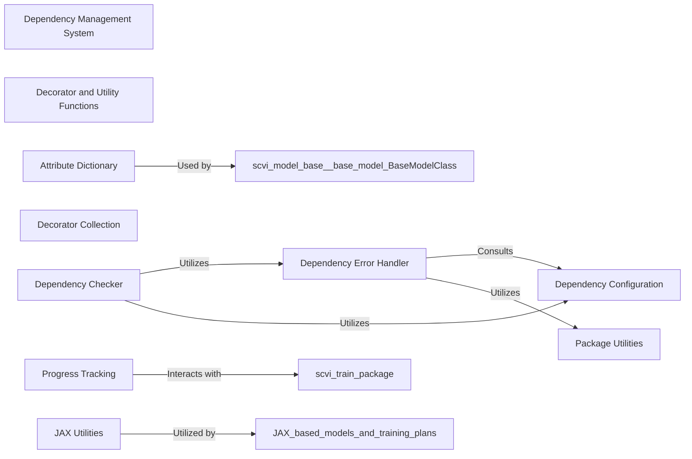

## Details

The `scvi.utils` package serves as a foundational collection of general-purpose helper functions and modules, supporting various tasks across the `scvi-tools` library. Its core purpose is to provide essential utilities that enhance code functionality, readability, and maintainability, ensuring the stability and correct execution of the entire system.

### Dependency Management System
This system is responsible for ensuring that all necessary external Python packages are installed and meet the required version constraints. It centralizes dependency configuration, checks for their presence and compatibility, and provides mechanisms to handle missing or incompatible dependencies gracefully. This is crucial for the stability and correct execution of `scvi-tools`.

**Related Classes/Methods**:

- <a href="https://github.com/scverse/scvi-tools/src/scvi/utils/_dependencies.py#L1-L1" target="_blank" rel="noopener noreferrer">`scvi.utils._dependencies` (1:1)</a>

### Decorator and Utility Functions
This component encompasses a variety of decorators and general utility functions that enhance code functionality, readability, and maintainability across the `scvi-tools` library. These utilities provide common patterns for tasks like deprecation warnings, property caching, and docstring management.

**Related Classes/Methods**:

- <a href="https://github.com/scverse/scvi-tools/src/scvi/utils/_decorators.py#L1-L1" target="_blank" rel="noopener noreferrer">`scvi.utils._decorators` (1:1)</a>
- <a href="https://github.com/scverse/scvi-tools/src/scvi/utils/_attrdict.py#L1-L1" target="_blank" rel="noopener noreferrer">`scvi.utils._attrdict` (1:1)</a>
- <a href="https://github.com/scverse/scvi-tools/src/scvi/utils/_docstrings.py#L1-L1" target="_blank" rel="noopener noreferrer">`scvi.utils._docstrings` (1:1)</a>
- <a href="https://github.com/scverse/scvi-tools/src/scvi/utils/_track.py#L1-L1" target="_blank" rel="noopener noreferrer">`scvi.utils._track` (1:1)</a>
- <a href="https://github.com/scverse/scvi-tools/src/scvi/utils/_jax.py#L1-L1" target="_blank" rel="noopener noreferrer">`scvi.utils._jax` (1:1)</a>

### Dependency Checker
This component, primarily represented by `scvi.utils._dependencies.dependencies`, acts as a decorator or direct function call to validate dependencies before a function's execution.

**Related Classes/Methods**:

- <a href="https://github.com/scverse/scvi-tools/src/scvi/utils/_dependencies.py#L16-L27" target="_blank" rel="noopener noreferrer">`scvi.utils._dependencies.dependencies` (16:27)</a>

### Dependency Error Handler
The `scvi.utils._dependencies.error_on_missing_dependencies` function is responsible for raising informative `ImportError` messages when dependencies are not met.

**Related Classes/Methods**:

- <a href="https://github.com/scverse/scvi-tools/src/scvi/utils/_dependencies.py#L5-L13" target="_blank" rel="noopener noreferrer">`scvi.utils._dependencies.error_on_missing_dependencies` (5:13)</a>

### Dependency Configuration
The internal dictionary `scvi.utils._dependencies._DEPENDENCY_SETTINGS` stores all dependency metadata, including names, required versions, and whether they are optional or required.

**Related Classes/Methods**:

- <a href="https://github.com/scverse/scvi-tools/src/scvi/utils/_dependencies.py#L1-L1" target="_blank" rel="noopener noreferrer">`scvi.utils._dependencies._DEPENDENCY_SETTINGS` (1:1)</a>

### Package Utilities
Functions like `scvi.utils._dependencies._get_imported_package_version` and `scvi.utils._dependencies._check_package_version` are low-level helpers that retrieve and compare package versions.

**Related Classes/Methods**:

- <a href="https://github.com/scverse/scvi-tools/src/scvi/utils/_dependencies.py#L1-L1" target="_blank" rel="noopener noreferrer">`scvi.utils._dependencies._get_imported_package_version` (1:1)</a>
- <a href="https://github.com/scverse/scvi-tools/src/scvi/utils/_dependencies.py#L1-L1" target="_blank" rel="noopener noreferrer">`scvi.utils._dependencies._check_package_version` (1:1)</a>

### Decorator Collection
The `scvi.utils._decorators` module contains various decorators (e.g., for deprecation, property caching). These are used by numerous classes and methods throughout `scvi-tools` to modify their behavior without altering their core logic.

**Related Classes/Methods**:

- <a href="https://github.com/scverse/scvi-tools/src/scvi/utils/_decorators.py#L1-L1" target="_blank" rel="noopener noreferrer">`scvi.utils._decorators` (1:1)</a>

### Attribute Dictionary
`scvi.utils._attrdict.attrdict` provides a dictionary-like object that allows access to its keys as attributes. This simplifies data access and is used in various models and data management classes.

**Related Classes/Methods**:

- <a href="https://github.com/scverse/scvi-tools/src/scvi/utils/_attrdict.py#L3-L11" target="_blank" rel="noopener noreferrer">`scvi.utils._attrdict.attrdict` (3:11)</a>

### Progress Tracking
`scvi.utils._track` provides utilities for tracking progress, potentially for long-running operations or training processes.

**Related Classes/Methods**:

- <a href="https://github.com/scverse/scvi-tools/src/scvi/utils/_track.py#L1-L1" target="_blank" rel="noopener noreferrer">`scvi.utils._track` (1:1)</a>

### JAX Utilities
`scvi.utils._jax` contains utilities specifically designed to support JAX integration within `scvi-tools`, enabling models and computations to leverage JAX's capabilities.

**Related Classes/Methods**:

- <a href="https://github.com/scverse/scvi-tools/src/scvi/utils/_jax.py#L1-L1" target="_blank" rel="noopener noreferrer">`scvi.utils._jax` (1:1)</a>

### [FAQ](https://github.com/CodeBoarding/GeneratedOnBoardings/tree/main?tab=readme-ov-file#faq)