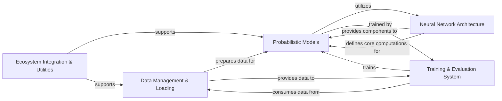

## Details

Final Architecture Analysis for `scvi-tools`

### Data Management & Loading [[Expand]](./Data_Management_Loading.md)
This component is responsible for all aspects of single-cell data handling. It manages the registration, validation, and preprocessing of `AnnData` objects, ensuring data integrity and consistency. Furthermore, it provides efficient mechanisms for loading and splitting data into mini-batches, which are essential for model training and inference.

**Related Classes/Methods**: _None_

### Probabilistic Models [[Expand]](./Probabilistic_Models.md)
This central component implements the diverse range of probabilistic models for single-cell data analysis. It encompasses both foundational models (e.g., SCVI, TOTALVI) and specialized or external contributions (e.g., CellAssign, MethylVI). These models define the overall statistical frameworks and computational graphs used for biological inference.

**Related Classes/Methods**: _None_

### Neural Network Architecture [[Expand]](./Neural_Network_Architecture.md)
This component provides the fundamental neural network building blocks, modules, and probabilistic distributions that form the computational backbone of all probabilistic models. It defines reusable layers, encoders, decoders, and complete Variational Autoencoder (VAE)-like structures, along with the statistical distributions crucial for generative modeling.

**Related Classes/Methods**: _None_

### Training & Evaluation System
This component orchestrates the entire lifecycle of model training, validation, and evaluation. It defines and manages various training plans, optimizers, callbacks (e.g., early stopping), and logging mechanisms, ensuring robust and reproducible model development and performance assessment.

**Related Classes/Methods**: _None_

### Ecosystem Integration & Utilities
This component comprises general-purpose helper functions, cross-cutting utilities (e.g., dependency checks, progress tracking), and functionalities for interacting with external model repositories like Hugging Face Hub. It facilitates model sharing, retrieval, and provides foundational support across the library.

**Related Classes/Methods**: _None_

### [FAQ](https://github.com/CodeBoarding/GeneratedOnBoardings/tree/main?tab=readme-ov-file#faq)