```mermaid
graph LR
    Data_Management_Loading["Data Management & Loading"]
    Core_Model_Architecture["Core Model Architecture"]
    Model_Training_Execution["Model Training & Execution"]
    Model_Analysis_Deployment["Model Analysis & Deployment"]
    Utilities["Utilities"]
    Data_Management_Loading -- "Provides prepared data to" --> Model_Training_Execution
    Data_Management_Loading -- "Registers data requirements with" --> Core_Model_Architecture
    Core_Model_Architecture -- "Defines and provides models to" --> Model_Training_Execution
    Core_Model_Architecture -- "Provides trained models/outputs to" --> Model_Analysis_Deployment
    Model_Training_Execution -- "Receives data from" --> Data_Management_Loading
    Model_Training_Execution -- "Trains and interacts with" --> Core_Model_Architecture
    Model_Analysis_Deployment -- "Evaluates outputs from" --> Core_Model_Architecture
    Model_Analysis_Deployment -- "Manages persistence of" --> Core_Model_Architecture
    Utilities -- "Provides common functionalities to" --> Data_Management_Loading
    Utilities -- "Provides common functionalities to" --> Model_Training_Execution
    click Data_Management_Loading href "https://github.com/CodeBoarding/GeneratedOnBoardings/blob/main/scvi-tools/Data_Management_Loading.md" "Details"
    click Model_Training_Execution href "https://github.com/CodeBoarding/GeneratedOnBoardings/blob/main/scvi-tools/Model_Training_Execution.md" "Details"
    click Utilities href "https://github.com/CodeBoarding/GeneratedOnBoardings/blob/main/scvi-tools/Utilities.md" "Details"
```

## Details

This high-level architecture analysis of `scvi-tools` identifies five core components, detailing their responsibilities, key source files, and interrelationships.

### Data Management & Loading [[Expand]](./Data_Management_Loading.md)
This component is responsible for handling the loading, preprocessing, validation, and registration of single-cell data, primarily using AnnData objects. It ensures data integrity and provides a standardized interface for models to access data. It also manages the creation of PyTorch DataLoaders for efficient batching and splitting data into training, validation, and test sets.

**Related Classes/Methods**:

- `scvi.data` (0:0)
- `scvi.dataloaders` (0:0)

### Core Model Architecture
This is the foundational layer for all scvi-tools models, defining their structure and probabilistic nature. It encompasses the base model framework, specific probabilistic modules (e.g., VAEs, TOTALVAE), neural network building blocks (e.g., encoders, decoders, fully connected layers), and statistical distributions (e.g., Negative Binomial, Normal) used for defining likelihoods and priors.

**Related Classes/Methods**:

- `scvi.model.base` (0:0)
- `scvi.module` (0:0)
- `scvi.nn` (0:0)
- `scvi.distributions` (0:0)

### Model Training & Execution [[Expand]](./Model_Training_Execution.md)
This component orchestrates the entire training process for scvi-tools models. It manages the training loop, optimizers, learning rate schedulers, callbacks for monitoring and early stopping, and logging of metrics. It efficiently feeds data batches to the models for forward and backward passes.

**Related Classes/Methods**:

- `scvi.train` (0:0)

### Model Analysis & Deployment
This component provides tools for evaluating the performance and diagnosing potential issues of trained models, including functionalities for posterior predictive checks and differential analysis. It also facilitates the saving, loading, and sharing of pre-trained models with external repositories like Hugging Face Hub or S3, handling metadata management and model serialization/deserialization.

**Related Classes/Methods**:

- `scvi.hub` (0:0)
- `scvi.criticism` (0:0)
- <a href="https://github.com/scverse/scvi-tools/src/scvi/model/base/_de_core.py#L105-L204" target="_blank" rel="noopener noreferrer">`scvi.model.base._de_core` (105:204)</a>
- <a href="https://github.com/scverse/scvi-tools/src/scvi/model/base/_differential.py#L0-L0" target="_blank" rel="noopener noreferrer">`scvi.model.base._differential` (0:0)</a>

### Utilities [[Expand]](./Utilities.md)
A collection of general-purpose helper functions and modules used across the scvi-tools library. These utilities support various tasks such as dependency checking, progress tracking, and data structure manipulation, providing foundational support for other components.

**Related Classes/Methods**:

- `scvi.utils` (0:0)

### [FAQ](https://github.com/CodeBoarding/GeneratedOnBoardings/tree/main?tab=readme-ov-file#faq)