```mermaid
graph LR
    Data_Management_Loading["Data Management & Loading"]
    Model_Core["Model Core"]
    Training_Optimization["Training & Optimization"]
    Model_Lifecycle_Evaluation["Model Lifecycle & Evaluation"]
    Core_Utilities["Core Utilities"]
    Data_Management_Loading -- "feeds data to" --> Training_Optimization
    Data_Management_Loading -- "provides data to" --> Model_Core
    Model_Core -- "consumes data from" --> Data_Management_Loading
    Model_Core -- "is trained by" --> Training_Optimization
    Model_Core -- "generates outputs for" --> Model_Lifecycle_Evaluation
    Training_Optimization -- "receives data from" --> Data_Management_Loading
    Training_Optimization -- "trains and configures" --> Model_Core
    Model_Lifecycle_Evaluation -- "analyzes outputs from" --> Model_Core
    Model_Lifecycle_Evaluation -- "manages instances of" --> Model_Core
    Core_Utilities -- "supports" --> Data_Management_Loading
    Core_Utilities -- "supports" --> Model_Core
    Core_Utilities -- "supports" --> Training_Optimization
    Core_Utilities -- "supports" --> Model_Lifecycle_Evaluation
    click Data_Management_Loading href "https://github.com/CodeBoarding/GeneratedOnBoardings/blob/main/scvi-tools/Data_Management_Loading.md" "Details"
    click Model_Core href "https://github.com/CodeBoarding/GeneratedOnBoardings/blob/main/scvi-tools/Model_Core.md" "Details"
    click Training_Optimization href "https://github.com/CodeBoarding/GeneratedOnBoardings/blob/main/scvi-tools/Training_Optimization.md" "Details"
    click Model_Lifecycle_Evaluation href "https://github.com/CodeBoarding/GeneratedOnBoardings/blob/main/scvi-tools/Model_Lifecycle_Evaluation.md" "Details"
    click Core_Utilities href "https://github.com/CodeBoarding/GeneratedOnBoardings/blob/main/scvi-tools/Core_Utilities.md" "Details"
```

## Details

The `scvi-tools` architecture is designed with a strong emphasis on modularity, clear separation of concerns, and extensibility, characteristic of a deep learning framework for bioinformatics. Data flows from initial management and loading, through the core probabilistic models, into a robust training infrastructure, and finally to evaluation and lifecycle management. A central utility layer supports all components.

### Data Management & Loading [[Expand]](./Data_Management_Loading.md)
This component is the entry point for all data within `scvi-tools`. It is responsible for the registration, validation, and structured management of single-cell omics data using `AnnData` objects. It also handles efficient data loading, batching, and splitting into training, validation, and test sets, preparing the data for model consumption.

**Related Classes/Methods**:

- `scvi.data.AnnDataManager` (1:1)
- `scvi.dataloaders.AnnTorchDataset` (1:1)
- `scvi.data.fields` (1:1)

### Model Core [[Expand]](./Model_Core.md)
This is the heart of the probabilistic modeling framework. It defines the foundational interfaces and common functionalities for all probabilistic models (e.g., VAEs) and their underlying neural network modules. It encompasses the actual model implementations, the fundamental deep learning building blocks (encoders, decoders, layers), and the mathematical probability distributions essential for defining likelihoods and priors.

**Related Classes/Methods**:

- `scvi.model.BaseModelClass` (1:1)
- `scvi.module.BaseModuleClass` (1:1)
- `scvi.model.SCVI` (1:1)
- `scvi.model.TOTALVI` (1:1)
- `scvi.nn.Encoder` (1:1)
- `scvi.nn.Decoder` (1:1)
- `scvi.distributions.NegativeBinomial` (1:1)

### Training & Optimization [[Expand]](./Training_Optimization.md)
This component orchestrates the entire model training process. It manages the training loop, handles device placement, and integrates various training plans and callbacks for specific model types. It also incorporates the hyperparameter optimization framework, allowing for efficient searching of optimal model configurations.

**Related Classes/Methods**:

- `scvi.train.Trainer` (1:1)
- `scvi.train.TrainRunner` (1:1)
- <a href="https://github.com/scverse/scvi-tools/blob/main/src/scvi/train/_trainingplans.py#L1-L1" target="_blank" rel="noopener noreferrer">`scvi.train._trainingplans` (1:1)</a>
- <a href="https://github.com/scverse/scvi-tools/blob/main/src/scvi/train/_callbacks.py#L1-L1" target="_blank" rel="noopener noreferrer">`scvi.train._callbacks` (1:1)</a>
- `scvi.autotune` (1:1)

### Model Lifecycle & Evaluation [[Expand]](./Model_Lifecycle_Evaluation.md)
This component provides tools for post-training model assessment and management. It includes functionalities for generating comprehensive criticism reports, performing diagnostics, and evaluating biological insights. Additionally, it facilitates the seamless sharing, downloading, and management of pre-trained models through integration with external model hubs.

**Related Classes/Methods**:

- `scvi.criticism` (1:1)
- `scvi.hub` (1:1)

### Core Utilities [[Expand]](./Core_Utilities.md)
A foundational collection of general-purpose utility functions that support various operations across the entire `scvi-tools` framework. This includes common helpers for data manipulation, dependency management, progress tracking, and other cross-cutting concerns.

**Related Classes/Methods**:

- `scvi.utils` (1:1)

### [FAQ](https://github.com/CodeBoarding/GeneratedOnBoardings/tree/main?tab=readme-ov-file#faq)