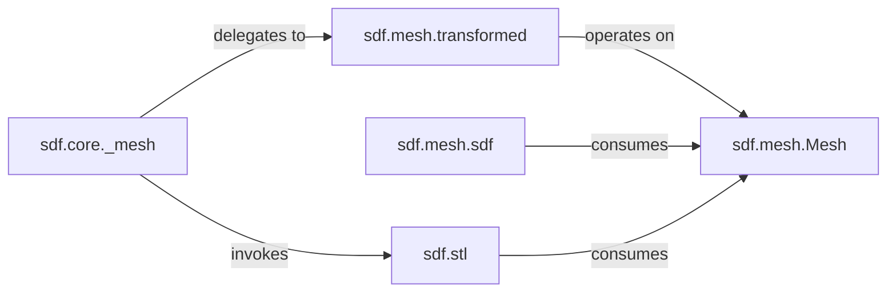

## Details

The `Mesh Handling & Output` subsystem is responsible for managing generated mesh data, applying post-generation transformations, and handling the serialization and export of meshes to various file formats. It also facilitates converting meshes back into SDF representations for iterative design.

### sdf.mesh.Mesh
The fundamental data structure representing 3D mesh data (vertices, faces). It is the primary entity manipulated and processed within this subsystem.

**Related Classes/Methods**:

- <a href="https://github.com/fogleman/sdf/blob/main/sdf/mesh.py" target="_blank" rel="noopener noreferrer">`sdf.mesh.Mesh`</a>

### sdf.mesh.transformed
Provides the core logic for applying generic geometric transformations (e.g., scaling, translation, rotation) to `Mesh` objects, returning a new transformed `Mesh`. Specialized transformations like `scaled`, `translated`, `positioned`, and `centered` delegate to this component.

**Related Classes/Methods**:

- <a href="https://github.com/fogleman/sdf/blob/main/sdf/mesh.py#L37-L41" target="_blank" rel="noopener noreferrer">`sdf.mesh.transformed`:37-41</a>
- <a href="https://github.com/fogleman/sdf/blob/main/sdf/mesh.py#L43-L49" target="_blank" rel="noopener noreferrer">`sdf.mesh.scaled`:43-49</a>
- <a href="https://github.com/fogleman/sdf/blob/main/sdf/mesh.py#L51-L54" target="_blank" rel="noopener noreferrer">`sdf.mesh.translated`:51-54</a>
- <a href="https://github.com/fogleman/sdf/blob/main/sdf/mesh.py#L56-L59" target="_blank" rel="noopener noreferrer">`sdf.mesh.positioned`:56-59</a>
- <a href="https://github.com/fogleman/sdf/blob/main/sdf/mesh.py#L61-L62" target="_blank" rel="noopener noreferrer">`sdf.mesh.centered`:61-62</a>

### sdf.mesh.sdf
Converts a given `Mesh` object into an SDF representation, enabling a round-trip or iterative design workflow where mesh data can be re-integrated into the SDF domain.

**Related Classes/Methods**:

- <a href="https://github.com/fogleman/sdf/blob/main/sdf/mesh.py#L64-L113" target="_blank" rel="noopener noreferrer">`sdf.mesh.sdf`:64-113</a>
- <a href="https://github.com/fogleman/sdf/blob/main/sdf/mesh.py#L31-L35" target="_blank" rel="noopener noreferrer">`sdf.mesh.bounding_box`:31-35</a>

### sdf.stl
Handles the serialization of `Mesh` objects into the STL file format, making the generated 3D models compatible with 3D printing and CAD software.

**Related Classes/Methods**:

- <a href="https://github.com/fogleman/sdf/blob/main/sdf/stl.py" target="_blank" rel="noopener noreferrer">`sdf.stl`</a>

### sdf.core._mesh
Acts as the primary orchestrator for mesh export operations from the `sdf.core` module. It ensures that the generated mesh is correctly prepared and saved, often involving transformations before final output.

**Related Classes/Methods**:

- <a href="https://github.com/fogleman/sdf/blob/main/sdf/core.py#L160-L164" target="_blank" rel="noopener noreferrer">`sdf.core._mesh`:160-164</a>

### [FAQ](https://github.com/CodeBoarding/GeneratedOnBoardings/tree/main?tab=readme-ov-file#faq)