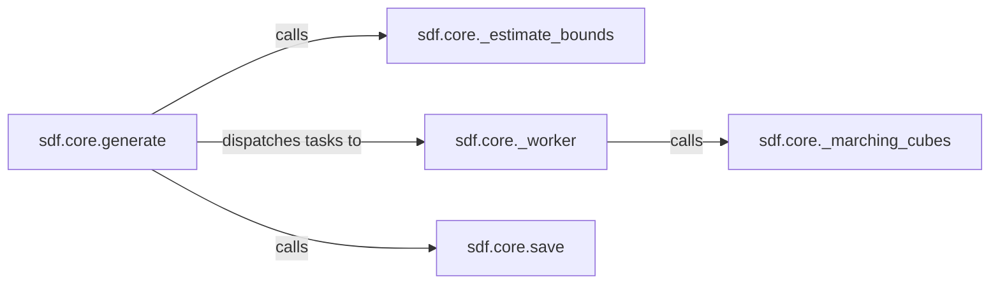

## Details

The `sdf.core` subsystem is central to the project's functionality, focusing on converting Signed Distance Functions (SDFs) into 3D polygonal meshes. The `generate` component acts as the primary orchestrator, initiating the mesh generation process. It first utilizes `_estimate_bounds` to determine the optimal evaluation grid. Subsequently, `generate` dispatches tasks to `_worker` components, which are responsible for processing chunks of the SDF evaluation grid and invoking the `_marching_cubes` algorithm to extract the mesh. Finally, `generate` calls `save` to persist the generated 3D model. This architecture ensures an efficient and modular approach to 3D mesh generation from SDF definitions.

### sdf.core.generate
The primary orchestrator and high-level entry point for the mesh generation process. It coordinates the overall flow from an SDF definition to a 3D mesh, including determining evaluation bounds, dispatching core meshing operations, and managing the final output saving.

**Related Classes/Methods**:

- <a href="https://github.com/fogleman/sdf/blob/main/sdf/core.py#L84-L150" target="_blank" rel="noopener noreferrer">`sdf.core.generate`:84-150</a>

### sdf.core._estimate_bounds
A crucial preliminary component responsible for intelligently determining the optimal spatial bounds and resolution for the SDF evaluation grid. This step is vital for efficient and accurate meshing by analyzing the SDF definition to infer an appropriate bounding box and grid density.

**Related Classes/Methods**:

- <a href="https://github.com/fogleman/sdf/blob/main/sdf/core.py#L62-L82" target="_blank" rel="noopener noreferrer">`sdf.core._estimate_bounds`:62-82</a>

### sdf.core._worker
A low-level computational component that processes chunks of the SDF evaluation grid. It evaluates the SDF at grid points within its assigned chunk and invokes the core meshing algorithm to convert these values into a polygonal mesh.

**Related Classes/Methods**:

- <a href="https://github.com/fogleman/sdf/blob/main/sdf/core.py#L45-L60" target="_blank" rel="noopener noreferrer">`sdf.core._worker`:45-60</a>

### sdf.core._marching_cubes
Implements the core Marching Cubes algorithm by wrapping an external library. This is the fundamental computational step for converting a volumetric scalar field (SDF values) into a polygonal mesh, performing the geometric calculations to extract isosurfaces and generate vertices and faces.

**Related Classes/Methods**:

- <a href="https://github.com/fogleman/sdf/blob/main/sdf/core.py#L16-L18" target="_blank" rel="noopener noreferrer">`sdf.core._marching_cubes`:16-18</a>

### sdf.core.save
Responsible for serializing and saving the generated polygonal mesh to a specified file format. This component handles the final output of the 3D model after it has been generated by the core engine.

**Related Classes/Methods**:

- <a href="https://github.com/fogleman/sdf/blob/main/sdf/core.py#L152-L158" target="_blank" rel="noopener noreferrer">`sdf.core.save`:152-158</a>

### [FAQ](https://github.com/CodeBoarding/GeneratedOnBoardings/tree/main?tab=readme-ov-file#faq)