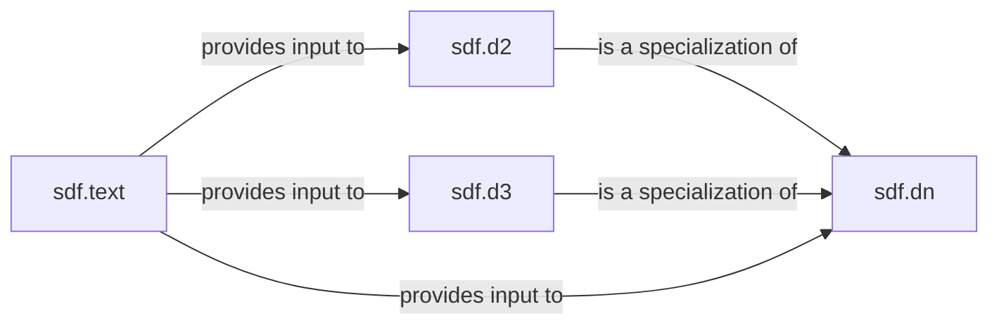

## Details

The SDF Definition & Input subsystem is responsible for establishing the foundational elements of Signed Distance Functions, encompassing both geometric primitives and the conversion of non-geometric data into SDF representations.

### sdf.dn
Acts as the abstract base for all SDF definitions, providing the generalized N-dimensional SDF evaluation function (sdf.dn.f). It establishes the fundamental mathematical framework for SDFs across arbitrary dimensions.

**Related Classes/Methods**:

- <a href="https://github.com/fogleman/sdf/blob/main/sdf/dn.py#L101-L113" target="_blank" rel="noopener noreferrer">`sdf.dn.f`:101-113</a>

### sdf.d2
Specializes the N-dimensional SDF concept for two dimensions. It defines fundamental 2D geometric SDF primitives (e.g., line, slab, rectangle) and provides the core 2D SDF evaluation function (sdf.d2.f).

**Related Classes/Methods**:

- <a href="https://github.com/fogleman/sdf/blob/main/sdf/d2.py#L282-L285" target="_blank" rel="noopener noreferrer">`sdf.d2.f`:282-285</a>
- <a href="https://github.com/fogleman/sdf/blob/main/sdf/d2.py#L82-L87" target="_blank" rel="noopener noreferrer">`sdf.d2.line`:82-87</a>
- <a href="https://github.com/fogleman/sdf/blob/main/sdf/d2.py#L89-L100" target="_blank" rel="noopener noreferrer">`sdf.d2.slab`:89-100</a>
- <a href="https://github.com/fogleman/sdf/blob/main/sdf/d2.py#L102-L114" target="_blank" rel="noopener noreferrer">`sdf.d2.rectangle`:102-114</a>

### sdf.d3
Specializes the N-dimensional SDF concept for three dimensions. It defines fundamental 3D geometric SDF primitives (e.g., box, plane) and essential 3D transformations (e.g., rotate, orient), along with the core 3D SDF evaluation function (sdf.d3.f).

**Related Classes/Methods**:

- <a href="https://github.com/fogleman/sdf/blob/main/sdf/d3.py#L513-L519" target="_blank" rel="noopener noreferrer">`sdf.d3.f`:513-519</a>
- <a href="https://github.com/fogleman/sdf/blob/main/sdf/d3.py#L122-L134" target="_blank" rel="noopener noreferrer">`sdf.d3.box`:122-134</a>
- <a href="https://github.com/fogleman/sdf/blob/main/sdf/d3.py#L98-L103" target="_blank" rel="noopener noreferrer">`sdf.d3.plane`:98-103</a>
- <a href="https://github.com/fogleman/sdf/blob/main/sdf/d3.py#L347-L360" target="_blank" rel="noopener noreferrer">`sdf.d3.rotate`:347-360</a>
- <a href="https://github.com/fogleman/sdf/blob/main/sdf/d3.py#L375-L377" target="_blank" rel="noopener noreferrer">`sdf.d3.orient`:375-377</a>

### sdf.text
Responsible for converting non-geometric data, specifically text (sdf.text.text) and images (sdf.text.image), into SDF representations. This allows external, non-geometric inputs to be integrated into the SDF processing pipeline.

**Related Classes/Methods**:

- <a href="https://github.com/fogleman/sdf/blob/main/sdf/text.py" target="_blank" rel="noopener noreferrer">`sdf.text.text`</a>
- <a href="https://github.com/fogleman/sdf/blob/main/sdf/text.py#L62-L65" target="_blank" rel="noopener noreferrer">`sdf.text.image`:62-65</a>

### [FAQ](https://github.com/CodeBoarding/GeneratedOnBoardings/tree/main?tab=readme-ov-file#faq)