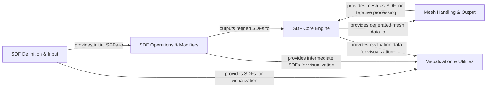

## Details

The `sdf` project is structured around a core pipeline for generating 3D meshes from Signed Distance Functions. The process begins with the `SDF Definition & Input` component, which provides fundamental SDF primitives and conversion capabilities. These initial SDFs are then passed to `SDF Operations & Modifiers`, where they are combined and refined using boolean operations and transformations. The resulting complex SDFs are fed into the `SDF Core Engine`, the computational heart of the system, responsible for evaluating SDFs and generating polygonal mesh data via marching cubes. This generated mesh data is then provided to `Mesh Handling & Output` for post-processing, serialization, and export. Notably, `Mesh Handling & Output` can also convert meshes back into SDFs, enabling iterative design. Throughout this pipeline, the `Visualization & Utilities` component supports debugging and previewing by consuming SDF and evaluation data from various stages. This modular design ensures a clear data flow, facilitating both understanding and visual representation of the system's architecture.

### SDF Definition & Input [[Expand]](./SDF_Definition_Input.md)
This component provides the foundational building blocks for constructing Signed Distance Functions (SDFs), including basic 2D/3D geometric shapes and transformations, as well as functionalities to convert non-geometric data (like text or images) into SDF representations.

**Related Classes/Methods**:

- <a href="https://github.com/fogleman/sdf/blob/main/sdf/d2.py#L282-L285" target="_blank" rel="noopener noreferrer">`sdf.d2.f`:282-285</a>
- <a href="https://github.com/fogleman/sdf/blob/main/sdf/d3.py#L513-L519" target="_blank" rel="noopener noreferrer">`sdf.d3.f`:513-519</a>
- <a href="https://github.com/fogleman/sdf/blob/main/sdf/d3.py#L122-L134" target="_blank" rel="noopener noreferrer">`sdf.d3.box`:122-134</a>
- <a href="https://github.com/fogleman/sdf/blob/main/sdf/d3.py#L347-L360" target="_blank" rel="noopener noreferrer">`sdf.d3.rotate`:347-360</a>
- <a href="https://github.com/fogleman/sdf/blob/main/sdf/dn.py#L101-L113" target="_blank" rel="noopener noreferrer">`sdf.dn.f`:101-113</a>
- <a href="https://github.com/fogleman/sdf/blob/main/sdf/text.py" target="_blank" rel="noopener noreferrer">`sdf.text.text`</a>
- <a href="https://github.com/fogleman/sdf/blob/main/sdf/text.py#L62-L65" target="_blank" rel="noopener noreferrer">`sdf.text.image`:62-65</a>

### SDF Operations & Modifiers
This component encompasses functions that combine, modify, or manipulate existing SDFs to create more complex shapes. This includes boolean operations (union, intersection, subtraction), blending, and other advanced transformations, forming the core logic for composing and refining SDF geometries.

**Related Classes/Methods**:

- <a href="https://github.com/fogleman/sdf/blob/main/sdf/d2.py" target="_blank" rel="noopener noreferrer">`sdf.d2.union`</a>
- <a href="https://github.com/fogleman/sdf/blob/main/sdf/d3.py" target="_blank" rel="noopener noreferrer">`sdf.d3.union`</a>
- <a href="https://github.com/fogleman/sdf/blob/main/sdf/dn.py#L7-L20" target="_blank" rel="noopener noreferrer">`sdf.dn.union`:7-20</a>
- <a href="https://github.com/fogleman/sdf/blob/main/sdf/d2.py" target="_blank" rel="noopener noreferrer">`sdf.d2.intersection`</a>
- <a href="https://github.com/fogleman/sdf/blob/main/sdf/d3.py" target="_blank" rel="noopener noreferrer">`sdf.d3.intersection`</a>
- <a href="https://github.com/fogleman/sdf/blob/main/sdf/dn.py#L37-L50" target="_blank" rel="noopener noreferrer">`sdf.dn.intersection`:37-50</a>
- <a href="https://github.com/fogleman/sdf/blob/main/sdf/d2.py" target="_blank" rel="noopener noreferrer">`sdf.d2.subtract`</a>
- <a href="https://github.com/fogleman/sdf/blob/main/sdf/d3.py" target="_blank" rel="noopener noreferrer">`sdf.d3.subtract`</a>
- <a href="https://github.com/fogleman/sdf/blob/main/sdf/dn.py" target="_blank" rel="noopener noreferrer">`sdf.dn.subtract`</a>
- <a href="https://github.com/fogleman/sdf/blob/main/sdf/ease.py" target="_blank" rel="noopener noreferrer">`sdf.ease.smoothstep`</a>

### SDF Core Engine [[Expand]](./SDF_Core_Engine.md)
The computational backbone of the `sdf` library. This component is responsible for evaluating SDFs over a grid, estimating their bounds, and executing the marching cubes algorithm to generate a polygonal mesh from the SDF data. It orchestrates the transformation from an abstract SDF definition to a concrete 3D mesh.

**Related Classes/Methods**:

- <a href="https://github.com/fogleman/sdf/blob/main/sdf/core.py#L84-L150" target="_blank" rel="noopener noreferrer">`sdf.core.generate`:84-150</a>
- <a href="https://github.com/fogleman/sdf/blob/main/sdf/core.py#L16-L18" target="_blank" rel="noopener noreferrer">`sdf.core._marching_cubes`:16-18</a>
- <a href="https://github.com/fogleman/sdf/blob/main/sdf/core.py#L152-L158" target="_blank" rel="noopener noreferrer">`sdf.core.save`:152-158</a>

### Mesh Handling & Output [[Expand]](./Mesh_Handling_Output.md)
This component manages the generated mesh data, providing functionalities for post-generation transformations (e.g., scaling, translation of the mesh itself) and handling the serialization and export of meshes to various standard file formats (e.g., STL, OBJ, PLY). It also includes the capability to convert a mesh back into an SDF representation, enabling iterative design workflows.

**Related Classes/Methods**:

- <a href="https://github.com/fogleman/sdf/blob/main/sdf/mesh.py#L37-L41" target="_blank" rel="noopener noreferrer">`sdf.mesh.transformed`:37-41</a>
- <a href="https://github.com/fogleman/sdf/blob/main/sdf/mesh.py#L64-L113" target="_blank" rel="noopener noreferrer">`sdf.mesh.sdf`:64-113</a>
- <a href="https://github.com/fogleman/sdf/blob/main/sdf/stl.py" target="_blank" rel="noopener noreferrer">`sdf.stl`</a>

### Visualization & Utilities
This auxiliary component provides tools for visualizing SDFs (e.g., 2D slices for debugging or previewing) and general utility functions that support the main pipeline but are not directly involved in the core data transformation.

**Related Classes/Methods**:

- <a href="https://github.com/fogleman/sdf/blob/main/sdf/core.py#L234-L244" target="_blank" rel="noopener noreferrer">`sdf.core.show_slice`:234-244</a>
- <a href="https://github.com/fogleman/sdf/blob/main/sdf/progress.py#L39-L43" target="_blank" rel="noopener noreferrer">`sdf.progress.update`:39-43</a>
- <a href="https://github.com/fogleman/sdf/blob/main/sdf/util.py" target="_blank" rel="noopener noreferrer">`sdf.util.identity`</a>

### [FAQ](https://github.com/CodeBoarding/GeneratedOnBoardings/tree/main?tab=readme-ov-file#faq)