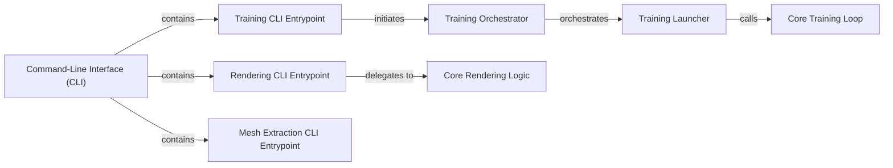

## Details

The Command-Line Interface (CLI) subsystem serves as the primary user interface for `sdfstudio`, orchestrating various operations such as model training, scene rendering, and mesh extraction. It acts as the gateway to the core ML pipelines, providing distinct entry points for each major functionality.

### Command-Line Interface (CLI) [[Expand]](./Command_Line_Interface_CLI_.md)
The overarching user interface, providing the main entry points for all `sdfstudio` operations. It parses high-level commands and dispatches them to specific functional modules.

**Related Classes/Methods**:

- <a href="https://github.com/autonomousvision/sdfstudio/blob/master/scripts/train.py" target="_blank" rel="noopener noreferrer">`scripts.train`</a>
- <a href="https://github.com/autonomousvision/sdfstudio/blob/master/scripts/render.py" target="_blank" rel="noopener noreferrer">`scripts.render`</a>
- <a href="https://github.com/autonomousvision/sdfstudio/blob/master/scripts/extract_mesh.py" target="_blank" rel="noopener noreferrer">`scripts.extract_mesh`</a>

### Training CLI Entrypoint
The specific entry point for initiating model training via the `train` command. It handles initial argument parsing and setup before delegating to the main training orchestration logic.

**Related Classes/Methods**:

- <a href="https://github.com/autonomousvision/sdfstudio/blob/master/scripts/train.py#L246-L255" target="_blank" rel="noopener noreferrer">`scripts.train.entrypoint`:246-255</a>

### Rendering CLI Entrypoint
The specific entry point for rendering scenes or trajectories via the `render` command. It processes rendering-specific arguments and orchestrates the rendering pipeline.

**Related Classes/Methods**:

- <a href="https://github.com/autonomousvision/sdfstudio/blob/master/scripts/render.py#L126-L159" target="_blank" rel="noopener noreferrer">`scripts.render.main`:126-159</a>

### Mesh Extraction CLI Entrypoint
The specific entry point for extracting 3D meshes from trained models via the `extract_mesh` command. It manages the parameters for mesh extraction and initiates the process.

**Related Classes/Methods**:

- <a href="https://github.com/autonomousvision/sdfstudio/blob/master/scripts/extract_mesh.py#L62-L133" target="_blank" rel="noopener noreferrer">`scripts.extract_mesh.main`:62-133</a>

### Training Orchestrator
Orchestrates the overall training workflow, setting up the environment, loading configurations, and preparing the training process. It acts as a high-level manager for the training pipeline.

**Related Classes/Methods**:

- <a href="https://github.com/autonomousvision/sdfstudio/blob/master/scripts/train.py#L220-L243" target="_blank" rel="noopener noreferrer">`scripts.train.main`:220-243</a>

### Training Launcher
Responsible for launching the actual training process, often involving distributed training setup or process management. It bridges the orchestration layer with the core training loop.

**Related Classes/Methods**:

- <a href="https://github.com/autonomousvision/sdfstudio/blob/master/scripts/train.py#L149-L217" target="_blank" rel="noopener noreferrer">`scripts.train.launch`:149-217</a>

### Core Training Loop
Contains the iterative core training logic, including forward and backward passes, optimization steps, and metric logging. This is where the model learning occurs.

**Related Classes/Methods**:

- <a href="https://github.com/autonomousvision/sdfstudio/blob/master/scripts/train.py#L78-L90" target="_blank" rel="noopener noreferrer">`scripts.train.train_loop`:78-90</a>

### Core Rendering Logic
Handles the detailed process of rendering a trajectory or scene into a video format. It interacts with the rendering engine and model to generate visual outputs.

**Related Classes/Methods**:

- <a href="https://github.com/autonomousvision/sdfstudio/blob/master/scripts/render.py#L38-L100" target="_blank" rel="noopener noreferrer">`scripts.render._render_trajectory_video`:38-100</a>

### [FAQ](https://github.com/CodeBoarding/GeneratedOnBoardings/tree/main?tab=readme-ov-file#faq)