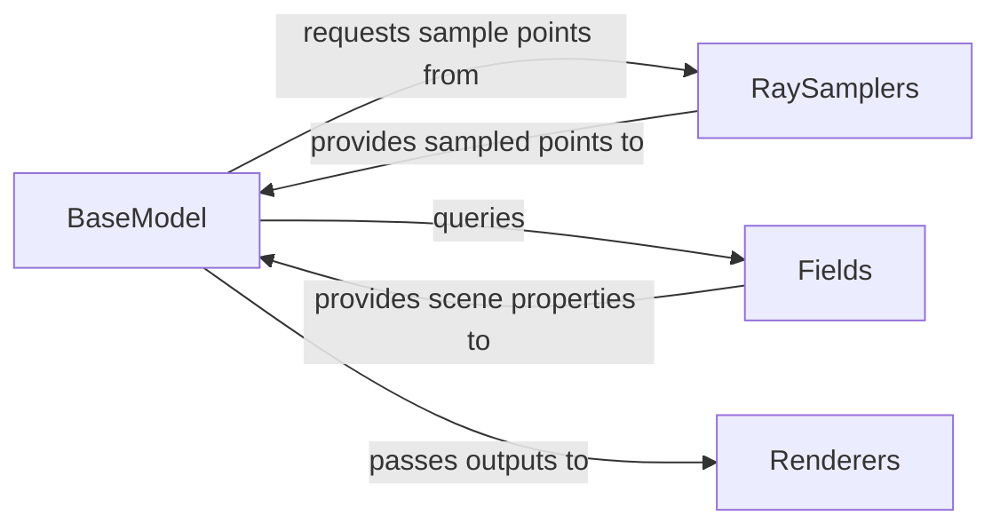

## Details

The `Core Neural Rendering Engine` subsystem in `sdfstudio` serves as the computational heart, responsible for defining, executing, and rendering 3D scenes using neural implicit representations. It embodies the project's core ML pipeline for inference and rendering, adhering to a modular and pipeline-driven architecture.

### BaseModel
Acts as the primary orchestrator for the entire neural rendering process. It initializes and integrates the core modules, defines the high-level forward pass logic, and coordinates the interactions between the scene representation, sampling, and rendering components.

**Related Classes/Methods**:

- <a href="https://github.com/autonomousvision/sdfstudio/blob/master/nerfstudio/models/base_model.py" target="_blank" rel="noopener noreferrer">`BaseModel`</a>

### Fields
Implements the neural network architectures that implicitly represent the 3D scene. This component is responsible for computing fundamental scene properties such as density, color, and Signed Distance Function (SDF) values at given 3D coordinates. It serves as the core "neural" part of the rendering engine.

**Related Classes/Methods**:

- <a href="https://github.com/autonomousvision/sdfstudio/blob/master/nerfstudio/fields/base_field.py" target="_blank" rel="noopener noreferrer">`BaseField`</a>
- <a href="https://github.com/autonomousvision/sdfstudio/blob/master/nerfstudio/fields/instant_ngp_field.py#L50-L201" target="_blank" rel="noopener noreferrer">`InstantNGPField`:50-201</a>
- <a href="https://github.com/autonomousvision/sdfstudio/blob/master/nerfstudio/fields/nerfacto_field.py#L67-L318" target="_blank" rel="noopener noreferrer">`NerfactoField`:67-318</a>
- <a href="https://github.com/autonomousvision/sdfstudio/blob/master/nerfstudio/fields/tensorf_field.py#L33-L144" target="_blank" rel="noopener noreferrer">`TensoRFField`:33-144</a>
- <a href="https://github.com/autonomousvision/sdfstudio/blob/master/nerfstudio/fields/sdf_field.py#L188-L698" target="_blank" rel="noopener noreferrer">`SDFField`:188-698</a>

### RaySamplers
Manages the generation and distribution of sample points along rays cast into the 3D scene. This component is crucial for efficiently querying the implicit scene representation by determining the specific locations where the `Fields` component needs to be evaluated.

**Related Classes/Methods**:

- <a href="https://github.com/autonomousvision/sdfstudio/blob/master/nerfstudio/model_components/ray_samplers.py" target="_blank" rel="noopener noreferrer">`RaySamplers`</a>

### Renderers
Aggregates and combines the per-sample outputs (e.g., colors, densities) obtained from the `Fields` component into final rendered images or other desired outputs (e.g., depth maps, normals). It performs the final step of synthesizing the 3D scene information into a 2D representation.

**Related Classes/Methods**:

- <a href="https://github.com/autonomousvision/sdfstudio/blob/master/nerfstudio/model_components/renderers.py" target="_blank" rel="noopener noreferrer">`Renderers`</a>

### [FAQ](https://github.com/CodeBoarding/GeneratedOnBoardings/tree/main?tab=readme-ov-file#faq)