```mermaid
graph LR
    ProcessData["ProcessData"]
    DataParser["DataParser"]
    DataManager["DataManager"]
    InputDataset["InputDataset"]
    Cameras["Cameras"]
    Rays["Rays"]
    PixelSampler["PixelSampler"]
    DataLoader["DataLoader"]
    ProcessData -- "prepares raw data for" --> DataParser
    DataParser -- "provides parsed data to" --> DataManager
    DataManager -- "instantiates and manages" --> InputDataset
    DataManager -- "utilizes for sampling logic" --> PixelSampler
    DataManager -- "uses to create efficient data iterables" --> DataLoader
    InputDataset -- "provides image and camera data to" --> PixelSampler
    InputDataset -- "provides camera parameters to" --> Cameras
    Cameras -- "generates based on camera parameters" --> Rays
    PixelSampler -- "samples pixels from" --> InputDataset
    DataLoader -- "iterates over and batches data from" --> InputDataset
```

## Details

The `nerfstudio` data subsystem orchestrates the flow of data from raw inputs to model-consumable batches. It begins with `ProcessData`, which pre-processes raw assets offline. The `DataParser` then standardizes this raw data into a structured format. The `DataManager` acts as the central hub, managing the `InputDataset`, which provides individual data samples. For efficient training, the `PixelSampler` selects pixels, and the `DataLoader` handles batching and iteration. Crucially, the `Cameras` component manages camera parameters, which are then used to generate `Rays`, the fundamental geometric primitives for neural rendering. This pipeline ensures a robust and efficient data supply for the training and evaluation of neural radiance field models.

### ProcessData
Handles initial, often offline, processing of raw input data (e.g., running COLMAP for structure-from-motion, video conversion). This component acts as a pre-processor, preparing raw assets for the parsing stage.

**Related Classes/Methods**:

- <a href="https://github.com/autonomousvision/sdfstudio/blob/master/nerfstudio/process_data/process_data_utils.py" target="_blank" rel="noopener noreferrer">`nerfstudio.process_data.process_data_utils`</a>

### DataParser
Parses raw input data from various formats (e.g., images, camera poses, 3D points) into a standardized `DataparserOutputs` structure. It abstracts away format-specific loading logic, enabling easy integration of new dataset types.

**Related Classes/Methods**:

- <a href="https://github.com/autonomousvision/sdfstudio/blob/master/nerfstudio/data/dataparsers/base_dataparser.py#L93-L128" target="_blank" rel="noopener noreferrer">`nerfstudio.data.dataparsers.base_dataparser.DataParser`:93-128</a>

### DataManager
Acts as the central orchestrator for the entire data pipeline during training and evaluation. It takes the parsed data, sets up the `InputDataset`, and manages the `PixelSampler` and `DataLoader` to provide efficient iterables of data batches to the training loop. It's the primary interface for the model to request data.

**Related Classes/Methods**:

- <a href="https://github.com/autonomousvision/sdfstudio/blob/master/nerfstudio/data/datamanagers/base_datamanager.py#L92-L251" target="_blank" rel="noopener noreferrer">`nerfstudio.data.datamanagers.base_datamanager.DataManager`:92-251</a>

### InputDataset
Provides a unified interface for accessing individual data samples (e.g., images, camera intrinsics/extrinsics, 3D points) based on the parsed outputs. It serves as the underlying data source for batching and sampling.

**Related Classes/Methods**:

- <a href="https://github.com/autonomousvision/sdfstudio/blob/master/nerfstudio/data/datasets/base_dataset.py#L36-L132" target="_blank" rel="noopener noreferrer">`nerfstudio.data.datasets.base_dataset.InputDataset`:36-132</a>

### Cameras
Manages camera parameters (intrinsics, extrinsics, camera type, distortion models) for each view. It's fundamental for understanding the scene geometry and for generating rays into the 3D environment.

**Related Classes/Methods**:

- <a href="https://github.com/autonomousvision/sdfstudio/blob/master/nerfstudio/cameras/cameras.py" target="_blank" rel="noopener noreferrer">`nerfstudio.cameras.cameras.Cameras`</a>

### Rays
Defines the data structures for rays, frustums, and sampled points along rays. These are the fundamental geometric primitives used by neural rendering models to query the scene.

**Related Classes/Methods**:

- <a href="https://github.com/autonomousvision/sdfstudio/blob/master/nerfstudio/cameras/rays.py#L109-L230" target="_blank" rel="noopener noreferrer">`nerfstudio.cameras.rays.Rays`:109-230</a>

### PixelSampler
Samples pixels from images (provided by `InputDataset`) to create batches for training. It encapsulates various sampling strategies (e.g., uniform, importance sampling) to optimize training efficiency.

**Related Classes/Methods**:

- <a href="https://github.com/autonomousvision/sdfstudio/blob/master/nerfstudio/data/pixel_samplers.py#L164-L214" target="_blank" rel="noopener noreferrer">`nerfstudio.data.pixel_samplers.PixelSampler`:164-214</a>

### DataLoader
A standard PyTorch component that facilitates efficient batching, shuffling, and iteration over the `InputDataset`. It handles multi-processing for data loading, ensuring data is fed to the model efficiently.

**Related Classes/Methods**:

- <a href="https://github.com/autonomousvision/sdfstudio/blob/master/nerfstudio/data/utils/dataloaders.py" target="_blank" rel="noopener noreferrer">`nerfstudio.data.utils.dataloaders.DataLoader`</a>

### [FAQ](https://github.com/CodeBoarding/GeneratedOnBoardings/tree/main?tab=readme-ov-file#faq)