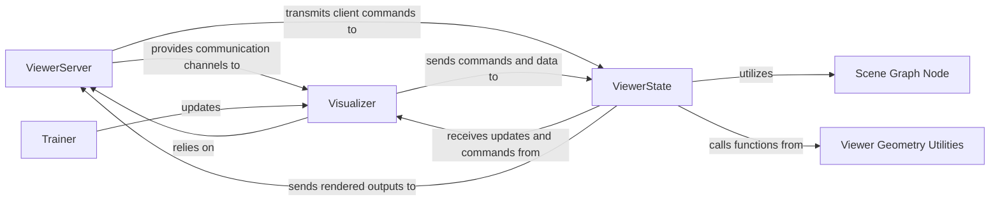

## Details

The sdfstudio viewer subsystem is designed to provide real-time visualization of the training process. The ViewerServer acts as the communication hub, managing both internal ZeroMQ messaging and external WebSocket connections to the client. The Visualizer serves as the primary interface for other system components, such as the Trainer, to interact with the viewer, enabling the transmission of scene updates and receiving user inputs. The ViewerState maintains the core 3D scene data, processing updates from the Visualizer and orchestrating rendering. It leverages Scene Graph Node for hierarchical scene organization and Viewer Geometry Utilities for geometric computations. The Trainer component, central to the training pipeline, actively updates the Visualizer to reflect the ongoing training progress, ensuring a dynamic and interactive visualization experience.

### ViewerServer
Manages the server-side communication, including setting up ZeroMQ (ZMQ) for internal messaging and a web server for WebSocket connections to the client-side viewer. It establishes and maintains communication channels and bridges ZMQ and WebSocket protocols.

**Related Classes/Methods**:

- <a href="https://github.com/autonomousvision/sdfstudio/blob/master/nerfstudio/viewer/server/server.py" target="_blank" rel="noopener noreferrer">`nerfstudio.viewer.server.server`</a>

### Visualizer
Provides a high-level interface for other parts of the sdfstudio system (e.g., the training pipeline) to interact with the viewer. It facilitates sending scene updates, camera poses, rendered images, and receiving user interactions from the viewer client.

**Related Classes/Methods**:

- <a href="https://github.com/autonomousvision/sdfstudio/blob/master/nerfstudio/viewer/server/visualizer.py" target="_blank" rel="noopener noreferrer">`nerfstudio.viewer.server.visualizer`</a>

### ViewerState
Manages the internal state of the 3D scene displayed in the viewer, including camera parameters, scene objects, and rendering configurations. It initializes and updates the scene, processes camera path payloads, and orchestrates image rendering within the viewer.

**Related Classes/Methods**:

- <a href="https://github.com/autonomousvision/sdfstudio/blob/master/nerfstudio/viewer/server/viewer_utils.py" target="_blank" rel="noopener noreferrer">`nerfstudio.viewer.server.viewer_utils`</a>

### Scene Graph Node
Implements a hierarchical node structure for organizing and managing elements within the viewer's scene graph. It provides functionalities for finding, setting values, and traversing nodes in the scene graph.

**Related Classes/Methods**:

- <a href="https://github.com/autonomousvision/sdfstudio/blob/master/nerfstudio/viewer/server/state/node.py" target="_blank" rel="noopener noreferrer">`nerfstudio.viewer.server.state.node`</a>

### Viewer Geometry Utilities
Contains utility functions for geometric transformations and camera-related calculations specific to the viewer, such as converting between different camera representations.

**Related Classes/Methods**:

- <a href="https://github.com/autonomousvision/sdfstudio/blob/master/nerfstudio/viewer/server/utils.py" target="_blank" rel="noopener noreferrer">`nerfstudio.viewer.server.utils`</a>

### Trainer
Orchestrates the training process, including model optimization and data management. It interacts with the viewer system to initialize and continuously update the 3D scene and rendered outputs based on the training progress.

**Related Classes/Methods**:

- <a href="https://github.com/autonomousvision/sdfstudio/blob/master/nerfstudio/engine/trainer.py#L52-L364" target="_blank" rel="noopener noreferrer">`nerfstudio.engine.trainer.Trainer`:52-364</a>

### [FAQ](https://github.com/CodeBoarding/GeneratedOnBoardings/tree/main?tab=readme-ov-file#faq)