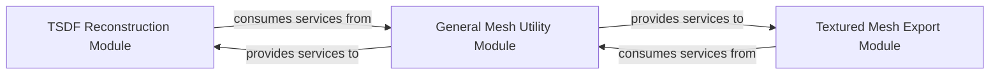

## Details

The `Model Export & Reconstruction` subsystem is a critical part of the `nerfstudio` project, focusing on transforming trained neural field representations into usable 3D models and meshes. It aligns with the project's `ML Toolkit/Framework` pattern by providing specialized, modular functionalities for post-processing and exporting the core ML outputs. This subsystem encompasses all functionalities related to extracting explicit 3D geometry (meshes) from implicit neural representations and preparing these meshes for external use, including texturing and format conversion.

### TSDF Reconstruction Module
Manages the creation and integration of Truncated Signed Distance Function (TSDF) volumes from neural field outputs. It is responsible for extracting a 3D mesh from the integrated TSDF volume, effectively converting the implicit surface representation into an explicit mesh. This module is fundamental for extracting geometry from SDF-based neural fields.

**Related Classes/Methods**:

- <a href="https://github.com/autonomousvision/sdfstudio/blob/master/nerfstudio/exporter/tsdf_utils.py" target="_blank" rel="noopener noreferrer">`nerfstudio/exporter/tsdf_utils.py`</a>

### General Mesh Utility Module
Provides foundational, generic utilities for handling 3D mesh data. This includes functionalities for loading meshes from various formats, performing basic mesh manipulations, and saving meshes into standard formats (e.g., `.obj`, `.ply`). It acts as a common service layer for other export-related modules.

**Related Classes/Methods**:

- <a href="https://github.com/autonomousvision/sdfstudio/blob/master/nerfstudio/exporter/exporter_utils.py" target="_blank" rel="noopener noreferrer">`nerfstudio/exporter/exporter_utils.py`</a>

### Textured Mesh Export Module
Specializes in the process of unwrapping 3D meshes and exporting them along with associated texture information. This involves generating UV coordinates, creating texture atlases, and ensuring the exported mesh retains its visual appearance through textures.

**Related Classes/Methods**:

- <a href="https://github.com/autonomousvision/sdfstudio/blob/master/nerfstudio/exporter/texture_utils.py" target="_blank" rel="noopener noreferrer">`nerfstudio/exporter/texture_utils.py`</a>

### [FAQ](https://github.com/CodeBoarding/GeneratedOnBoardings/tree/main?tab=readme-ov-file#faq)